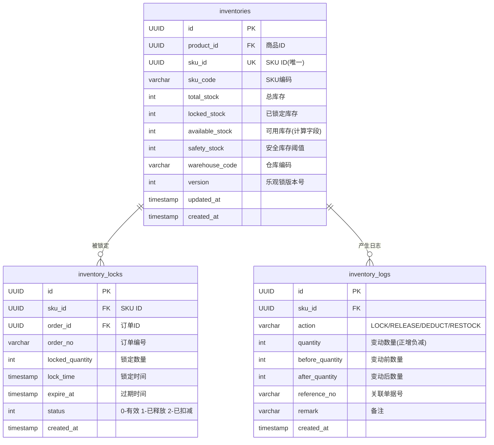
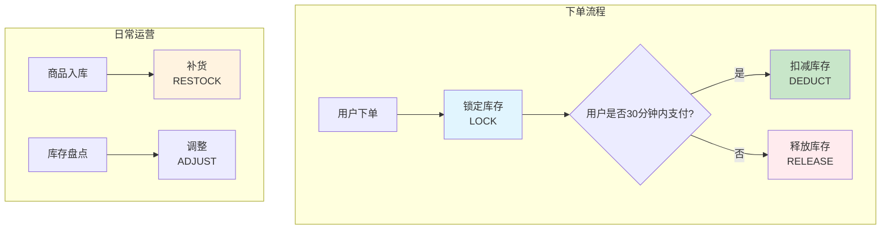
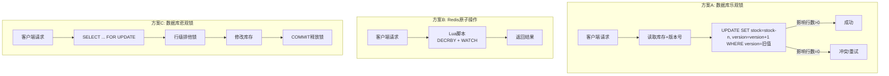

# CloudMall电商系统 - 库存服务(Inventory Service)

> **本篇导读**：本文深入讲解CloudMall库存服务的完整实现，这是电商系统中并发要求最高的服务之一。重点讲解库存锁定（防超卖）、库存释放、库存扣减三种核心操作，以及高并发场景下的三种并发控制方案对比与选型。

## 目录

- [1. 库存数据模型](#1-库存数据模型)
  - [1.1 Inventory库存记录](#11-inventory库存记录)
  - [1.2 InventoryLock库存锁](#12-inventorylock库存锁)
  - [1.3 InventoryLog变动日志](#13-inventorylog变动日志)
- [2. 核心功能实现](#2-核心功能实现)
  - [2.1 库存查询](#21-库存查询)
  - [2.2 库存锁定（下单预占）](#22-库存锁定下单预占)
  - [2.3 库存释放（取消/超时释放）](#23-库存释放取消超时释放)
  - [2.4 库存扣减（支付后正式扣减）](#24-库存扣减支付后正式扣减)
  - [2.5 库存补货（入库操作）](#25-库存补货入库操作)
- [3. 并发控制方案详解](#3-并发控制方案详解)
  - [3.1 方案A：数据库乐观锁](#31-方案a数据库乐观锁)
  - [3.2 方案B：Redis原子操作](#32-方案bredis原子操作)
  - [3.3 方案C：数据库悲观锁](#33-方案c数据库悲观锁)
  - [3.4 三种方案对比与选型建议](#34-三种方案对比与选型建议)
- [4. 库存预警机制](#4-库存预警机制)
- [5. 完整代码实现](#5-完整代码实现)
- [6. 测试要点](#6-测试要点)

---

## 1. 库存数据模型

### 1.1 ER关系图



### 1.2 实体定义

```csharp
using System;
using System.Collections.Generic;

namespace CloudMall.Inventory.Domain.Entities
{
    /// <summary>
    /// 库存记录
    /// 每个SKU对应一条库存记录
    /// </summary>
    public class Inventory
    {
        public Guid Id { get; set; }

        /// <summary>
        /// 商品ID
        /// </summary>
        public Guid ProductId { get; set; }

        /// <summary>
        /// SKU ID（唯一标识）
        /// </summary>
        public Guid SkuId { get; set; }

        /// <summary>
        /// SKU编码
        /// </summary>
        public string SkuCode { get; set; }

        /// <summary>
        /// 总库存（物理库存）
        /// </summary>
        public int TotalStock { get; set; }

        /// <summary>
        /// 已锁定库存（下单未支付的预占库存）
        /// </summary>
        public int LockedStock { get; set; } = 0;

        /// <summary>
        /// 可用库存 = TotalStock - LockedStock
        /// </summary>
        public int AvailableStock => TotalStock - LockedStock;

        /// <summary>
        /// 安全库存阈值（低于此值触发预警）
        /// </summary>
        public int SafetyStock { get; set; } = 10;

        /// <summary>
        /// 仓库编码
        /// </summary>
        public string WarehouseCode { get; set; } = "DEFAULT";

        /// <summary>
        /// 乐观锁版本号（用于并发控制）
        /// 每次更新自增
        /// </summary>
        public int Version { get; set; } = 0;

        public DateTime CreatedAt { get; set; } = DateTime.UtcNow;
        public DateTime UpdatedAt { get; set; } = DateTime.UtcNow;

        // 导航属性
        public ICollection<InventoryLock> Locks { get; set; }
            = new List<InventoryLock>();
        public ICollection<InventoryLog> Logs { get; set; }
            = new List<InventoryLog>();
    }

    /// <summary>
    /// 库存锁记录
    /// 记录每次库存锁定的详细信息，用于追踪和释放
    /// </summary>
    public class InventoryLock
    {
        public Guid Id { get; set; }

        /// <summary>
        /// 关联的SKU ID
        /// </summary>
        public Guid SkuId { get; set; }

        /// <summary>
        /// 关联的订单ID
        /// </summary>
        public Guid OrderId { get; set; }

        /// <summary>
        /// 订单编号
        /// </summary>
        public string OrderNo { get; set; }

        /// <summary>
        /// 锁定数量
        /// </summary>
        public int Quantity { get; set; }

        /// <summary>
        /// 锁定时间
        /// </summary>
        public DateTime LockTime { get; set; } = DateTime.UtcNow;

        /// <summary>
        /// 锁定过期时间（超过此时间自动释放）
        /// 通常为订单过期时间 + 缓冲时间
        /// </summary>
        public DateTime ExpireAt { get; set; }

        /// <summary>
        /// 锁状态：
        /// 0 - 有效（锁定中）
        /// 1 - 已释放（订单取消/超时）
        /// 2 - 已扣减（订单支付完成）
        /// </summary>
        public LockStatus Status { get; set; } = LockStatus.Active;

        public DateTime CreatedAt { get; set; } = DateTime.UtcNow;
        public DateTime? ReleasedAt { get; set; }
    }

    /// <summary>
    /// 锁状态枚举
    /// </summary>
    public enum LockStatus
    {
        Active = 0,      // 有效（锁定中）
        Released = 1,    // 已释放
        Deducted = 2     // 已扣减
    }

    /// <summary>
    /// 库存变动日志
    /// 完整记录所有库存变化，支持审计和对账
    /// </summary>
    public class InventoryLog
    {
        public Guid Id { get; set; }
        public Guid SkuId { get; set; }

        /// <summary>
        /// 操作类型
        /// </summary>
        public InventoryAction Action { get; set; }

        /// <summary>
        /// 变动数量（正数=增加，负数=减少）
        /// </summary>
        public int Quantity { get; set; }

        /// <summary>
        /// 变动前可用库存
        /// </summary>
        public int BeforeQuantity { get; set; }

        /// <summary>
        /// 变动后可用库存
        /// </summary>
        public int AfterQuantity { get; set; }

        /// <summary>
        /// 关联单据编号（订单号/入库单号等）
        /// </summary>
        public string ReferenceNo { get; set; }

        /// <summary>
        /// 备注
        /// </summary>
        public string Remark { get; set; }

        public DateTime CreatedAt { get; set; } = DateTime.UtcNow;
    }

    /// <summary>
    /// 库存操作类型枚举
    /// </summary>
    public enum InventoryAction
    {
        Lock,       // 锁定（下单时）
        Release,    // 释放（取消/超时）
        Deduct,     // 扣减（支付成功）
        Restock,    // 补货（入库）
        Adjust      // 调整（人工修正）
    }
}
```

---

## 2. 核心功能实现

### 2.1 库存操作流程总览



### 2.2 核心服务接口与实现

```csharp
using System;
using System.Collections.Generic;
using System.Linq;
using System.Threading.Tasks;
using Microsoft.Extensions.Logging;
using CloudMall.Inventory.Domain.Entities;
using CloudMall.Service.Inventory.DTOs;
using CloudMall.Inventory.Infrastructure.Repositories;

namespace CloudMall.Service.Inventory.Services
{
    /// <summary>
    /// 库存服务核心接口
    /// </summary>
    public interface IInventoryService
    {
        /// <summary>查询可用库存</summary>
        Task<int> GetAvailableStockAsync(Guid skuId);

        /// <summary>批量查询库存</summary>
        Task<Dictionary<Guid, int>> BatchGetStockAsync(
            IEnumerable<Guid> skuIds);

        /// <summary>锁定库存（下单时调用）</summary>
        Task<LockResult> LockAsync(LockRequest request);

        /// <summary>批量锁定</summary>
        Task<BatchLockResult> BatchLockAsync(BatchLockRequest request);

        /// <summary>释放库存（取消/超时时调用）</summary>
        Task<ReleaseResult> ReleaseAsync(ReleaseRequest request);

        /// <summary>扣减库存（支付成功后调用）</summary>
        Task<DeductResult> DeductAsync(DeductRequest request);

        /// <summary>补货（入库）</summary>
        Task RestockAsync(Guid skuId, int quantity, string referenceNo = null);
    }

    /// <summary>
    /// 库存服务核心实现
    /// 采用策略模式支持多种并发控制方式
    /// </summary>
    public class InventoryService : IInventoryService
    {
        private readonly IInventoryRepository _inventoryRepo;
        private readonly IConcurrencyStrategy _concurrencyStrategy;
        private readonly IEventBus _eventBus;
        private readonly ILogger<InventoryService> _logger;

        public InventoryService(
            IInventoryRepository inventoryRepo,
            IConcurrencyStrategy concurrencyStrategy,
            IEventBus eventBus,
            ILogger<InventoryService> logger)
        {
            _inventoryRepo = inventoryRepo;
            _concurrencyStrategy = concurrencyStrategy;
            _eventBus = eventBus;
            _logger = logger;
        }

        #region 查询

        public async Task<int> GetAvailableStockAsync(Guid skuId)
        {
            var inventory = await _inventoryRepo.GetBySkuIdAsync(skuId);
            return inventory?.AvailableStock ?? 0;
        }

        public async Task<Dictionary<Guid, int>> BatchGetStockAsync(
            IEnumerable<Guid> skuIds)
        {
            var list = await _inventoryRepo.GetBySkuIdsAsync(skuIds);
            return list.ToDictionary(i => i.SkuId, i => i.AvailableStock);
        }

        #endregion

        #region 锁定库存

        /// <summary>
        /// 锁定库存
        /// 这是防止超卖的核心操作！
        /// 
        /// 流程：
        /// 1. 校验库存充足
        /// 2. 原子性扣减可用库存 + 增加锁定库存
        /// 3. 创建锁定记录（含过期时间）
        /// 4. 发布库存锁定事件
        /// </summary>
        public async Task<LockResult> LockAsync(LockRequest request)
        {
            _logger.LogInformation(
                "开始锁定库存: SkuId={SkuId}, Qty={Qty}, OrderId={OrderId}",
                request.SkuId, request.Quantity, request.OrderId);

            // 1. 使用并发控制策略执行原子锁定
            var lockResult = await _concurrencyStrategy.LockStockAsync(
                request.SkuId,
                request.Quantity,
                request.ExpireInMinutes);

            if (!lockResult.Success)
            {
                _logger.LogWarning(
                    "库存锁定失败: SkuId={SkuId}, Reason={Reason}",
                    request.SkuId, lockResult.ErrorMessage);

                return new LockResult
                {
                    Success = false,
                    ErrorMessage = lockResult.ErrorMessage ??
                        "库存不足或锁定失败"
                };
            }

            // 2. 创建库存锁记录
            var lockRecord = new InventoryLock
            {
                Id = Guid.NewGuid(),
                SkuId = request.SkuId,
                OrderId = request.OrderId,
                OrderNo = request.OrderNo,
                Quantity = request.Quantity,
                LockTime = DateTime.UtcNow,
                ExpireAt = DateTime.UtcNow.AddMinutes(
                    request.ExpireInMinutes),
                Status = LockStatus.Active
            };

            await _inventoryRepo.AddLockAsync(lockRecord);

            // 3. 记录变动日志
            await _inventoryRepo.AddLogAsync(new InventoryLog
            {
                SkuId = request.SkuId,
                Action = InventoryAction.Lock,
                Quantity = -request.Quantity,
                BeforeQuantity = lockResult.BeforeQuantity,
                AfterQuantity = lockResult.AfterQuantity,
                ReferenceNo = request.OrderNo,
                Remark = $"订单{request.OrderNo}锁定库存"
            });

            // 4. 检查是否需要预警
            await CheckAndAlertLowStockAsync(request.SkuId, lockResult.AfterQuantity);

            // 5. 发布事件
            try
            {
                await _eventBus.PublishAsync(new InventoryLockedEvent
                {
                    SkuId = request.SkuId,
                    OrderId = request.OrderId,
                    OrderNo = request.OrderNo,
                    LockedQuantity = request.Quantity,
                    RemainingStock = lockResult.AfterQuantity,
                    LockedAt = DateTime.UtcNow
                });
            }
            catch (Exception ex)
            {
                _logger.LogWarning(ex, "发布库存锁定事件失败");
            }

            _logger.LogInformation(
                "库存锁定成功: SkuId={SkuId}, LockedQty={Qty}, Remaining={Remaining}",
                request.SkuId, request.Quantity, lockResult.AfterQuantity);

            return new LockResult
            {
                Success = true,
                LockId = lockRecord.Id,
                RemainingStock = lockResult.AfterQuantity
            };
        }

        /// <summary>
        /// 批量锁定（一个订单包含多个SKU的场景）
        /// 要么全部成功，要么全部失败（事务性）
        /// </summary>
        public async Task<BatchLockResult> BatchLockAsync(BatchLockRequest request)
        {
            var results = new List<SingleLockResult>();
            bool allSuccess = true;

            foreach (var item in request.Items)
            {
                var result = await LockAsync(new LockRequest
                {
                    SkuId = item.SkuId,
                    Quantity = item.Quantity,
                    OrderId = request.OrderId,
                    OrderNo = request.OrderNo,
                    ExpireInMinutes = request.ExpireInMinutes
                });

                results.Add(new SingleLockResult
                {
                    SkuId = item.SkuId,
                    Success = result.Success,
                    ErrorMessage = result.ErrorMessage
                });

                if (!result.Success)
                    allSuccess = false;
            }

            // 如果有失败的，需要回滚已成功的锁定
            if (!allSuccess && results.Any(r => r.Success))
            {
                _logger.LogWarning(
                    "批量锁定部分失败，开始回滚: OrderId={OrderId}",
                    request.OrderId);

                foreach (var successItem in results.Where(r => r.Success))
                {
                    await ReleaseAsync(new ReleaseRequest
                    {
                        SkuId = successItem.SkuId,
                        OrderId = request.OrderId,
                        Reason = "批量锁定回滚"
                    });
                }
            }

            return new BatchLockResult
            {
                Success = allSuccess,
                Results = results
            };
        }

        #endregion

        #region 释放库存

        /// <summary>
        /// 释放库存
        /// 场景：订单取消、超时未支付
        /// 将锁定库存归还到可用库存
        /// </summary>
        public async Task<ReleaseResult> ReleaseAsync(ReleaseRequest request)
        {
            _logger.LogInformation(
                "释放库存: SkuId={SkuId}, OrderId={OrderId}",
                request.SkuId, request.OrderId);

            // 1. 查找有效的锁定记录
            var lockRecord = await _inventoryRepo
                .GetActiveLockAsync(request.SkuId, request.OrderId);

            if (lockRecord == null)
            {
                _logger.LogWarning(
                    "未找到有效的库存锁: SkuId={SkuId}, OrderId={OrderId}",
                    request.SkuId, request.OrderId);

                return new ReleaseResult
                {
                    Success = true,  // 幂等处理：已释放过也视为成功
                    Message = "该订单的库存未被锁定或已释放"
                };
            }

            // 2. 原子性释放（增加可用库存 + 减少锁定库存）
            var releaseResult = await _concurrencyStrategy.ReleaseStockAsync(
                request.SkuId,
                lockRecord.Quantity);

            if (!releaseResult.Success)
            {
                _logger.LogError("库存释放失败: SkuId={SkuId}", request.SkuId);
                return new ReleaseResult
                {
                    Success = false,
                    ErrorMessage = "库存释放失败，需人工处理"
                };
            }

            // 3. 更新锁记录状态
            lockRecord.Status = LockStatus.Released;
            lockRecord.ReleasedAt = DateTime.UtcNow;
            await _inventoryRepo.UpdateLockAsync(lockRecord);

            // 4. 记录日志
            await _inventoryRepo.AddLogAsync(new InventoryLog
            {
                SkuId = request.SkuId,
                Action = InventoryAction.Release,
                Quantity = lockRecord.Quantity,
                BeforeQuantity = releaseResult.BeforeQuantity,
                AfterQuantity = releaseResult.AfterQuantity,
                ReferenceNo = request.OrderNo,
                Remark = request.Reason ?? $"订单{request.OrderNo}释放库存"
            });

            // 5. 发布事件
            await _eventBus.PublishAsync(new InventoryReleasedEvent
            {
                SkuId = request.SkuId,
                OrderId = request.OrderId,
                ReleasedQuantity = lockRecord.Quantity,
                CurrentStock = releaseResult.AfterQuantity,
                ReleasedAt = DateTime.UtcNow
            });

            _logger.LogInformation(
                "库存释放成功: SkuId={SkuId}, ReleasedQty={Qty}, Current={Current}",
                request.SkuId, lockRecord.Quantity, releaseResult.AfterQuantity);

            return new ReleaseResult { Success = true };
        }

        #endregion

        #region 扣减库存

        /// <summary>
        /// 扣减库存
        /// 场景：订单支付成功后，将锁定库存转为实际扣减
        /// 这是库存从"锁定"变为"减少"的关键步骤
        /// </summary>
        public async Task<DeductResult> DeductAsync(DeductRequest request)
        {
            _logger.LogInformation(
                "扣减库存: SkuId={SkuId}, OrderId={OrderId}",
                request.SkuId, request.OrderId);

            // 1. 查找锁定记录
            var lockRecord = await _inventoryRepo
                .GetActiveLockAsync(request.SkuId, request.OrderId);

            if (lockRecord == null)
            {
                // 可能已被扣减过（幂等检查）
                var deductedLock = await _inventoryRepo
                    .GetDeductedLockAsync(request.SkuId, request.OrderId);

                if (deductedLock != null)
                {
                    return new DeductResult
                    {
                        Success = true,
                        Message = "库存已扣减（重复请求）"
                    };
                }

                throw new BusinessException(
                    "未找到有效的库存锁定记录");
            }

            // 2. 执行原子扣减
            var deductResult = await _concurrencyStrategy.DeductStockAsync(
                request.SkuId,
                lockRecord.Quantity);

            if (!deductResult.Success)
            {
                _logger.LogError("库存扣减失败: SkuId={SkuId}", request.SkuId);
                throw new BusinessException("库存扣减失败");
            }

            // 3. 更新锁记录为已扣减
            lockRecord.Status = LockStatus.Deducted;
            lockRecord.ReleasedAt = DateTime.UtcNow;
            await _inventoryRepo.UpdateLockAsync(lockRecord);

            // 4. 记录日志
            await _inventoryRepo.AddLogAsync(new InventoryLog
            {
                SkuId = request.SkuId,
                Action = InventoryAction.Deduct,
                Quantity = -lockRecord.Quantity,
                BeforeQuantity = deductResult.BeforeQuantity,
                AfterQuantity = deductResult.AfterQuantity,
                ReferenceNo = request.OrderNo,
                Remark = $"订单{request.OrderNo}支付成功，扣减库存"
            });

            // 5. 发布事件
            await _eventBus.PublishAsync(new InventoryDeductedEvent
            {
                SkuId = request.SkuId,
                OrderId = request.OrderId,
                DeductedQuantity = lockRecord.Quantity,
                CurrentStock = deductResult.AfterQuantity,
                DeductedAt = DateTime.UtcNow
            });

            _logger.LogInformation(
                "库存扣减成功: SkuId={SkuId}, DeductedQty={Qty}, Current={Current}",
                request.SkuId, lockRecord.Quantity, deductResult.AfterQuantity);

            return new DeductResult { Success = true };
        }

        #endregion

        #region 补货

        /// <summary>
        /// 补货入库
        /// 增加总库存和可用库存
        /// </summary>
        public async Task RestockAsync(
            Guid skuId, int quantity, string referenceNo = null)
        {
            if (quantity <= 0)
                throw new BusinessException("补货数量必须大于0");

            var inventory = await _inventoryRepo.GetBySkuIdAsync(skuId);

            if (inventory == null)
            {
                // 首次补货，创建库存记录
                inventory = new Inventory
                {
                    Id = Guid.NewGuid(),
                    SkuId = skuId,
                    TotalStock = quantity,
                    LockedStock = 0
                };
                await _inventoryRepo.AddAsync(inventory);
            }
            else
            {
                var before = inventory.AvailableStock;
                inventory.TotalStock += quantity;
                inventory.Version++;
                inventory.UpdatedAt = DateTime.UtcNow;
                await _inventoryRepo.UpdateAsync(inventory);

                // 记录日志
                await _inventoryRepo.AddLogAsync(new InventoryLog
                {
                    SkuId = skuId,
                    Action = InventoryAction.Restock,
                    Quantity = quantity,
                    BeforeQuantity = before,
                    AfterQuantity = inventory.AvailableStock,
                    ReferenceNo = referenceNo ?? $"RESTOCK_{DateTime.Now:yyyyMMddHHmmss}",
                    Remark = "入库补货"
                });
            }

            _logger.LogInformation(
                "补货成功: SkuId={SkuId}, Qty={Qty}", skuId, quantity);
        }

        #endregion

        #region 预警

        /// <summary>
        /// 低库存预警检查
        /// </summary>
        private async Task CheckAndAlertLowStockAsync(
            Guid skuId, int currentStock)
        {
            var inventory = await _inventoryRepo.GetBySkuIdAsync(skuId);
            if (inventory == null) return;

            if (currentStock <= inventory.SafetyStock &&
                currentStock > 0)  // 大于0才预警（等于0是缺货）
            {
                _logger.LogWarning(
                    "低库存预警! SkuId={SkuId}, Current={Current}, Safety={Safety}",
                    skuId, currentStock, inventory.SafetyStock);

                try
                {
                    await _eventBus.PublishAsync(new LowStockAlertEvent
                    {
                        SkuId = skuId,
                        CurrentStock = currentStock,
                        SafetyStock = inventory.SafetyStock,
                        AlertAt = DateTime.UtcNow
                    });
                }
                catch (Exception ex)
                {
                    _logger.LogWarning(ex, "发布低库存预警事件失败");
                }
            }
        }

        #endregion
    }
}
```

---

## 3. 并发控制方案详解

### 3.1 三种方案架构对比



### 3.2 方案A：数据库乐观锁实现

```csharp
/// <summary>
/// 乐观锁并发控制策略
/// 使用版本号（Version字段）检测并发冲突
/// 适用于：中等并发场景，实现简单
/// </summary>
public class OptimisticLockStrategy : IConcurrencyStrategy
{
    private readonly InventoryDbContext _context;
    private readonly ILogger<OptimisticLockStrategy> _logger;
    private const int MAX_RETRY_COUNT = 3;

    public OptimisticLockStrategy(
        InventoryDbContext context,
        ILogger<OptimisticLockStrategy> logger)
    {
        _context = context;
        _logger = logger;
    }

    public async Task<StockOperationResult> LockStockAsync(
        Guid skuId, int quantity, int expireMinutes)
    {
        for (int retry = 0; retry < MAX_RETRY_COUNT; retry++)
        {
            using var transaction = await _context.Database.BeginTransactionAsync();

            try
            {
                // 1. 读取当前库存和版本号
                var inventory = await _context.Inventories
                    .Where(i => i.SkuId == skuId)
                    .FirstOrDefaultAsync();

                if (inventory == null)
                    return StockOperationResult.Failed("SKU不存在");

                if (inventory.AvailableStock < quantity)
                    return StockOperationResult.Failed("库存不足");

                var beforeStock = inventory.AvailableStock;
                var oldVersion = inventory.Version;

                // 2. 使用版本号进行条件更新（CAS操作）
                var rowsAffected = await _context.Database.ExecuteSqlRawAsync(@"
                    UPDATE inventories
                    SET total_stock = total_stock - {0},
                        locked_stock = locked_stock + {0},
                        version = version + 1,
                        updated_at = NOW()
                    WHERE sku_id = {1} AND version = {2}
                        AND (total_stock - locked_stock) >= {0}
                ", quantity, skuId, oldVersion, quantity);

                if (rowsAffected > 0)
                {
                    await transaction.CommitAsync();
                    return StockOperationResult.Success(
                        beforeStock, beforeStock - quantity);
                }

                // 版本号不匹配 → 并发冲突
                await transaction.RollbackAsync();
                _logger.LogDebug(
                    "乐观锁冲突，重试 {Retry}/{MaxRetry}: SkuId={SkuId}",
                    retry + 1, MAX_RETRY_COUNT, skuId);

                // 短暂等待后重试
                await Task.Delay(10 * (retry + 1));
            }
            catch (Exception ex)
            {
                await transaction.RollbackAsync();
                _logger.LogError(ex, "乐观锁操作异常");
                return StockOperationResult.Failed($"操作异常: {ex.Message}");
            }
        }

        return StockOperationResult.Failed("重试次数耗尽，请稍后再试");
    }

    public async Task<StockOperationResult> ReleaseStockAsync(
        Guid skuId, int quantity)
    {
        // 类似逻辑：增加total_stock和减少locked_stock
        var rowsAffected = await _context.Database.ExecuteSqlRawAsync(@"
            UPDATE inventories
            SET total_stock = total_stock + {0},
                locked_stock = GREATEST(locked_stock - {0}, 0),
                version = version + 1,
                updated_at = NOW()
            WHERE sku_id = {1}
        ", quantity, skuId);

        return rowsAffected > 0
            ? StockOperationResult.Success(0, 0)  // 简化处理
            : StockOperationResult.Failed("释放失败");
    }

    public async Task<StockOperationResult> DeductStockAsync(
        Guid skuId, int quantity)
    {
        // 扣减：只减少total_stock（因为locked_stock之前已经加了）
        var rowsAffected = await _context.Database.ExecuteSqlRawAsync(@"
            UPDATE inventories
            SET total_stock = total_stock - {0},
                locked_stock = GREATEST(locked_stock - {0}, 0),
                version = version + 1,
                updated_at = NOW()
            WHERE sku_id = {1} AND locked_stock >= {0}
        ", quantity, skuId, quantity);

        return rowsAffected > 0
            ? StockOperationResult.Success(0, 0)
            : StockOperationResult.Failed("扣减失败");
    }
}
```

### 3.3 方案B：Redis原子操作实现

```csharp
/// <summary>
/// Redis Lua脚本原子操作策略
/// 最高性能，适合高并发场景
/// </summary>
public class RedisAtomicStrategy : IConcurrencyStrategy
{
    private readonly IDatabase _redis;
    private readonly InventoryDbContext _db;
    private const string STOCK_KEY_PREFIX = "inv:stock:";
    private const string LOCKED_KEY_PREFIX = "inv:locked:";

    // Lua脚本：原子性锁定库存
    private const string LOCK_SCRIPT = @"
        local stockKey = KEYS[1]
        local lockedKey = KEYS[2]
        local qty = tonumber(ARGV[1])

        local stock = tonumber(redis.call('GET', stockKey) or '0')
        local locked = tonumber(redis.call('GET', lockedKey) or '0')
        local available = stock - locked

        if available < qty then
            return cjson.encode({success=false, error='INSUFFICIENT_STOCK',
                available=available})
        end

        redis.call('INCRBY', lockedKey, qty)
        return cjson.encode({success=true, available=available - qty})
    ";

    // Lua脚本：原子性释放库存
    private const string RELEASE_SCRIPT = @"
        local lockedKey = KEYS[1]
        local qty = tonumber(ARGV[1])

        local current = tonumber(redis.call('GET', lockedKey) or '0')
        if current < qty then
            qty = current
        end

        redis.call('INCRBY', lockedKey, -qty)
        return cjson.encode({success=true, released=qty})
    ";

    public RedisAtomicStrategy(IConnectionMultiplexer redis, InventoryDbContext db)
    {
        _redis = redis.GetDatabase();
        _db = db;
    }

    public async Task<StockOperationResult> LockStockAsync(
        Guid skuId, int quantity, int expireMinutes)
    {
        var stockKey = $"{STOCK_KEY_PREFIX}{skuId}";
        var lockedKey = $"{LOCKED_KEY_PREFIX}{skuId}";

        var script = new LuaScript(LOCK_SCRIPT);
        var result = await _scriptEvaluate(script,
            new[] { stockKey, lockedKey },
            new[] { quantity.ToString() });

        var data = JsonSerializer.Deserialize<Dictionary<string, object>>(
            result.ToString());

        if (!(bool)data["success"])
        {
            return StockOperationResult.Failed(
                data.ContainsKey("error") ? data["error"].ToString() : "库存不足");
        }

        // 异步同步到数据库（最终一致性）
        _ = Task.Run(() => SyncToDatabase(skuId));

        var available = Convert.ToInt32(data["available"]);
        return StockOperationResult.Success(available + quantity, available);
    }

    public async Task<StockOperationResult> ReleaseStockAsync(
        Guid skuId, int quantity)
    {
        var lockedKey = $"{LOCKED_KEY_PREFIX}{skuId}";
        var script = new LuaScript(RELEASE_SCRIPT);
        var result = await _scriptEvaluate(script,
            new[] { lockedKey },
            new[] { quantity.ToString() });

        var data = JsonSerializer.Deserialize<Dictionary<string, object>>(
            result.ToString());
        return (bool)data["success"]
            ? StockOperationResult.Success(0, 0)
            : StockOperationResult.Failed("释放失败");
    }

    public async Task<StockOperationResult> DeductStockAsync(
        Guid skuId, int quantity)
    {
        // Redis扣减：减少总库存
        var stockKey = $"{STOCK_KEY_PREFIX}{skuId}";
        var lockedKey = $"{LOCKED_KEY_PREFIX}{skuId}";

        var script = new LuaScript(@"
            local stockKey = KEYS[1]
            local lockedKey = KEYS[2]
            local qty = tonumber(ARGV[1])
            redis.call('DECRBY', stockKey, qty)
            redis.call('DECRBY', lockedKey, qty)
            return cjson.encode({success=true})
        ");

        await _scriptEvaluate(script, new[] { stockKey, lockedKey },
            new[] { quantity.ToString() });

        return StockOperationResult.Success(0, 0);
    }

    private async Task _scriptEvaluate(LuaScript script,
        RedisKey[] keys, RedisValue[] values)
    {
        await _redis.ScriptEvaluateAsync(script, keys, values);
    }

    /// <summary>
    /// 定期将Redis中的库存数据同步到PostgreSQL
    /// 保证持久化和一致性
    /// </summary>
    private async Task SyncToDatabase(Guid skuId)
    {
        try
        {
            var redisStock = await _redis.StringGetAsync(
                $"{STOCK_KEY_PREFIX}{skuId}");
            var redisLocked = await _redis.StringGetAsync(
                $"{LOCKED_KEY_PREFIX}{skuId}");

            if (!redisStock.IsNullOrEmpty)
            {
                await _db.Database.ExecuteSqlRawAsync(@"
                    UPDATE inventories
                    SET total_stock = {0}, locked_stock = {1},
                        updated_at = NOW()
                    WHERE sku_id = {2}
                ", (int)redisStock, (int)(redisLocked.HasValue ?
                    redisLocked : 0), skuId);
            }
        }
        catch (Exception ex)
        {
            // 同步失败不影响主流程
        }
    }
}
```

### 3.4 方案C：数据库悲观锁实现

```csharp
/// <summary>
/// 悲观锁并发控制策略
/// 使用 SELECT ... FOR UPDATE 获取行级排他锁
/// 适用