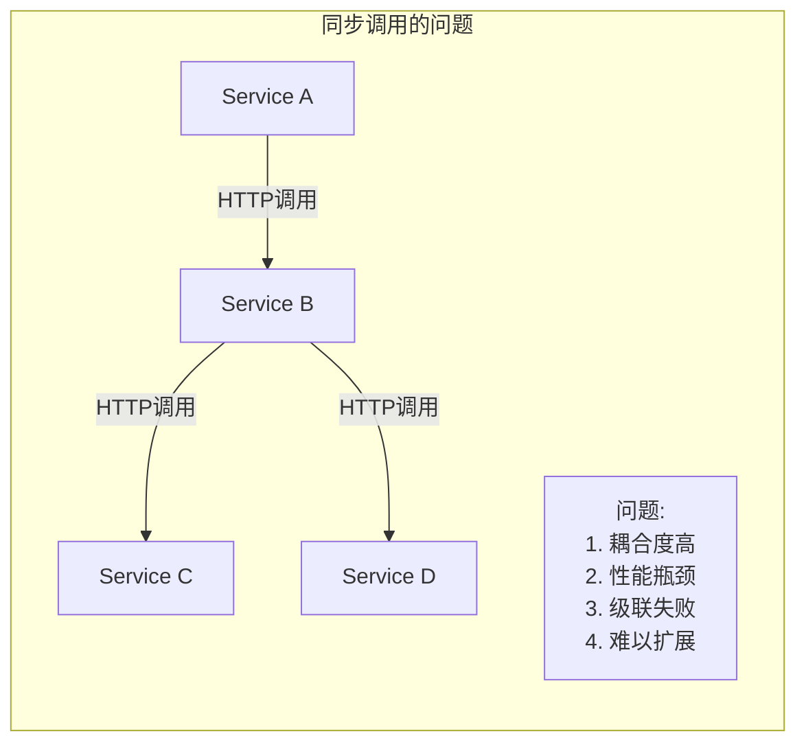
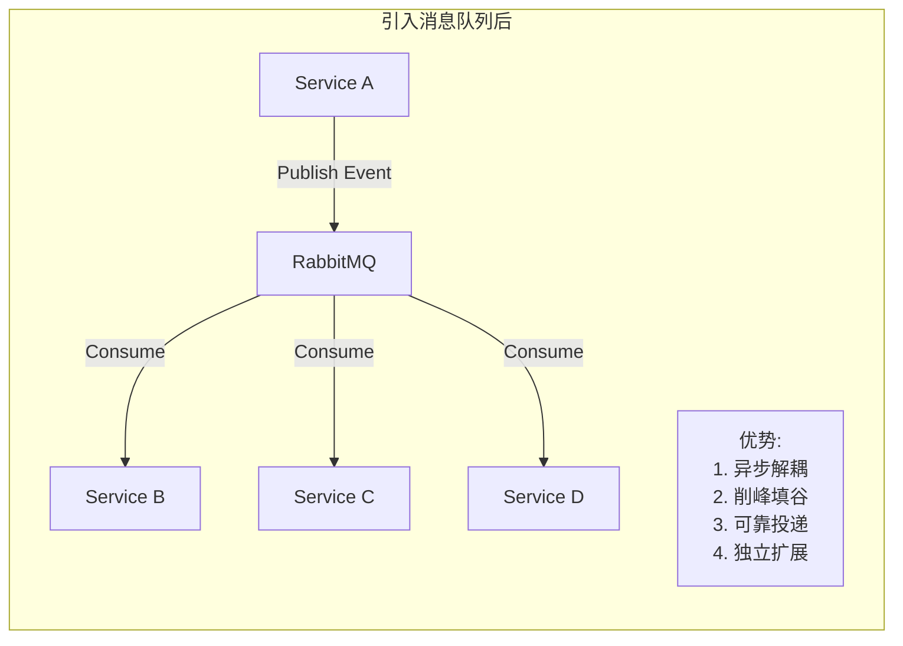
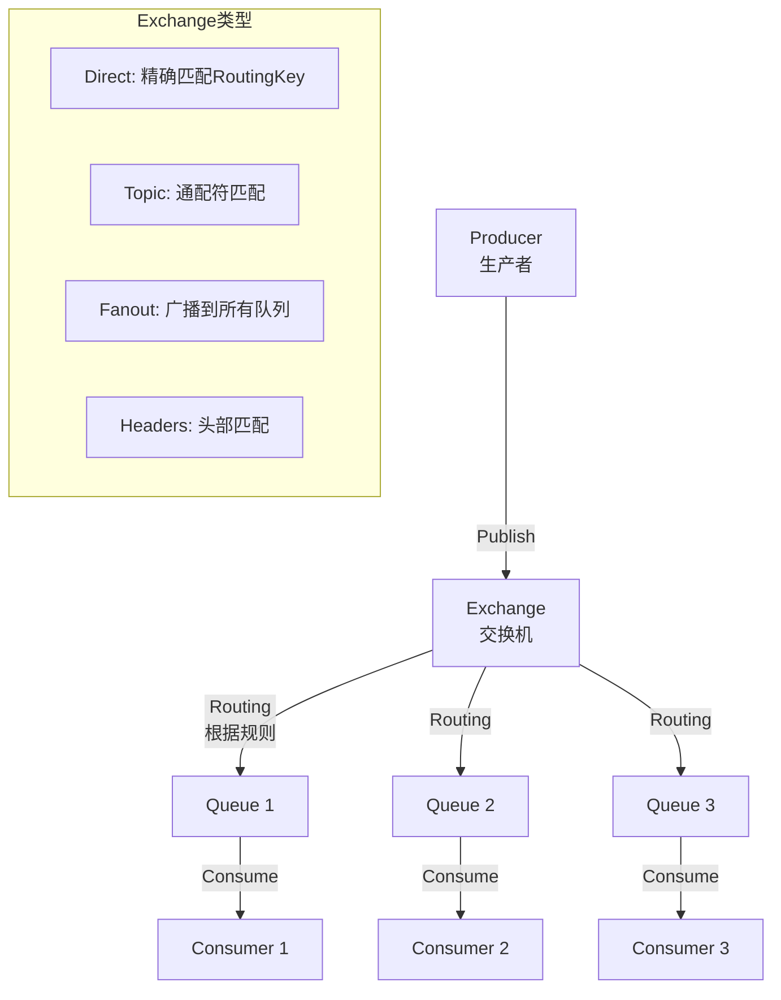
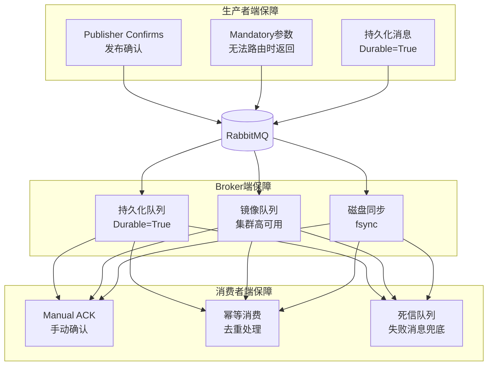

# CloudMall电商系统 - RabbitMQ消息队列集成

> **本篇导读**：本文深入讲解CloudMall微服务架构中RabbitMQ消息队列的完整集成方案，包括核心概念、事件设计、MassTransit库集成、发布者模式、消费者模式以及消息可靠性保障机制。消息队列是微服务异步解耦的核心基础设施。

## 目录

- [1. 为什么需要消息队列](#1-为什么需要消息队列)
- [2. RabbitMQ核心概念](#2-rabbitmq核心概念)
  - [2.1 核心组件详解](#21-核心组件详解)
  - [2.2 消息流转模型](#22-消息流转模型)
- [3. CloudMall事件设计（Domain Events）](#3-cloudmall事件设计domain-events)
- [4. 消息发布者模式（MassTransit集成）](#4-消息发布者模式masstransit集成)
- [5. 消费者模式](#5-消费者模式)
- [6. 消息可靠性保障](#6-消息可靠性保障)
- [7. 完整代码实现](#7-完整代码实现)
- [8. 测试要点](#8-测试要点)

---

## 1. 为什么需要消息队列

### 1.1 三大核心价值





### 1.2 CloudMall中的使用场景

| 场景 | 发布者 | 消费者 | 说明 |
|-----|-------|--------|------|
| 商品变更同步索引 | Product Service | Elasticsearch | 异步更新搜索索引 |
| 订单支付成功通知 | Payment Service | Order/Inventory/Notification | 触发后续业务流程 |
| 库存预警 | Inventory Service | Notification Service | 低库存告警 |
| 用户注册邮件 | Identity Service | Notification Service | 发送欢迎邮件 |
| 下单Saga协调 | Order Service | 各参与服务 | 分布式事务编排 |

---

## 2. RabbitMQ核心概念

### 2.1 架构总览



### 2.2 核心组件说明

| 组件 | 说明 | CloudMall使用方式 |
|-----|------|-----------------|
| **Broker** | RabbitMQ服务器实例 | Docker容器部署 |
| **Connection** | TCP连接 | 连接池管理 |
| **Channel** | 通道（轻量级连接） | 每个线程一个Channel |
| **Exchange** | 交换机（路由消息） | Topic类型为主 |
| **Queue** | 队列（存储消息） | 每个事件类型对应队列 |
| **Binding** | 绑定（Exchange→Queue规则） | RoutingKey绑定 |
| **Routing Key** | 路由键 | 格式：`{service}.{entity}.{action}` |
| **Message** | 消息体 + 属性 | JSON序列化 |

---

## 3. CloudMall事件设计

### 3.1 事件命名规范

```
格式：{Domain}{Entity}{Action}Event
示例：
- ProductCreatedEvent      (商品创建)
- ProductUpdatedEvent      (商品更新)
- OrderCreatedEvent        (订单创建)
- OrderPaidEvent           (订单支付成功)
- InventoryLockedEvent     (库存锁定)
- UserRegisteredEvent      (用户注册)
- PaymentCompletedEvent    (支付完成)
```

### 3.2 完整事件清单与消费者映射

```csharp
namespace CloudMall.Common.Events
{
    // ===== 商品域事件 =====
    public record ProductCreatedEvent(
        Guid ProductId, string Name, Guid CategoryId,
        Guid BrandId, DateTime CreatedAt) : IDomainEvent;

    public record ProductUpdatedEvent(
        Guid ProductId, string Name, DateTime UpdatedAt) : IDomainEvent;

    public record ProductDeletedEvent(
        Guid ProductId, DateTime DeletedAt) : IDomainEvent;

    // ===== 订单域事件 =====
    public record OrderCreatedEvent(
        Guid OrderId, string OrderNo, Guid UserId,
        decimal TotalAmount, int ItemCount, DateTime CreatedAt) : IDomainEvent;

    public record OrderPaidEvent(
        Guid OrderId, string OrderNo, Guid UserId,
        decimal TotalAmount, DateTime PaidAt) : IDomainEvent;

    public record OrderCancelledEvent(
        Guid OrderId, Guid UserId, string Reason,
        DateTime CancelledAt) : IDomainEvent;

    public record OrderShippedEvent(
        Guid OrderId, string TrackingNumber,
        string ShippingCompany) : IDomainEvent;

    // ===== 库存域事件 =====
    public record InventoryLockedEvent(
        Guid SkuId, Guid OrderId, string OrderNo,
        int LockedQuantity, int RemainingStock,
        DateTime LockedAt) : IDomainEvent;

    public record InventoryReleasedEvent(
        Guid SkuId, Guid OrderId, int ReleasedQuantity,
        int CurrentStock, DateTime ReleasedAt) : IDomainEvent;

    public record InventoryDeductedEvent(
        Guid SkuId, Guid OrderId, int DeductedQuantity,
        int CurrentStock, DateTime DeductedAt) : IDomainEvent;

    public record LowStockAlertEvent(
        Guid SkuId, int CurrentStock, int SafetyStock,
        DateTime AlertAt) : IDomainEvent;

    // ===== 支付域事件 =====
    public record PaymentCompletedEvent(
        Guid PaymentId, string PaymentNo, Guid OrderId,
        string OrderNo, Guid UserId, long AmountInCents,
        string Channel, string TradeNo, DateTime PaidAt) : IDomainEvent;

    public record PaymentRefundedEvent(
        Guid PaymentId, Guid OrderId, string RefundNo,
        long RefundAmount, string RefundType,
        DateTime RefundedAt) : IDomainEvent;

    // ===== 用户域事件 =====
    public record UserRegisteredEvent(
        Guid UserId, string Email, DateTime RegisteredAt) : IDomainEvent;

    public record UserLoggedInEvent(
        Guid UserId, string IpAddress, DateTime LoginAt) : IDomainEvent;

    /// <summary>
    /// 领域事件标记接口
    /// </summary>
    public interface IDomainEvent
    {
        Guid EventId { get; }
        DateTime OccurredAt { get; }
        string EventType { get; }
    }
}
```

### 3.3 事件-消费者路由矩阵

| 事件名 | Exchange | Routing Key | 消费者服务 | 处理动作 |
|--------|----------|-------------|-----------|---------|
| ProductCreated | `cloudmall.events` | `product.created` | Elasticsearch | 创建搜索索引 |
| ProductCreated | `cloudmall.events` | `product.created` | Redis | 预热缓存 |
| ProductUpdated | `cloudmall.events` | `product.updated` | Elasticsearch | 更新索引 |
| ProductUpdated | `cloudmall.events` | `product.updated` | Redis | 清除缓存 |
| OrderCreated | `cloudmall.events` | `order.created` | Notification | 发送确认邮件 |
| OrderPaid | `cloudmall.events` | `order.paid` | Inventory | 扣减库存 |
| OrderPaid | `cloudmall.events` | `order.paid` | Notification | 发送支付成功通知 |
| OrderCancelled | `cloudmall.events` | `order.cancelled` | Inventory | 释放库存 |
| OrderCancelled | `cloudmall.events` | `order.cancelled` | Notification | 发送取消通知 |
| InventoryLocked | `cloudmall.events` | `inventory.locked` | Notification | （可选）日志记录 |
| PaymentCompleted | `cloudmall.events` | `payment.completed` | Order | 更新订单为已支付 |
| UserRegistered | `cloudmall.events` | `user.registered` | Notification | 发送欢迎邮件 |

---

## 4. 消息发布者模式（MassTransit集成）

### 4.1 MassTransit配置

```csharp
// Program.cs - 所有服务的统一配置模板
using MassTransit;
using MassTransit.RabbitMqConfigurations;

var builder = WebApplication.CreateBuilder(args);

builder.Services.AddMassTransit(x =>
{
    // 注册当前程序集中的所有消费者
    x.AddConsumers(typeof(Program).Assembly);

    // 使用RabbitMQ作为传输层
    x.UsingRabbitMq((context, cfg) =>
    {
        // 连接配置
        cfg.Host(builder.Configuration["RabbitMQ:Host"], "/", h =>
        {
            h.Username(builder.Configuration["RabbitMQ:Username"]);
            h.Password(builder.Configuration["RabbitMQ:Password"]);

            // 生产环境启用SSL
            if (!builder.Environment.IsDevelopment())
            {
                h.UseSsl(s => s.ServerName = builder.Configuration["RabbitMQ:Host"]);
            }
        });

        // 消息序列化配置（使用System.Text.Json）
        cfg.UseJsonSerializer();
        cfg.UseJsonSerializerOptions(options =>
        {
            options.PropertyNamingPolicy = JsonNamingPolicy.CamelCase;
        });

        // 发布确认（Publisher Confirms）
        cfg.UsePublishConfirm();

        // 重试策略：指数退避
        cfg.UseMessageRetry(r => r.Interval(3, TimeSpan.FromSeconds(1)));

        // 配置端点和交换机
        cfg.ConfigureEndpoints(context,

            // 自定义名称格式器（kebab-case）
            new KebabCaseEndpointNameFormatter(false),

            // 交换机配置
            e =>
            {
                e.AutoDelete = false;
                e.Durable = true;
            },

            // 队列配置
            q =>
            {
                q.AutoDelete = false;
                q.Durable = true;
                // 设置死信交换机
                q.SetArgument("x-dead-letter-exchange",
                    "cloudmall.dlx");
                // 死信路由键
                q.SetArgument("x-dead-letter-routing-key", "#");
                // 消息过期时间（7天）
                q.SetArgument("x-message-ttl", 604800000);
            });

        // Prefetch count（每次从队列取出的消息数）
        cfg.PrefetchCount = 16;

        // 并发限制
        cfg.UseConcurrencyLimit(32);
    });
});

// 注册IBus接口用于手动发布
builder.Services.AddTransient<IBus>(p => p.GetRequiredService<IBus>());
```

### 4.2 EventBus封装

```csharp
using System.Threading.Tasks;
using MassTransit;
using Microsoft.Extensions.Logging;

namespace CloudMall.Common.Messaging
{
    /// <summary>
    /// 事件总线接口
    /// 提供简洁的事件发布API，屏蔽MassTransit细节
    /// </summary>
    public interface IEventBus
    {
        /// <summary>
        /// 发布领域事件（Fire-and-Forget模式）
        /// 不等待确认，适合非关键业务场景
        /// </summary>
        Task PublishAsync<TEvent>(TEvent @event) where TEvent : class;

        /// <summary>
        /// 发布事件并等待确认
        /// 适用于关键业务场景
        /// </summary>
        Task PublishAndWaitAsync<TEvent>(TEvent @event)
            where TEvent : class;

        /// <summary>
        /// 发送命令消息（点对点）
        /// </summary>
        Task SendAsync<TCommand>(string destination, TCommand command)
            where TCommand : class;
    }

    /// <summary>
    /// 基于RabbitMQ + MassTransit的事件总线实现
    /// </summary>
    public class RabbitMqEventBus : IEventBus
    {
        private readonly IBus _bus;
        private readonly IPublishEndpoint _publishEndpoint;
        private readonly ISendEndpointProvider _sendEndpointProvider;
        private readonly ILogger<RabbitMqEventBus> _logger;

        public RabbitMqEventBus(
            IBus bus,
            IPublishEndpoint publishEndpoint,
            ISendEndpointProvider sendEndpointProvider,
            ILogger<RabbitMqEventBus> logger)
        {
            _bus = bus;
            _publishEndpoint = publishEndpoint;
            _sendEndpointProvider = sendEndpointProvider;
            _logger = logger;
        }

        public async Task PublishAsync<TEvent>(TEvent @event) where TEvent : class
        {
            var eventType = typeof(TEvent).Name;

            try
            {
                await _publishEndpoint.Publish(@event);

                _logger.LogDebug(
                    "事件已发布: {EventType}, CorrelationId={CorrelationId}",
                    eventType,
                    GetEventId(@event));
            }
            catch (Exception ex)
            {
                _logger.LogError(ex,
                    "事件发布失败: {EventType}", eventType);
                throw;  // 让调用者决定是否忽略
            }
        }

        public async Task PublishAndWaitAsync<TEvent>(TEvent @event)
            where TEvent : class
        {
            try
            {
                await _publishEndpoint.Publish(@event,
                    context =>
                    {
                        // 设置超时
                        context.TimeToLive = TimeSpan.FromSeconds(30);
                    });
            }
            catch (Exception ex)
            {
                _logger.LogError(ex,
                    "事件发布（等待确认）失败: {EventType}",
                    typeof(TEvent).Name);
                throw;
            }
        }

        public async Task SendAsync<TCommand>(
            string destination, TCommand command) where TCommand : class
        {
            var endPoint = await _sendEndpointProvider
                .GetSendEndpoint(new Uri(destination));

            await endPoint.Send(command);
        }

        private static object GetEventId(object @event)
        {
            return @event.GetType()
                .GetProperty("EventId")?.GetValue(@event)
                ?? "unknown";
        }
    }
}
```

### 4.3 发布者使用示例

```csharp
// 在Product Service中发布商品创建事件
public class ProductService : IProductService
{
    private readonly IEventBus _eventBus;

    public async Task<ProductResponseDto> CreateAsync(CreateProductRequestDto dto)
    {
        // ... 业务逻辑 ...

        // 保存到数据库后发布事件
        var product = await _repository.AddAsync(productEntity);

        // 发布商品创建事件
        await _eventBus.PublishAsync(new ProductCreatedEvent
        {
            ProductId = product.Id,
            Name = product.Name,
            CategoryId = product.CategoryId,
            BrandId = product.BrandId,
            CreatedAt = product.CreatedAt
        });

        return MapToDto(product);
    }
}
```

---

## 5. 消费者模式

### 5.1 消费者基类设计

```csharp
using System.Threading.Tasks;
using MassTransit;
using Microsoft.Extensions.Logging;

namespace CloudMall.Common.Messaging.Consumers
{
    /// <summary>
    /// 基础消费者抽象类
    /// 提供统一的日志、错误处理和指标收集
    /// </summary>
    public abstract class BaseConsumer<TEvent> : IConsumer<TEvent>
        where TEvent : class
    {
        protected readonly ILogger Logger;
        protected readonly string ConsumerName;

        protected BaseConsumer(ILogger logger)
        {
            Logger = logger;
            ConsumerName = GetType().Name.Replace("Consumer", "");
        }

        public async Task Consume(ConsumeContext<TEvent> context)
        {
            var eventId = GetEventId(context.Message);
            var eventName = typeof(TEvent).Name;

            Logger.LogInformation(
                "[{Consumer}] 开始处理事件: {Event}, EventId={EventId}, " +
                "MessageId={MessageId}",
                ConsumerName, eventName, eventId, context.MessageId);

            var stopwatch = System.Diagnostics.Stopwatch.StartNew();

            try
            {
                // 幂等性检查
                if (await IsDuplicateAsync(eventId))
                {
                    Logger.LogWarning(
                        "[{Consumer}] 重复事件，跳过: EventId={EventId}",
                        ConsumerName, eventId);
                    return;
                }

                // 执行具体的消费逻辑
                await HandleAsync(context.Message, context.CancellationToken);

                stopwatch.Stop();

                Logger.LogInformation(
                    "[{Consumer}] 事件处理完成: {Event}, EventId={EventId}, " +
                    "耗时={ElapsedMs}ms",
                    ConsumerName, eventName, eventId,
                    stopwatch.ElapsedMilliseconds);
            }
            catch (Exception ex)
            {
                stopwatch.Stop();

                Logger.LogError(ex,
                    "[{Consumer}] 事件处理失败: {Event}, EventId={EventId}, " +
                    "耗时={ElapsedMs}ms, Error={Error}",
                    ConsumerName, eventName, eventId,
                    stopwatch.ElapsedMilliseconds, ex.Message);

                // 根据异常类型决定是否重抛（触发MassTransit重试）
                if (IsRecoverable(ex))
                {
                    throw;  // MassTransit会自动重试
                }
                else
                {
                    // 不可恢复的错误：记录到死信队列
                    Logger.LogCritical(ex,
                        "[{Consumer}] 不可恢复的错误! EventId={EventId}, " +
                        "消息将进入死信队列",
                        ConsumerName, eventId);
                    throw;
                }
            }
        }

        /// <summary>
        /// 子类实现的具体处理逻辑
        /// </summary>
        protected abstract Task HandleAsync(TEvent @event,
            CancellationToken cancellationToken);

        /// <summary>
        /// 幂等性检查（子类可覆盖）
        /// 默认实现：基于EventId的去重
        /// </summary>
        protected virtual Task<bool> IsDuplicateAsync(string eventId)
        {
            return Task.FromResult(false);  // 默认不检查
        }

        /// <summary>
        /// 判断异常是否可恢复
        /// </summary>
        protected virtual bool IsRecoverable(Exception ex)
        {
            // 网络超时、临时不可用 → 可重试
            // 数据校验错误、业务逻辑错误 → 不可重试
            return ex is TimeoutException
                or HttpRequestException
                or Npgsql.NpgsqlException;
        }

        private static string GetEventId(object message)
        {
            return message.GetType().GetProperty("EventId")
                ?.GetValue(message)?.ToString() ?? "unknown";
        }
    }
}
```

### 5.2 具体消费者实现示例

```csharp
using System.Threading.Tasks;
using CloudMall.Common.Events;
using CloudMall.Notification.Infrastructure.Services;
using MassTransit;

namespace CloudMall.Notification.Consumers
{
    /// <summary>
    /// 订单支付成功事件消费者
    /// 负责发送支付成功通知给用户
    /// </summary>
    public class OrderPaidEventConsumer : BaseConsumer<OrderPaidEvent>
    {
        private readonly INotificationService _notificationService;

        public OrderPaidEventConsumer(
            ILogger<OrderPaidEventConsumer> logger,
            INotificationService notificationService)
            : base(logger)
        {
            _notificationService = notificationService;
        }

        protected override async Task HandleAsync(
            OrderPaidEvent @event, CancellationToken cancellationToken)
        {
            // 发送支付成功通知
            await _notificationService.SendPaymentSuccessNotificationAsync(
                new PaymentSuccessNotificationDto
                {
                    UserId = @event.UserId,
                    OrderId = @event.OrderId,
                    OrderNo = @event.OrderNo,
                    Amount = @event.TotalAmount,
                    PaidAt = @event.PaidAt
                });
        }
    }

    /// <summary>
    /// 商品创建事件消费者
    /// 负责发送新商品上架通知（可选）
    /// </summary>
    public class ProductCreatedEventConsumer : BaseConsumer<ProductCreatedEvent>
    {
        private readonly INotificationService _notificationService;

        public ProductCreatedEventConsumer(
            ILogger<ProductCreatedEventConsumer> logger,
            INotificationService notificationService)
            : base(logger)
        {
            _notificationService = notificationService;
        }

        protected override async Task HandleAsync(
            ProductCreatedEvent @event, CancellationToken cancellationToken)
        {
            // 可选：向运营人员发送新商品上架通知
            if (@event.IsRecommended)
            {
                await _notificationService.SendAdminNotificationAsync(
                    $"推荐商品上架: {@event.Name}");
            }
        }
    }

    /// <summary>
    /// 库存预警事件消费者
    /// 负责发送低库存告警
    /// </summary>
    public class LowStockAlertEventConsumer : BaseConsumer<LowStockAlertEvent>
    {
        private readonly IAlertService _alertService;

        public LowStockAlertEventConsumer(
            ILogger<LowStockAlertEventConsumer> logger,
            IAlertService alertService)
            : base(logger)
        {
            _alertService = alertService;
        }

        protected override async Task HandleAsync(
            LowStockAlertEvent @event, CancellationToken cancellationToken)
        {
            await _alertService.SendLowStockAlertAsync(new StockAlertDto
            {
                SkuId = @event.SkuId,
                CurrentStock = @event.CurrentStock,
                SafetyStock = @event.SafetyStock,
                AlertLevel = @event.CurrentStock <= 0 ? AlertLevel.Critical :
                           @event.CurrentStock <= @event.SafetyStock / 2
                               ? AlertLevel.Warning : AlertLevel.Info
            });
        }
    }
}
```

### 5.3 死信队列(DLQ)处理器

```csharp
/// <summary>
    /// 死信队列消费者
    /// 处理所有无法正常消费的消息
    /// 用于人工排查和修复
    /// </summary>
public class DeadLetterQueueConsumer : IConsumer<Fault<INotificationSent>>
{
    private readonly ILogger<DeadLetterQueueConsumer> _logger;
    private readonly IDeadLetterRepository _deadLetterRepo;

    public DeadLetterQueueConsumer(
        ILogger<DeadLetterQueueConsumer> logger,
        IDeadLetterRepository deadLetterRepo)
    {
        _logger = logger;
        _deadLetterRepo = deadLetterRepo;
    }

    public async Task Consume(
        ConsumeContext<Fault<INotificationSent>> context)
    {
        var fault = context.Message;
        var originalMessage = fault.Message;

        _logger.LogError(
            "消息进入死信队列! MessageType={Type}, MessageId={Id}, " +
            "Exceptions={@Exceptions}, Timestamp={Timestamp}",
            originalMessage.GetType().Name,
            context.MessageId,
            fault.Exceptions.Select(e => new
            {
                e.ExceptionType,
                e.Message,
                e.SourceContext
            }),
            fault.Timestamp);

        // 持久化到数据库，方便后续查看和处理
        await _deadLetterRepo.SaveAsync(new DeadLetterRecord
        {
            Id = Guid.NewGuid(),
            OriginalMessageId = context.MessageId?.ToString(),
            MessageType = originalMessage.GetType().FullName,
            MessageBody = JsonSerializer.Serialize(originalMessage),
            Exceptions = JsonSerializer.Serialize(fault.Exceptions),
            FaultTimestamp = fault.Timestamp,
            ReceivedAt = DateTime.UtcNow,
            RetryCount = fault.RetryCount,
            Status = DeadLetterStatus.PendingReview
        });
    }
}
```

---

## 6. 消息可靠性保障

### 6.1 可靠性保障体系



### 6.2 关键配置代码

```csharp
// 可靠性配置增强版
cfg.ConfigureEndpoints(context,
    new KebabCaseEndpointNameFormatter(false),

    // Exchange: 持久化 + 不自动删除
    configurator =>
    {
        configurator.AutoDelete = false;
        configurator.Durable = true;
    },

    // Queue: 持久化 + 不自动删除 + DLQ配置
    configurator =>
    {
        configurator.AutoDelete = false;
        configurator.Durable = true;

        // 死信交换机配置
        configurator.SetArgument("x-dead-letter-exchange", "cloudmall.dlx");
        configurator.SetArgument("x-dead-letter-routing-key", "#");

        // 消息最大长度
        configurator.SetArgument("x-max-length", 10000);

        // 消息TTL（默认7天）
        configurator.SetArgument("x-message-ttl", 604800000);
    });

// 消费者配置：手动ACK + 重试策略
cfg.ConfigureConsumer<SomeConsumer>(consumer =>
{
    // 手动确认模式
    consumer.UseMessageRetry(r => r.Interval(5, TimeSpan.FromSeconds(2)));

    consumer.Options<ReceiveEndpointOptions>(options =>
    {
        options.PrefetchCount = 8;
    });
});
```

### 6.3 幂等消费者实现

```csharp
/// <summary>
/// 幂等消费者基类
/// 通过Redis Set实现消息去重
/// </summary>
public abstract class IdempotentConsumer<TEvent> : BaseConsumer<TEvent>
    where TEvent : class
{
    private readonly IDistributedCache _cache;
    private const string IDEMPOTENCY_PREFIX = "mq:idemp:";

    protected IdempotentConsumer(
        ILogger logger, IDistributedCache cache) : base(logger)
    {
        _cache = cache;
    }

    protected override async Task<bool> IsDuplicateAsync(string eventId)
    {
        var key = $"{IDEMPOTENCY_PREFIX}{eventId}";

        // 检查是否已处理过
        var existing = await _cache.GetStringAsync(key);
        if (existing != null)
            return true;

        // 标记为已处理（设置30天过期）
        await _cache.SetStringAsync(key, "processed",
            new DistributedCacheEntryOptions
            {
                AbsoluteExpirationRelativeToNow = TimeSpan.FromDays(30)
            });

        return false;
    }
}
```

---

## 7. 完整代码实现

### 7.1 appsettings.json中的RabbitMQ配置

```json
{
  "RabbitMQ": {
    "Host": "rabbitmq",
    "Username": "guest",
    "Password": "guest",
    "VirtualHost": "/",
    "Port": 5672,
    "ManagementPort": 15672
  },
  "MassTransit": {
    "PrefetchCount": 16,
    "ConcurrencyLimit": 32,
    "RetryCount": 3,
    "RetryIntervalSeconds": 1
  }
}
```

### 7.2 docker-compose中RabbitMQ服务定义

```yaml
# 详见第10篇完整docker-compose.yml
services:
  rabbitmq:
    image: rabbitmq:3.12-management-alpine
    container_name: cloudmall-rabbitmq
    ports:
      - "5672:5672"   # AMQP端口
      - "15672:15672" # Management UI端口
    environment:
      RABBITMQ_DEFAULT_USER: guest
      RABBITMQ_DEFAULT_PASSWORD: guest
      RABBITMQ_DEFAULT_VHOST: /
    volumes:
      - rabbitmq_data:/var/lib/rabbitmq
      - ./rabbitmq/definitions.json:/etc/rabbitmq/definitions.json:ro
      - ./rabbitmq/conf:/etc/rabbitmq/conf.d/:ro
    healthcheck:
      test: ["CMD", "rabbitmq-diagnostics", "-q", "ping"]
      interval: 10s
      timeout: 5s
      retries: 5
    networks:
      - cloudmall-network
```

---

## 8. 测试要点

### 8.1 功能测试场景

| 场景 | 验证点 | 优先级 |
|-----|-------|--------|
| 正常发布+消费 | 事件正确到达消费者 | P0 |
| 消费者处理异常 | 消息进入重试队列 | P0 |
| 重试耗尽 | 消息进入死信队列 | P0 |
| 重复消息 | 幂等检查生效，不重复处理 | P0 |
| Broker宕机恢复 | 持久化消息不丢失 | P0 |
| 消费者离线 | 消息堆积，上线后正常消费 | P0 |
| 大量消息积压 | 消费速率正常，无内存溢出 | P1 |
| 多实例消费 | 负载均衡分配 | P1 |

### 8.2 性能基准目标

| 指标 | 目标值 |
|-----|--------|
| 发布延迟（P99） | < 10ms |
| 消费延迟（P99） | < 50ms |
| 吞吐量 | > 50000 msg/s |
| 消息丢失率 | 0% |
| Broker可用性 | 99.9% |

---

## 总结

本文详细讲解了CloudMall中RabbitMQ消息队列的完整集成：

1. **核心价值**：异步解耦、削峰填谷、可靠投递
2. **事件设计**：统一的Domain Events规范、命名约定、路由矩阵
3. **发布者模式**：MassTransit + EventBus封装、Fire-and-Forget/Publish-Confirm
4. **消费者模式**：BaseConsumer基类、统一日志/错误处理/指标
5. **可靠性保障**：Publisher Confirms + Manual ACK + 幂等 + DLQ

**下一篇预告**：[09-Saga分布式事务实战](./09-Saga分布式事务实战.md) - 深入讲解如何利用消息队列编排跨服务的分布式事务。

---

> **双向链接**：
> - [[../02-架构篇/03-消息队列与事件驱动]] - 消息队列基础知识
> - [[04-订单服务(Order Service)](./04-订单服务(Order%20Service).md)] - Saga事务的使用方
> - [[01-系统架构与技术选型](./01-系统架构与技术选型.md)] - 项目总览
> - [[09-Saga分布式事务实战](./09-Saga分布式事务实战.md)] - 下一篇文章
