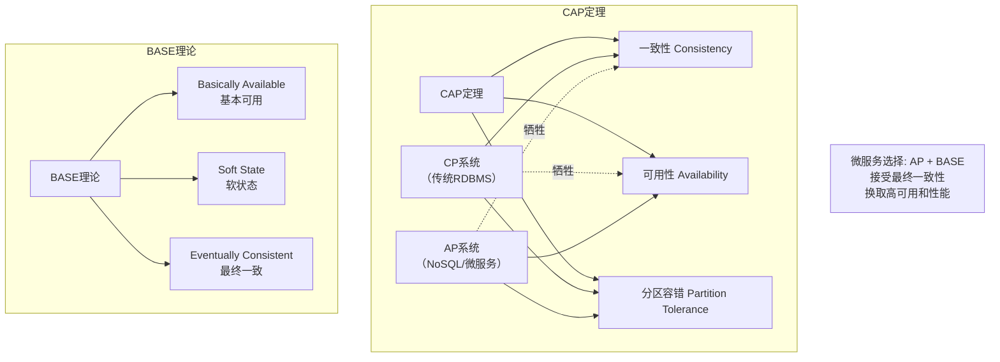
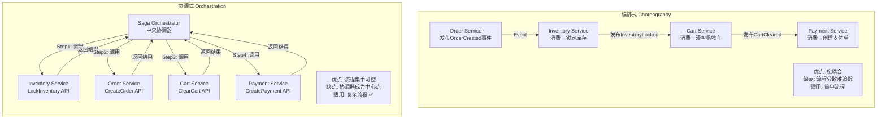
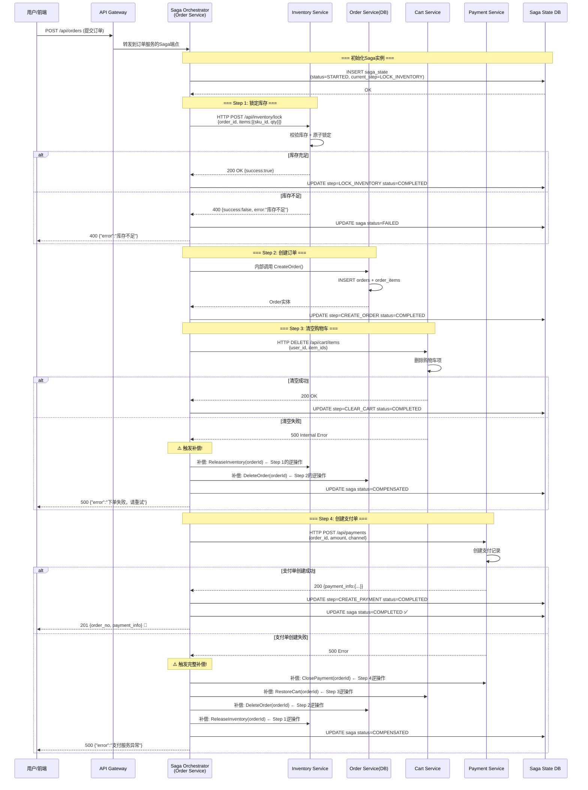
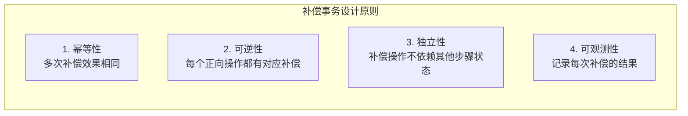

# CloudMall电商系统 - Saga分布式事务实战

> **本篇导读**：本文是CloudMall微服务电商实战系列的核心理论篇章，深入讲解分布式事务的难题、Saga模式的两种实现方式（编排式Choreography vs 协调式Orchestration），并以CloudMall下单全流程为例，详细展示Saga编排器、补偿事务、状态持久化和超时处理的完整实现。

## 目录

- [1. 分布式事务难题](#1-分布式事务难题)
  - [1.1 CAP定理与BASE理论](#11-cap定理与base理论)
  - [1.2 为什么不能使用2PC/3PC](#12-为什么不能使用2pc3pc)
- [2. Saga模式详解](#2-saga模式详解)
  - [2.1 编排式(Choreography)](#21-编排式choreography)
  - [2.2 协调式(Orchestration)](#22-协调式orchestration)
  - [2.3 CloudMall选型：协调式Saga](#23-cloudmall选型协调式saga)
- [3. CloudMall下单Saga流程](#3-cloudmall下单saga流程)
  - [3.1 完整时序图](#31-完整时序图)
  - [3.2 各步骤详细说明](#32-各步骤详细说明)
- [4. 补偿事务设计](#4-补偿事务设计)
- [5. Saga状态持久化](#5-saga状态持久化)
- [6. 超时处理机制](#6-超时处理机制)
- [7. 完整代码实现](#7-完整代码实现)
- [8. 测试要点](#8-测试要点)

---

## 1. 分布式事务难题

### 1.1 CAP定理与BASE理论



### 1.2 传统分布式事务方案的局限性

| 方案 | 原理 | 问题 |
|-----|------|------|
| **2PC (两阶段提交)** | Prepare → Commit/Rolllock | 所有参与者阻塞，单点故障风险大 |
| **3PC (三阶段提交)** | CanCommit → PreCommit → DoCommit | 网络分区时仍可能阻塞 |
| **XA (JTA)** | 资源管理器协调 | 长事务锁定资源，性能差 |
| **TCC (Try-Confirm-Cancel)** | 三阶段业务补偿 | 代码侵入性强，开发成本高 |

**结论**：CloudMall采用**Saga模式**，通过**补偿事务**实现最终一致性。

---

## 2. Saga模式详解

### 2.1 编排式 vs 协调式对比



### 2.2 详细对比表

| 维度 | 编排式(Choreography) | 协调式(Orchestration) |
|-----|---------------------|----------------------|
| **复杂度** | 低 | 中 |
| **耦合度** | 低（仅依赖事件） | 中（依赖协调器） |
| **可观测性** | 差（分散在各服务） | 好（集中管理状态） |
| **流程变更** | 需修改多个服务 | 只修改协调器 |
| **事务顺序** | 难以保证 | 容易控制 |
| **补偿逻辑** | 分散在各自服务 | 集中在协调器 |
| **适用场景** | 2-3步简单流程 | **4步以上复杂流程** |
| **CloudMall选择** | 辅助使用 | **主要使用** |

---

## 3. CloudMall下单Saga流程

### 3.1 完整时序图



### 3.2 步骤定义

```csharp
namespace CloudMall.Saga.Orchestration.Steps
{
    /// <summary>
    /// CloudMall下单Saga步骤定义
    /// </summary>
    public static class CreateOrderSagaSteps
    {
        // 正向操作步骤
        public const string LOCK_INVENTORY = "LockInventory";
        public const string CREATE_ORDER = "CreateOrder";
        public const string CLEAR_CART = "ClearCart";
        public const string CREATE_PAYMENT = "CreatePayment";

        // 所有的正向步骤（按执行顺序）
        public static readonly List<string> ForwardSteps = new()
        {
            LOCK_INVENTORY,
            CREATE_ORDER,
            CLEAR_CART,
            CREATE_PAYMENT
        };

        // 补偿操作映射（正向步骤 → 补偿方法）
        public static readonly Dictionary<string, string>
            CompensationMap = new()
        {
            { CREATE_PAYMENT, "ClosePayment" },
            { CLEAR_CART, "RestoreCart" },
            { CREATE_ORDER, "DeleteOrder" },
            { LOCK_INVENTORY, "ReleaseInventory" }
        };

        // 每步的超时时间（秒）
        public static readonly Dictionary<string, int>
            StepTimeouts = new()
        {
            { LOCK_INVENTORY, 5 },
            { CREATE_ORDER, 10 },
            { CLEAR_CART, 5 },
            { CREATE_PAYMENT, 10 }
        };
    }
}
```

---

## 4. 补偿事务设计

### 4.1 补偿事务原则



### 4.2 补偿接口定义

```csharp
using System.Threading.Tasks;
using CloudMall.Saga.Orchestration.DTOs;

namespace CloudMall.Saga.Orchestration.Compensation
{
    /// <summary>
    /// 补偿操作接口
    /// 每个参与Saga的服务都需要实现此接口
    /// </summary>
    public interface ICompensationHandler
    {
        /// <summary>
        /// 处理名（对应步骤名）
        /// </summary>
        string HandlerName { get; }

        /// <summary>
        /// 执行补偿操作
        /// </summary>
        Task<CompensationResult> CompensateAsync(
            CompensateRequest request);
    }

    /// <summary>
    /// 补偿请求
    /// </summary>
    public class CompensateRequest
    {
        public Guid SagaId { get; set; }
        public Guid OrderId { get; set; }
        public string StepName { get; set; }
        public object OriginalRequestData { get; set; }  // 原始请求数据
        public DateTime OriginalExecuteTime { get; set; } // 原始执行时间
    }

    /// <summary>
    /// 补偿结果
    /// </summary>
    public class CompensationResult
    {
        public bool Success { get; set; }
        public string ErrorMessage { get; set; }
        public object CompensationData { get; set; }

        public static CompensationResult Ok() => new() { Success = true };
        public static CompensationResult Fail(string error) =>
            new() { Success = false, ErrorMessage = error };
    }
}
```

### 4.3 各服务补偿处理器实现

```csharp
/// <summary>
/// 库存释放补偿处理器
/// 对应正向操作：LockInventory
/// </summary>
public class InventoryReleaseCompensationHandler : ICompensationHandler
{
    private readonly IInventoryService _inventoryService;
    private readonly ILogger _logger;

    public string HandlerName => CreateOrderSagaSteps.LOCK_INVENTORY;

    public InventoryReleaseCompensationHandler(
        IInventoryService inventoryService,
        ILogger<InventoryReleaseCompensationHandler> logger)
    {
        _inventoryService = inventoryService;
        _logger = logger;
    }

    public async Task<CompensationResult> CompensateAsync(
        CompensateRequest request)
    {
        _logger.LogInformation(
            "[补偿] 释放库存: SagaId={SagaId}, OrderId={OrderId}",
            request.SagaId, request.OrderId);

        try
        {
            var lockItems = ((List<InventoryLockItemDto>)
                request.OriginalRequestData);

            foreach (var item in lockItems)
            {
                await _inventoryService.ReleaseAsync(new ReleaseRequest
                {
                    SkuId = item.SkuId,
                    OrderId = request.OrderId,
                    Reason = $"Saga补偿: {request.SagaId}"
                });
            }

            return CompensationResult.Ok();
        }
        catch (Exception ex)
        {
            _logger.LogError(ex,
                "[补偿] 库存释放失败! SagaId={SagaId}, OrderId={OrderId}",
                request.SagaId, request.OrderId);

            return CompensationResult.Fail(ex.Message);
        }
    }
}

/// <summary>
/// 订单删除补偿处理器
/// 对应正向操作：CreateOrder
/// </summary>
public class OrderDeleteCompensationHandler : ICompensationHandler
{
    private readonly IOrderRepository _orderRepo;
    private readonly ILogger _logger;

    public string HandlerName => CreateOrderSagaSteps.CREATE_ORDER;

    public async Task<CompensationResult> CompensateAsync(
        CompensateRequest request)
    {
        try
        {
            await _orderRepo.DeleteAsync(request.OrderId);
            return CompensationResult.Ok();
        }
        catch (Exception ex)
        {
            _logger.LogError(ex, "[补偿] 删除订单失败: {OrderId}", request.OrderId);
            return CompensationResult.Fail(ex.Message);
        }
    }
}

/// <summary>
/// 购物车恢复补偿处理器
/// 对应正向操作：ClearCart
/// </summary>
public class CartRestoreCompensationHandler : ICompensationHandler
{
    private readonly ICartService _cartService;
    private readonly ILogger _logger;

    public string HandlerName => CreateOrderSagaSteps.CLEAR_CART;

    public async Task<CompensationResult> CompensateAsync(
        CompensateRequest request)
    {
        try
        {
            // 从Saga状态中获取原始购物车数据并恢复
            await _cartService.RestoreCartAsync(request.OrderId);
            return CompensationResult.Ok();
        }
        catch (Exception ex)
        {
            _logger.LogError(ex, "[补偿] 恢复购物车失败");
            return CompensationResult.Fail(ex.Message);
        }
    }
}

/// <summary>
/// 支付单关闭补偿处理器
/// 对应正向操作：CreatePayment
/// </summary>
public class PaymentCloseCompensationHandler : ICompensationHandler
{
    private readonly IPaymentService _paymentService;
    private readonly ILogger _logger;

    public string HandlerName => CreateOrderSagaSteps.CREATE_PAYMENT;

    public async Task<CompensationResult> CompensateAsync(
        CompensateRequest request)
    {
        try
        {
            await _paymentService.ClosePaymentAsync(request.OrderId);
            return CompensationResult.Ok();
        }
        catch (Exception ex)
        {
            _logger.LogError(ex, "[补偿] 关闭支付单失败");
            return CompensationResult.Fail(ex.Message);
        }
    }
}
```

---

## 5. Saga状态持久化

### 5.1 数据模型

```csharp
namespace CloudMall.Saga.Orchestration.Models
{
    /// <summary>
    /// Saga状态实体
    /// 持久化到数据库，支持故障恢复
    /// </summary>
    public class SagaState
    {
        public Guid Id { get; set; }              // Saga实例ID
        public string SagaType { get; set; }      // 类型: CreateOrderSaga
        public Guid CorrelationId { get; set; }   // 关联的业务ID（如OrderId）
        public Guid UserId { get; set; }          // 触发用户
        public SagaStatus Status { get; set; }     // 整体状态
        public string CurrentStep { get; set; }   // 当前正在执行的步骤
        public string Payload { get; set; }       // 原始请求JSON
        public string Result { get; set; }        // 结果JSON
        public string ErrorMessages { get; set; } // 错误信息
        public int CurrentRetryCount { get; set; } // 当前重试次数
        public DateTime StartedAt { get; set; }
        public DateTime? CompletedAt { get; set; }
        public DateTime CreatedAt { get; set; }
        public DateTime UpdatedAt { get; set; }

        // 步骤状态集合
        public ICollection<SagaStepState> Steps { get; set; }
    }

    public class SagaStepState
    {
        public Guid Id { get; set; }
        public Guid SagaId { get; set; }
        public string StepName { get; set; }
        public SagaStepStatus Status { get; set; }
        public DateTime? StartedAt { get; set; }
        public DateTime? CompletedAt { get; set; }
        public string RequestData { get; set; }
        public string ResponseData { get; set; }
        public string ErrorMessage { get; set; }
        public int RetryCount { get; set; }
        public int SortOrder { get; set; }
    }

    public enum SagaStatus
    {
        Pending,           // 待处理
        Started,           // 执行中
        Completed,         // 成功完成
        Failed,            // 执行失败
        Compensating,      // 补偿中
        CompensationFailed,// 补偿部分失败
        TimedOut           // 超时
    }

    public enum SagaStepStatus
    {
        Pending,       // 待执行
        Started,       // 执行中
        Completed,     // 成功完成
        Failed,        // 失败
        Compensating,  // 补偿中
        Compensated    // 已补偿
    }
}
```

### 5.2 EF Core配置

```csharp
protected override void OnModelCreating(ModelBuilder modelBuilder)
{
    modelBuilder.Entity<SagaState>(entity =>
    {
        entity.ToTable("saga_states");

        entity.HasKey(e => e.Id);

        entity.HasIndex(e => e.SagaType);
        entity.HasIndex(e => e.Status);
        entity.HasIndex(e => e.CorrelationId);

        entity.Property(e => e.Payload).HasColumnType("jsonb");
        entity.Property(e => e.Result).HasColumnType("jsonb");
    });

    modelBuilder.Entity<SagaStepState>(entity =>
    {
        entity.ToTable("saga_step_states");

        entity.HasKey(e => e.Id);

        entity.HasOne<SagaState>()
            .WithMany(s => s.Steps)
            .HasForeignKey(e => e.SagaId)
            .OnDelete(DeleteBehavior.Cascade);

        entity.HasIndex(e => new { e.SagaId, e.StepName })
            .IsUnique();
    });
}
```

---

## 6. 超时处理机制

```csharp
/// <summary>
/// Saga超时检测后台服务
/// 定期扫描超时的Saga实例并触发补偿
/// </summary>
public class SagaTimeoutHostedService : BackgroundService
{
    private readonly ISagaStateManager _stateManager;
    private readonly ISagaOrchestrator _orchestrator;
    private readonly ILogger<SagaTimeoutHostedService> _logger;

    // 配置
    private const int CHECK_INTERVAL_SECONDS = 30;   // 检查间隔
    private const int GLOBAL_TIMEOUT_MINUTES = 30;   // 全局超时时间

    public SagaTimeoutHostedService(
        ISagaStateManager stateManager,
        ISagaOrchestrator orchestrator,
        ILogger<SagaTimeoutHostedService> logger)
    {
        _stateManager = stateManager;
        _orchestrator = orchestrator;
        _logger = logger;
    }

    protected override async Task ExecuteAsync(
        CancellationToken stoppingToken)
    {
        while (!stoppingToken.IsCancellationRequested)
        {
            try
            {
                await Task.Delay(
                    TimeSpan.FromSeconds(CHECK_INTERVAL_SECONDS),
                    stoppingToken);

                await CheckAndHandleTimeoutsAsync();
            }
            catch (OperationCanceledException)
            {
                break;
            }
            catch (Exception ex)
            {
                _logger.LogError(ex, "Saga超时检查异常");
            }
        }
    }

    private async Task CheckAndHandleTimeoutsAsync()
    {
        // 查找所有Started状态且超过全局超时的Saga
        var timedOutSagas = await _stateManager
            .GetTimedOutSagasAsync(GLOBAL_TIMEOUT_MINUTES);

        foreach (var saga in timedOutSagas)
        {
            _logger.LogWarning(
                "[超时检测] Saga超时! SagaId={SagaId}, Type={Type}, " +
                "Started={Started}, CurrentStep={Step}",
                saga.Id, saga.SagaType, saga.StartedAt, saga.CurrentStep);

            try
            {
                // 标记为超时状态
                await _stateManager.UpdateStatusAsync(
                    saga.Id, SagaStatus.TimedOut,
                    $"Saga全局超时({GLOBAL_TIMEOUT_MINUTES}分钟), " +
                    $"当前停在步骤: {saga.CurrentStep}");

                // 触发补偿
                await _orchestrator.CompensateAsync(saga.Id);
            }
            catch (Exception ex)
            {
                _logger.LogError(ex,
                    "[超时检测] Saga补偿处理异常: SagaId={SagaId}",
                    saga.Id);
            }
        }
    }
}
```

---

## 7. 完整代码实现

### 7.1 SagaOrchestrator核心实现

```csharp
using System;
using System.Linq;
using System.Threading.Tasks;
using Microsoft.Extensions.Logging;
using CloudMall.Saga.Orchestration.DTOs;
using CloudMall.Saga.Orchestration.Models;
using CloudMall.Saga.Orchestration.Compensation;

namespace CloudMall.Saga.Orchestration.Core
{
    /// <summary>
    /// Saga编排器（协调者模式）
    /// 中央协调器，统一指挥各步骤的执行与补偿
    /// </summary>
    public class SagaOrchestrator : ISagaOrchestrator
    {
        private readonly ISagaStateManager _stateManager;
        private readonly IServiceProvider _serviceProvider;
        private readonly ILogger<SagaOrchestrator> _logger;

        // 步骤执行器注册表
        private readonly Dictionary<string, IStepExecutor> _executors;
        // 补偿处理器注册表
        private readonly Dictionary<string, ICompensationHandler> _compensators;

        public SagaOrchestrator(
            ISagaStateManager stateManager,
            IServiceProvider serviceProvider,
            IEnumerable<IStepExecutor> executors,
            IEnumerable<ICompensationHandler> compensators,
            ILogger<SagaOrchestrator> logger)
        {
            _stateManager = stateManager;
            _serviceProvider = serviceProvider;
            _logger = logger;

            _executors = executors.ToDictionary(e => e.StepName);
            _compensators = compensators.ToDictionary(c => c.HandlerName);
        }

        /// <summary>
        /// 启动一个新的Saga流程
        /// </summary>
        public async Task<SagaResult> StartAsync<T>(T request) where T : ISagaRequest
        {
            var sagaId = Guid.NewGuid();

            // 1. 创建Saga状态
            var sagaState = new SagaState
            {
                Id = sagaId,
                SagaType = typeof(T).Name,
                CorrelationId = request.CorrelationId ?? Guid.NewGuid(),
                UserId = request.UserId,
                Status = SagaStatus.Started,
                CurrentStep = CreateOrderSagaSteps.ForwardSteps.First(),
                Payload = JsonSerializer.Serialize(request),
                StartedAt = DateTime.UtcNow,
                CreatedAt = DateTime.UtcNow,
                UpdatedAt = DateTime.UtcNow,
                Steps = CreateOrderSagaSteps.ForwardSteps
                    .Select((name, i) => new SagaStepState
                    {
                        Id = Guid.NewGuid(),
                        SagaId = sagaId,
                        StepName = name,
                        Status = SagaStepStatus.Pending,
                        SortOrder = i
                    }).ToList()
            };

            await _stateManager.CreateAsync(sagaState);

            _logger.LogInformation(
                "[Saga:{SagaId}] 流程启动: Type={Type}, CorrelationId={CorrelationId}",
                sagaId, sagaState.SagaType, sagaState.CorrelationId);

            // 2. 按序执行各步骤
            var completedSteps = new List<string>();

            try
            {
                for (int i = 0; i < CreateOrderSagaSteps.ForwardSteps.Count; i++)
                {
                    var stepName = CreateOrderSagaSteps.ForwardSteps[i];
                    sagaState.CurrentStep = stepName;

                    if (!_executors.TryGetValue(stepName, out var executor))
                    {
                        throw new InvalidOperationException(
                            $"未找到步骤执行器: {stepName}");
                    }

                    // 更新步骤状态
                    await _stateManager.UpdateStepStatusAsync(
                        sagaId, stepName, SagaStepStatus.Started);

                    _logger.LogDebug(
                        "[Saga:{SagaId}] 执行步骤 [{Idx}/{Total}]: {Step}",
                        sagaId, i + 1,
                        CreateOrderSagaSteps.ForwardSteps.Count, stepName);

                    // 执行步骤
                    var stepResult = await executor.ExecuteAsync(
                        sagaState, request);

                    if (!stepResult.Success)
                    {
                        _logger.LogWarning(
                            "[Saga:{SagaId}] 步骤失败: {Step}, Error={Error}",
                            sagaId, stepName, stepResult.ErrorMessage);

                        // 记录步骤失败信息
                        await _stateManager.UpdateStepStatusAsync(
                            sagaId, stepName, SagaStepStatus.Failed,
                            stepResult.ErrorMessage);

                        // 触发补偿
                        throw new SagaStepFailedException(
                            stepName, stepResult.ErrorMessage);
                    }

                    // 步骤成功
                    completedSteps.Add(stepName);
                    await _stateManager.UpdateStepStatusAsync(
                        sagaId, stepName, SagaStepStatus.Completed,
                        responseData: JsonSerializer.Serialize(stepResult.Data));
                }

                // 所有步骤成功
                sagaState.Status = SagaStatus.Completed;
                sagaState.CompletedAt = DateTime.UtcNow;
                await _stateManager.UpdateAsync(sagaState);

                _logger.LogInformation(
                    "[Saga:{SagaId}] 流程执行成功!", sagaId);

                return new SagaResult
                {
                    SagaId = sagaId,
                    Success = true,
                    CorrelationId = sagaState.CorrelationId
                };
            }
            catch (Exception ex) when (ex is not OperationCanceledException)
            {
                _logger.LogError(ex,
                    "[Saga:{SagaId}] 流程失败，开始补偿", sagaId);

                // 执行补偿事务
                var compensationResult = await CompensateInternalAsync(
                    sagaId, completedSteps, ex.Message);

                sagaState.Status = compensationResult.AllCompensated
                    ? SagaStatus.Failed
                    : SagaStatus.CompensationFailed;
                sagaState.ErrorMessages = ex.Message;
                sagaState.CompletedAt = DateTime.UtcNow;
                await _stateManager.UpdateAsync(sagaState);

                return new SagaResult
                {
                    SagaId = sagaId,
                    Success = false,
                    Error = ex.Message,
                    CompensationSucceeded = compensationResult.AllCompensated
                };
            }
        }

        /// <summary>
        /// 补偿事务（公开方法）
        /// </summary>
        public async Task<bool> CompensateAsync(Guid sagaId)
        {
            var saga = await _stateManager.GetByIdAsync(sagaId);
            if (saga == null) return false;

            var completedSteps = saga.Steps
                .Where(s => s.Status == SagaStepStatus.Completed)
                .OrderByDescending(s => s.SortOrder)
                .Select(s => s.StepName)
                .ToList();

            var result = await CompensateInternalAsync(
                sagaId, completedSteps, "手动触发补偿");

            return result.AllCompensated;
        }

        /// <summary>
        /// 补偿事务内部实现（按逆序）
        /// </summary>
        private async Task<CompensationExecutionResult> CompensateInternalAsync(
            Guid sagaId,
            List<string> completedSteps,
            string originalError)
        {
            _logger.LogWarning(
                "[Saga:{SagaId}] 开始补偿，已完成步骤: {Steps}",
                sagaId, string.Join(" → ", completedSteps));

            var errors = new List<string>();

            for (int i = completedSteps.Count - 1; i >= 0; i--)
            {
                var stepName = completedSteps[i];

                // 查找对应的补偿处理器名称
                if (!CreateOrderSagaSteps.CompensationMap.TryGetValue(
                    stepName, out var compensateName))
                {
                    _logger.LogWarning(
                        "[Saga:{SagaId}] 步骤{Step}无需补偿或未配置",
                        sagaId, stepName);
                    continue;
                }

                if (!_compensators.TryGetValue(compensateName, out var handler))
                {
                    errors.Add($"{stepName}: 未找到补偿处理器");
                    continue;
                }

                _logger.LogDebug("[Saga:{SagaId}] 补偿步骤: {Step} → {Handler}",
                    sagaId, stepName, compensateName);

                try
                {
                    // 更新步骤状态为补偿中
                    await _stateManager.UpdateStepStatusAsync(
                        sagaId, stepName, SagaStepStatus.Compensating);

                    // 获取原始请求数据
                    var stepState = saga.Steps
                        .FirstOrDefault(s => s.StepName == stepName);

                    var compensateResult = await handler.CompensateAsync(
                        new CompensateRequest
                        {
                            SagaId = sagaId,
                            OrderId = saga.CorrelationId,
                            StepName = stepName,
                            OriginalRequestData =
                                DeserializeRequestData(stepName, stepState?.RequestData),
                            OriginalExecuteTime = stepState?.StartedAt ?? DateTime.UtcNow
                        });

                    if (compensateResult.Success)
                    {
                        await _stateManager.UpdateStepStatusAsync(
                            sagaId, stepName, SagaStepStatus.Compensated);

                        _logger.LogDebug(
                            "[Saga:{SagaId}] 补偿成功: {Step}", sagaId, stepName);
                    }
                    else
                    {
                        errors.Add($"{stepName}: {compensateResult.ErrorMessage}");
                        _logger.LogError(
                            "[Saga:{SagaId}] 补偿失败: {Step}, Error={Error}",
                            sagaId, stepName, compensateResult.ErrorMessage);
                    }
                }
                catch (Exception ex)
                {
                    errors.Add($"{stepName}: {ex.Message}");
                    _logger.LogError(ex,
                        "[Saga:{SagaId}] 补偿异常: {Step}", sagaId, stepName);
                }
            }

            var allOk = errors.Count == 0;

            if (!allOk)
            {
                _logger.LogError(
                    "[Saga:{SagaId}] 补偿部分失败! Errors:\n{Errors}",
                    sagaId, string.Join("\n", errors));

                // 发送告警
                // ... 发送到通知/运维系统
            }
            else
            {
                _logger.LogInformation(
                    "[Saga:{SagaId}] 补偿全部成功", sagaId);
            }

            return new CompensationExecutionResult
            {
                AllCompensated = allOk,
                Errors = errors
            };
        }

        private static object DeserializeRequestData(
            string stepName, string requestData)
        {
            if (string.IsNullOrEmpty(requestData)) return null;

            return stepName switch
            {
                CreateOrderSagaSteps.LOCK_INVENTORY =>
                    JsonSerializer.Deserialize<List<InventoryLockItemDto>>(requestData),
                _ => requestData
            };
        }
    }

    #region DTOs

    public interface ISagaRequest
    {
        Guid UserId { get; }
        Guid? CorrelationId { get; }
    }

    public record SagaResult
    {
        public Guid SagaId { get; init; }
        public bool Success { get; init; }
        public string Error { get; init; }
        public bool? CompensationSucceeded { get; init; }
        public Guid? CorrelationId { get; init; }
    }

    public record StepExecutionResult
    {
        public bool Success { get; init; }
        public string ErrorMessage { get; init; }
        public object Data { get; init; }
    }

    public interface IStepExecutor
    {
        string StepName { get; }
        Task<StepExecutionResult> ExecuteAsync(SagaState saga, object request);
    }

    public record CompensationExecutionResult
    {
        public bool AllCompensated { get; init; }
        public List<string> Errors { get; init; }
    }

    public class SagaStepFailedException : Exception
    {
        public string StepName { get; }
        public SagaStepFailedException(string stepName, string message)
            : base(message) => StepName = stepName;
    }

    #endregion
}
```

---

## 8. 测试要点

### 8.1 关键测试场景

| 场景 | 操作 | 预期结果 | 优先级 |
|-----|------|---------|--------|
| 正常全流程 | 提交有效订单 | 4步全部成功，Saga状态Completed | P0 |
| Step1库存不足 | 下单数量>库存 | 直接返回错误，无补偿 | P0 |
| Step3清空失败 | Cart Service宕机 | 补偿Step2+Step1 | P0 |
| Step4支付失败 | Payment Service异常 | 补偿Step3+Step2+Step1 | P0 |
| 全局超时 | 30分钟内未完成 | 自动触发补偿 | P0 |
| 并发Saga冲突 | 同一订单重复下单 | 幂等拒绝或正确处理 | P1 |
| 补偿也失败 | Inventory补偿异常 | 标记CompensationFailed+告警 | P1 |
| 故障恢复后重启 | Orchestrator重启 | 从数据库恢复未完成的Saga | P0 |

### 8.2 Saga状态转换验证

```
测试矩阵：
STARTED → (所有步骤成功) → COMPLETED
STARTED → (任一步骤失败) → COMPENSATING → (全部成功) → FAILED
STARTED → (任一步骤失败) → COMPENSATING → (部分失败) → COMPENSATION_FAILED
STARTED → (超时) → TIMED_OUT → COMPENSATING → ...
```

---

## 总结

本文深入讲解了CloudMall中Saga分布式事务的完整实现：

1. **理论基础**：CAP/BASE理论、为什么不用2PC/TCC、Saga两种模式对比
2. **流程设计**：4步下单Saga完整时序图（锁定库存→创建订单→清空购物车→创建支付单）
3. **补偿机制**：每步都有对应的补偿操作，按逆序执行
4. **状态持久化**：Saga状态+步骤状态持久化到PostgreSQL，支持故障恢复
5. **超时处理**：后台定时任务检测超时Saga并自动触发补偿
6. **可观测性**：完整的日志追踪、状态查询、告警通知

**下一篇预告（收官之作）**：[10-Docker Compose一键部署](./10-Docker%20Compose一键部署.md) - 将整个CloudMall系统容器化部署，包含完整的docker-compose.yml、Dockerfile、环境配置和运维指南。

---

> **双向链接**：
> - [[../02-架构篇/05-分布式事务]] - 分布式事务基础知识
> - [[04-订单服务(Order Service)](./04-订单服务(Order%20Service).md)] - Saga的使用方
> - [[08-RabbitMQ消息队列集成](./08-RabbitMQ消息队列集成.md)] - 事件驱动基础设施
> - [[10-Docker Compose一键部署](./10-Docker%20Compose一键部署.md)] - 下一篇文章（收官）
