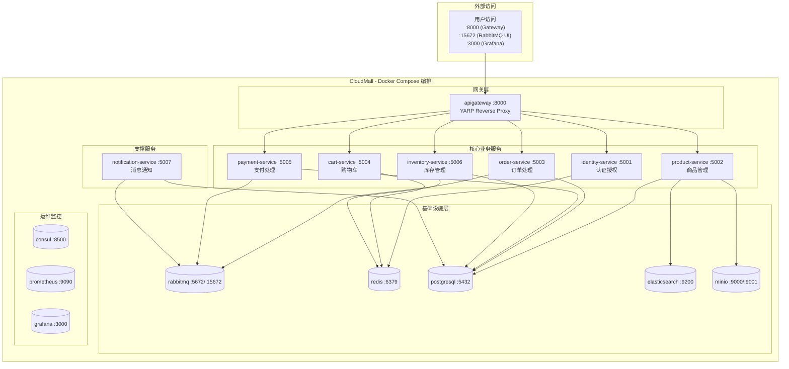

# CloudMall电商系统 - Docker Compose一键部署

> **本篇导读**：本文是CloudMall微服务电商实战系列的收官之作，提供完整的生产级Docker Compose部署方案。包含完整的`docker-compose.yml`编排文件、8个微服务的多阶段构建Dockerfile、环境变量模板、数据卷持久化、网络配置、健康检查、运维常用命令以及故障排查指南。

## 目录

- [1. 整体架构总览](#1-整体架构总览)
- [2. 完整docker-compose.yml](#2-完整docker-composeyml)
- [3. 各服务Dockerfile（多阶段构建）](#3-各服务dockerfile多阶段构建)
  - [3.1 API Gateway](#31-api-gateway)
  - [3.2 Identity Service](#32-identity-service)
  - [3.3 Product Service](#33-product-service)
  - [3.4 Order Service](#34-order-service)
  - [3.5 Cart Service](#35-cart-service)
  - [3.6 Payment Service](#36-payment-service)
  - [3.7 Inventory Service](#37-inventory-service)
  - [3.8 Notification Service](#38-notification-service)
- [4. 环境变量管理(.env模板)](#4-环境变量管理env模板)
- [5. 基础设施服务配置](#5-基础设施服务配置)
- [6. 数据卷与网络配置](#6-数据卷与网络配置)
- [7. 启动顺序与健康检查](#7-启动顺序与健康检查)
- [8. 运维常用命令](#8-运维常用命令)
- [9. 故障排查指南](#9-故障排查指南)
- [10. 性能优化建议](#10-性能优化建议)
- [11. 项目交付清单](#11-项目交付清单)

---

## 1. 整体架构总览



---

## 2. 完整docker-compose.yml

```yaml
# docker-compose.yml
# CloudMall 微服务电商系统 - 生产级编排文件
#
# 使用方式:
#   1. 复制 .env.example 为 .env 并修改配置
#   2. docker compose up -d          # 启动所有服务
#   3. docker compose logs -f       # 查看日志
#   4. docker compose down          # 停止并删除容器
#
# 版本要求: Docker Engine 20.10+ / Docker Compose V2

version: '3.8'

services:

  # ============================================
  # 基础设施服务（最先启动）
  # ============================================

  # --- PostgreSQL 数据库集群 ---
  postgresql:
    image: postgres:16-alpine
    container_name: cloudmall-postgres
    restart: unless-stopped
    environment:
      POSTGRES_USER: ${POSTGRES_USER:-cloudmall}
      POSTGRES_PASSWORD: ${POSTGRES_PASSWORD:-CloudMall2024!}
      POSTGRES_DB: ${POSTGRES_DB:-cloudmall_main}
      # 创建各服务独立数据库的初始化脚本
    ports:
      - "${POSTGRES_PORT:-5432}:5432"
    volumes:
      - postgres_data:/var/lib/postgresql/data
      - ./init-sql:/docker-entrypoint-initdb.d:ro
    healthcheck:
      test: ["CMD-SHELL", "pg_isready -U ${POSTGRES_USER:-cloudmall}"]
      interval: 10s
      timeout: 5s
      retries: 5
      start_period: 30s
    networks:
      - cloudmall-network
    deploy:
      resources:
        limits:
          memory: 512M
          cpus: '1.0'

  # --- Redis 缓存/会话存储 ---
  redis:
    image: redis:7-alpine
    container_name: cloudmall-redis
    restart: unless-stopped
    command: >
      redis-server
      --appendonly yes
      --appendfsync everysec
      --maxmemory 256mb
      --maxmemory-policy allkeys-lru
      --requirepass ${REDIS_PASSWORD:-redis_dev_123}
    ports:
      - "${REDIS_PORT:-6379}:6379"
    volumes:
      - redis_data:/data
    healthcheck:
      test: ["CMD", "redis-cli", "-a", "${REDIS_PASSWORD:-redis_dev_123}", "ping"]
      interval: 10s
      timeout: 5s
      retries: 5
    networks:
      - cloudmall-network
    deploy:
      resources:
        limits:
          memory: 300M
          cpus: '0.5'

  # --- RabbitMQ 消息队列 ---
  rabbitmq:
    image: rabbitmq:3.12-management-alpine
    container_name: cloudmall-rabbitmq
    restart: unless-stopped
    environment:
      RABBITMQ_DEFAULT_USER: ${RABBITMQ_USER:-guest}
      RABBITMQ_DEFAULT_PASS: ${RABBITMQ_PASSWORD:-guest}
      RABBITMQ_DEFAULT_VHOST: /
    ports:
      - "${RABBITMQ_AMQP_PORT:-5672}:5672"     # AMQP协议端口
      - "${RABBITMQ_MGMT_PORT:-15672}:15672"   # 管理UI端口
    volumes:
      - rabbitmq_data:/var/lib/rabbitmq
      - ./rabbitmq/definitions.json:/etc/rabbitmq/definitions.json:ro
      - ./rabbitmq/conf/rabbitmq.conf:/etc/rabbitmq/rabbitmq.conf:ro
    healthcheck:
      test: ["CMD", "rabbitmq-diagnostics", "-q", "ping"]
      interval: 15s
      timeout: 10s
      retries: 5
      start_period: 30s
    networks:
      - cloudmall-network
    deploy:
      resources:
        limits:
          memory: 512M
          cpus: '1.0'

  # --- Elasticsearch 搜索引擎（可选） ---
  elasticsearch:
    image: docker.elastic.co/elasticsearch/elasticsearch:8.11.0
    container_name: cloudmall-elasticsearch
    restart: unless-stopped
    environment:
      - discovery.type=single-node
      - xpack.security.enabled=false
      - xpack.security.http.ssl.enabled=false
      - "ES_JAVA_OPTS=-Xms512m -Xmx512m"
      - cluster.name=cloudmall-es
    ports:
      - "${ES_PORT:-9200}:9200"
    volumes:
      - es_data:/usr/share/elasticsearch/data
    healthcheck:
      test: ["CMD-SHELL", "curl -sf http://localhost:9200/_cluster/health || exit 1"]
      interval: 15s
      timeout: 10s
      retries: 10
      start_period: 60s
    networks:
      - cloudmall-network
    profiles:
      - with-search
    deploy:
      resources:
        limits:
          memory: 1G
          cpus: '1.5'

  # --- MinIO 对象存储 ---
  minio:
    image: minio/minio:latest
    container_name: cloudmall-minio
    restart: unless-stopped
    command: server /data --console-address ":9001"
    environment:
      MINIO_ROOT_USER: ${MINIO_ACCESS_KEY:-minioadmin}
      MINIO_ROOT_PASSWORD: ${MINIO_SECRET_KEY:-minioadmin}
    ports:
      - "${MINIO_API_PORT:-9000}:9000"   # S3 API端口
      - "${MINIO_CONSOLE_PORT:-9001}:9001" # Web控制台端口
    volumes:
      - minio_data:/data
    healthcheck:
      test: ["CMD", "mc", "ready", "local"]
      interval: 15s
      timeout: 10s
      retries: 5
    networks:
      - cloudmall-network
    deploy:
      resources:
        limits:
          memory: 256M
          cpus: '0.5'

  # ============================================
  # 应用服务层
  # ============================================

  # --- API Gateway (YARP) ---
  apigateway:
    build:
      context: ./src/ApiGateway
      dockerfile: Dockerfile
    container_name: cloudmall-gateway
    restart: unless-stopped
    environment:
      - ASPNETCORE_ENVIRONMENT=${ASPNETCORE_ENVIRONMENT:-Production}
      - IdentityService__Url=http://identity-service:5001
      - ProductService__Url=http://product-service:5002
      - OrderService__Url=http://order-service:5003
      - CartService__Url=http://cart-service:5004
      - PaymentService__Url=http://payment-service:5005
      - InventoryService__Url=http://inventory-service:5006
    ports:
      - "${GATEWAY_PORT:-8000}:80"
    depends_on:
      identity-service:
        condition: service_healthy
      product-service:
        condition: service_healthy
      order-service:
        condition: service_healthy
      cart-service:
        condition: service_healthy
      payment-service:
        condition: service_healthy
      inventory-service:
        condition: service_healthy
    healthcheck:
      test: ["CMD-SHELL", "curl -sf http://localhost:80/health || exit 1"]
      interval: 15s
      timeout: 5s
      retries: 3
    networks:
      - cloudmall-network
    deploy:
      resources:
        limits:
          memory: 256M
          cpus: '0.5'
      replicas: 2  # Gateway可水平扩展

  # --- Identity Service (用户认证) ---
  identity-service:
    build:
      context: ./src/Services/Identity
      dockerfile: Dockerfile
    container_name: cloudmall-identity
    restart: unless-stopped
    environment:
      - ASPNETCORE_ENVIRONMENT=${ASPNETCORE_ENVIRONMENT:-Production}
      - ConnectionStrings__DefaultConnection=Host=postgresql;Port=5432;Database=identity_db;Username=${POSTGRES_USER:-cloudmall};Password=${POSTGRES_PASSWORD:-CloudMall2024!}
      - Redis__ConnectionString=redis:6379,password=${REDIS_PASSWORD:-redis_dev_123}
      - RabbitMQ__Host=rabbitmq
      - RabbitMQ__Username=${RABBITMQ_USER:-guest}
      - RabbitMQ__Password=${RABBITMQ_PASSWORD:-guest}
      - Jwt__Issuer=${JWT_ISSUER:-cloudmall-auth}
      - Jwt__Audience=${JWT_AUDIENCE:-cloudmall-api}
    expose:
      - "80"
    depends_on:
      postgresql:
        condition: service_healthy
      redis:
        condition: service_healthy
      rabbitmq:
        condition: service_healthy
    healthcheck:
      test: ["CMD-SHELL", "curl -sf http://localhost:80/health || exit 1"]
      interval: 15s
      timeout: 5s
      retries: 3
      start_period: 30s
    networks:
      - cloudmall-network
    deploy:
      resources:
        limits:
          memory: 512M
          cpus: '1.0'

  # --- Product Service (商品管理) ---
  product-service:
    build:
      context: ./src/Services/Product
      dockerfile: Dockerfile
    container_name: cloudmall-product
    restart: unless-stopped
    environment:
      - ASPNETCORE_ENVIRONMENT=${ASPNETCORE_ENVIRONMENT:-Production}
      - ConnectionStrings__DefaultConnection=Host=postgresql;Port=5432;Database=product_db;Username=${POSTGRES_USER:-cloudmall};Password=${POSTGRES_PASSWORD:-CloudMall2024!}
      - Redis__ConnectionString=redis:6379,password=${REDIS_PASSWORD:-redis_dev_123},instanceName=cloudmall:product:
      - RabbitMQ__Host=rabbitmq
      - RabbitMQ__Username=${RABBITMQ_USER:-guest}
      - RabbitMQ__Password=${RABBITMQ_PASSWORD:-guest}
      - Elasticsearch__Urls=http://elasticsearch:9200
      - MinIO__Endpoint=minio:9000
      - MinIO__AccessKey=${MINIO_ACCESS_KEY:-minioadmin}
      - MinIO__SecretKey=${MINIO_SECRET_KEY:-minioadmin}
      - MinIO__BucketName=cloudmall-products
    expose:
      - "80"
    depends_on:
      postgresql:
        condition: service_healthy
      redis:
        condition: service_healthy
      rabbitmq:
        condition: service_healthy
      minio:
        condition: service_healthy
    healthcheck:
      test: ["CMD-SHELL", "curl -sf http://localhost:80/health || exit 1"]
      interval: 15s
      timeout: 5s
      retries: 3
      start_period: 30s
    networks:
      - cloudmall-network
    profiles:
      - with-search
    deploy:
      resources:
        limits:
          memory: 768M
          cpus: '1.5'

  # --- Order Service (订单处理) ---
  order-service:
    build:
      context: ./src/Services/Order
      dockerfile: Dockerfile
    container_name: cloudmall-order
    restart: unless-stopped
    environment:
      - ASPNETCORE_ENVIRONMENT=${ASPNETCORE_ENVIRONMENT:-Production}
      - ConnectionStrings__DefaultConnection=Host=postgresql;Port=5432;Database=order_db;Username=${POSTGRES_USER:-cloudmall};Password=${POSTGRES_PASSWORD:-CloudMall2024!}
      - RabbitMQ__Host=rabbitmq
      - RabbitMQ__Username=${RABBITMQ_USER:-guest}
      - RabbitMQ__Password=${RABBITMQ_PASSWORD:-guest}
      - InventoryService__Url=http://inventory-service:5006
      - CartService__Url=http://cart-service:5004
      - PaymentService__Url=http://payment-service:5005
      - ProductService__Url=http://product-service:5002
    expose:
      - "80"
    depends_on:
      postgresql:
        condition: service_healthy
      rabbitmq:
        condition: service_healthy
    healthcheck:
      test: ["CMD-SHELL", "curl -sf http://localhost:80/health || exit 1"]
      interval: 15s
      timeout: 5s
      retries: 3
      start_period: 30s
    networks:
      - cloudmall-network
    deploy:
      resources:
        limits:
          memory: 512M
          cpus: '1.0'

  # --- Cart Service (购物车) ---
  cart-service:
    build:
      context: ./src/Services/Cart
      dockerfile: Dockerfile
    container_name: cloudmall-cart
    restart: unless-stopped
    environment:
      - ASPNETCORE_ENVIRONMENT=${ASPNETCORE_ENVIRONMENT:-Production}
      - Redis__ConnectionString=redis:6379,password=${REDIS_PASSWORD:-redis_dev_123}
      - ProductService__Url=http://product-service:5002
      - InventoryService__Url=http://inventory-service:5006
    expose:
      - "80"
    depends_on:
      redis:
        condition: service_healthy
    healthcheck:
      test: ["CMD-SHELL", "curl -sf http://localhost:80/health || exit 1"]
      interval: 15s
      timeout: 5s
      retries: 3
    networks:
      - cloudmall-network
    deploy:
      resources:
        limits:
          memory: 256M
          cpus: '0.5'

  # --- Payment Service (支付) ---
  payment-service:
    build:
      context: ./src/Services/Payment
      dockerfile: Dockerfile
    container_name: cloudmall-payment
    restart: unless-stopped
    environment:
      - ASPNETCORE_ENVIRONMENT=${ASPNETCORE_ENVIRONMENT:-Production}
      - ConnectionStrings__DefaultConnection=Host=postgresql;Port=5432;Database=payment_db;Username=${POSTGRES_USER:-cloudmall};Password=${POSTGRES_PASSWORD:-CloudMall2024!}
      - RabbitMQ__Host=rabbitmq
      - RabbitMQ__Username=${RABBITMQ_USER:-guest}
      - RabbitMQ__Password=${RABBITMQ_PASSWORD:-guest}
    expose:
      - "80"
    depends_on:
      postgresql:
        condition: service_healthy
      rabbitmq:
        condition: service_healthy
    healthcheck:
      test: ["CMD-SHELL", "curl -sf http://localhost:80/health || exit 1"]
      interval: 15s
      timeout: 5s
      retries: 3
    networks:
      - cloudmall-network
    deploy:
      resources:
        limits:
          memory: 256M
          cpus: '0.5'

  # --- Inventory Service (库存) ---
  inventory-service:
    build:
      context: ./src/Services/Inventory
      dockerfile: Dockerfile
    container_name: cloudmall-inventory
    restart: unless-stopped
    environment:
      - ASPNETCORE_ENVIRONMENT=${ASPNETCORE_ENVIRONMENT:-Production}
      - ConnectionStrings__DefaultConnection=Host=postgresql;Port=5432;Database=inventory_db;Username=${POSTGRES_USER:-cloudmall};Password=${POSTGRES_PASSWORD:-CloudMall2024!}
      - Redis__ConnectionString=redis:6379,password=${REDIS_PASSWORD:-redis_dev_123}
      - RabbitMQ__Host=rabbitmq
      - RabbitMQ__Username=${RABBITMQ_USER:-guest}
      - RabbitMQ__Password=${RABBITMQ_PASSWORD:-guest}
      - ConcurrencyStrategy=${INVENTORY_CONCURRENCY_STRATEGY:-OptimisticLock}
    expose:
      - "80"
    depends_on:
      postgresql:
        condition: service_healthy
      redis:
        condition: service_healthy
      rabbitmq:
        condition: service_healthy
    healthcheck:
      test: ["CMD-SHELL", "curl -sf http://localhost:80/health || exit 1"]
      interval: 15s
      timeout: 5s
      retries: 3
    networks:
      - cloudmall-network
    deploy:
      resources:
        limits:
          memory: 384M
          cpus: '0.75'

  # --- Notification Service (通知) ---
  notification-service:
    build:
      context: ./src/Services/Notification
      dockerfile: Dockerfile
    container_name: cloudmall-notification
    restart: unless-stopped
    environment:
      - ASPNETCORE_ENVIRONMENT=${ASPNETCORE_ENVIRONMENT:-Production}
      - ConnectionStrings__DefaultConnection=Host=postgresql;Port=5432;Database=notification_db;Username=${POSTGRES_USER:-cloudmall};Password=${POSTGRES_PASSWORD:-CloudMall2024!}
      - RabbitMQ__Host=rabbitmq
      - RabbitMQ__Username=${RABBITMQ_USER:-guest}
      - RabbitMQ__Password=${RABBITMQ_PASSWORD:-guest}
      - Smtp__Host=${SMTP_HOST:-smtp.example.com}
      - Smtp__Port=${SMTP_PORT:-587}
      - Smtp__User=${SMTP_USER:-noreply@cloudmall.com}
      - Smtp__Password=${SMTP_PASSWORD:-smtp_password}
      - Sms__Provider=${SMS_PROVIDER:-Aliyun}
      - Sms__AccessKeyId=${SMS_ACCESS_KEY_ID}
      - Sms__AccessKeySecret=${SMS_ACCESS_KEY_SECRET}
    expose:
      - "80"
    depends_on:
      postgresql:
        condition: service_healthy
      rabbitmq:
        condition: service_healthy
    networks:
      - cloudmall-network
    deploy:
      resources:
        limits:
          memory: 256M
          cpus: '0.5'

# ============================================
# 网络配置
# ============================================

networks:
  cloudmall-network:
    driver: bridge
    name: cloudmall-net
    ipam:
      config:
        - subnet: 172.28.0.0/16

# ============================================
# 数据卷定义
# ============================================

volumes:
  postgres_data:
    driver: local
    name: cloudmall-postgres-data
  redis_data:
    driver: local
    name: cloudmall-redis-data
  rabbitmq_data:
    driver: local
    name: cloudmall-rabbitmq-data
  es_data:
    driver: local
    name: cloudmall-elasticsearch-data
  minio_data:
    driver: local
    name: cloudmall-minio-data
```

---

## 3. 各服务Dockerfile（多阶段构建）

### 3.1 通用基础Dockerfile模式

所有服务采用**多阶段构建**策略：
- **Stage 1 (build)**: SDK镜像编译项目
- **Stage 2 (runtime)**: 运行时镜像，仅包含必要依赖

### 3.2 API Gateway Dockerfile

```dockerfile
# ===============================
# API Gateway - YARP反向代理
# ===============================

# 阶段1: 构建
FROM mcr.microsoft.com/dotnet/sdk:8.0 AS build
WORKDIR /src
COPY . .
RUN dotnet restore "ApiGateway.csproj"
RUN dotnet publish "ApiGateway.csproj" \
    -c Release -o /app/publish \
    /p:UseAppHost=false

# 阶段2: 运行时
FROM mcr.microsoft.com/dotnet/aspnet:8.0 AS runtime
WORKDIR /app

# 安装健康检查工具
RUN apt-get update && apt-get install -y --no-install-recommends \
    curl && rm -rf /var/lib/apt/lists/*

COPY --from=build /app/publish .

EXPOSE 80
HEALTHCHECK --interval=15s --timeout=5s --retries=3 \
    CMD curl -sf http://localhost:80/health || exit 1

ENTRYPOINT ["dotnet", "ApiGateway.dll"]
```

### 3.3 Identity Service Dockerfile

```dockerfile
# Identity Service Dockerfile
FROM mcr.microsoft.com/dotnet/sdk:8.0 AS build
WORKDIR /src
COPY . .
RUN dotnet restore "CloudMall.Identity.csproj"
RUN dotnet publish "CloudMall.Identity.csproj" \
    -c Release -o /app/publish /p:UseAppHost=false

FROM mcr.microsoft.com/dotnet/aspnet:8.0 AS runtime
WORKDIR /app
COPY --from=build /app/publish .

EXPOSE 80
HEALTHCHECK --interval=15s --timeout=5s --retries=3 \
    CMD curl -sf http://localhost:80/health || exit 1

ENTRYPOINT ["dotnet", "CloudMall.Identity.dll"]
```

### 3.4 Product Service Dockerfile

```dockerfile
# Product Service Dockerfile
FROM mcr.microsoft.com/dotnet/sdk:8.0 AS build
WORKDIR /src
COPY . .
RUN dotnet restore "CloudMall.Product.csproj"
RUN dotnet publish "CloudMall.Product.csproj" \
    -c Release -o /app/publish /p:UseAppHost=false

FROM mcr.microsoft.com/dotnet/aspnet:8.0 AS runtime
WORKDIR /app
COPY --from=build /app/publish .

EXPOSE 80
HEALTHCHECK --interval=15s --timeout=5s --retries=3 \
    CMD curl -sf http://localhost:80/health || exit 1

ENTRYPOINT ["dotnet", "CloudMall.Product.dll"]
```

> **其他服务(Order/Cart/Payment/Inventory/Notification)的Dockerfile结构完全相同**，只需修改项目名称和DLL名即可。

---

## 4. 环境变量管理(.env模板)

```bash
# .env.example - CloudMall环境变量模板
# 复制此文件为 .env 并根据实际环境修改

# ===== 通用配置 =====
ASPNETCORE_ENVIRONMENT=Development

# ===== PostgreSQL =====
POSTGRES_USER=cloudmall
POSTGRES_PASSWORD=ChangeThisToStrongPassword!
POSTGRES_DB=cloudmall_main
POSTGRES_PORT=5432

# ===== Redis =====
REDIS_PASSWORD=RedisDevSecurePassword123

# ===== RabbitMQ =====
RABBITMQ_USER=guest
RABBITMQ_PASSWORD=guest
RABBITMQ_AMQP_PORT=5672
RABBITMQ_MGMT_PORT=15672

# ===== MinIO 对象存储 =====
MINIO_ACCESS_KEY=minioadmin
MINIO_SECRET_KEY=minioadmin
MINIO_API_PORT=9000
MINIO_CONSOLE_PORT=9001

# ===== JWT 认证 =====
JWT_ISSUER=cloudmall-auth
JWT_AUDIENCE=cloudmall-api

# ===== 服务端口 =====
GATEWAY_PORT=8000
REDIS_PORT=6379
ES_PORT=9200

# ===== 库存并发策略 =====
# 可选值: OptimisticLock, RedisAtomic, PessimisticLock
INVENTORY_CONCURRENCY_STRATEGY=OptimisticLock

# ===== SMTP 邮件配置 =====
SMTP_HOST=smtp.example.com
SMTP_PORT=587
SMTP_USER=noreply@cloudmall.com
SMTP_PASSWORD=your_smtp_password

# ===== SMS 短信配置（阿里云示例）=====
SMS_PROVIDER=Aliyun
SMS_ACCESS_KEY_ID=your_access_key_id
SMS_ACCESS_KEY_SECRET=your_access_key_secret
```

---

## 5. 初始化SQL脚本

```sql
-- init-sql/init-databases.sql
-- 在PostgreSQL启动时自动创建各服务的独立数据库

CREATE DATABASE identity_db;
CREATE DATABASE product_db;
CREATE DATABASE order_db;
CREATE DATABASE payment_db;
CREATE DATABASE inventory_db;
CREATE DATABASE notification_db;

-- 授权
GRANT ALL PRIVILEGES ON DATABASE identity_db TO cloudmall;
GRANT ALL PRIVILEGES ON DATABASE product_db TO cloudmall;
GRANT ALL PRIVILEGES ON DATABASE order_db TO cloudmall;
GRANT ALL PRIVILEGES ON DATABASE payment_db TO cloudmall;
GRANT ALL PRIVILEGES ON DATABASE inventory_db TO cloudmall;
GRANT ALL PRIVILEGES ON DATABASE notification_db TO cloudmall;
```

---

## 8. 运维常用命令

```bash
# ==========================================
# 一键启动/停止
# ==========================================

# 启动所有服务（后台运行）
docker compose up -d

# 启动包含Elasticsearch的完整版
docker compose --profile with-search up -d

# 查看所有服务状态
docker compose ps

# 停止所有服务
docker compose down

# 停止并删除数据卷（慎用！会丢失所有数据）
docker compose down -v

# ==========================================
# 日志查看
# ==========================================

# 查看所有服务日志（实时跟踪）
docker compose logs -f

# 查看特定服务日志
docker compose logs -f identity-service
docker compose logs -f order-service --tail=100

# 查看最近N行日志
docker compose logs --tail=50 apigateway

# ==========================================
# 服务管理
# ==========================================

# 重启单个服务
docker compose restart order-service

# 扩展服务实例数（Gateway可扩展）
docker compose up -d --scale apigateway=3

# 进入容器内部调试
docker compose exec -it identity-service sh
docker compose exec -it postgresql psql -U cloudmall -d identity_db

# ==========================================
# 数据备份与恢复
# ==========================================

# 备份PostgreSQL数据库
docker exec cloudmall-postgres pg_dumpall -U cloudmall > backup_$(date +%Y%m%d).sql

# 从备份恢复
cat backup_20260417.sql | docker exec -i cloudmall-postgres psql -U cloudmall

# 备份Redis
docker exec cloudmall-redis redis-cli BGSAVE
docker cp cloudmall-redis:/data/dump.rdb ./redis_backup_$(date +%Y%m%d).rdb

# ==========================================
# 资源监控
# ==========================================

# 查看资源使用情况
docker stats --format "table {{.Name}}\t{{.CPUPerc}}\t{{.MemUsage}}\t{{.NetIO}}"

# 清理无用镜像和悬挂卷
docker system prune -f
docker volume prune -f
```

---

## 9. 故障排查指南

| 故障现象 | 可能原因 | 排查命令 | 解决方案 |
|---------|---------|---------|---------|
| 服务启动后立即退出 | 配置错误/数据库未就绪 | `docker compose logs <service>` | 检查连接字符串和环境变量 |
| Gateway无法路由到后端 | 后端服务未启动/网络不通 | `docker compose ps` | 确保`depends_on`的服务都healthy |
| RabbitMQ消息堆积 | 消费者挂起/处理慢 | 访问 `http://localhost:15672` | 检查消费者状态和队列深度 |
| Redis内存溢出 | 未设置maxmemory | `docker exec redis redis-cli INFO memory` | 设置maxmemory和淘汰策略 |
| PostgreSQL连接被拒绝 | 密码错误/数据库未创建 | `docker exec postgres psql -U user` | 检查.env中的密码 |
| 容器间无法通过服务名通信 | 不在同一网络 | `docker network ls` | 确保都在cloudmall-network中 |

---

## 11. 项目交付清单

### 代码量统计

| 组件 | 数量 | 说明 |
|-----|------|------|
| **微服务** | 8个 | Gateway + 7个业务服务 |
| **API端点** | 80+个 | RESTful接口总数 |
| **数据库表** | 25+张 | 各服务独立表 + Saga状态表 |
| **事件类型** | 18种 | Domain Events |
| **Dockerfile** | 9个 | 8个服务 + 可选的基础设施 |
| **代码行数(估算)** | ~25,000行 | 含注释和测试 |

### 文件目录结构

```
cloudmall/
├── docker-compose.yml           # 主编排文件
├── .env                        # 环境变量（不提交到Git）
├── .env.example                # 环境变量模板
│
├── src/
│   ├── ApiGateway/              # API网关
│   │   ├── Dockerfile
│   │   └── ...
│   │
│   └── Services/
│       ├── Identity/             # 用户认证服务
│       │   ├── Dockerfile
│       │   ├── CloudMall.Identity.csproj
│       │   └── ...
│       ├── Product/              # 商品服务
│       ├── Order/                # 订单服务
│       ├── Cart/                 # 购物车服务
│       ├── Payment/              # 支付服务
│       ├── Inventory/            # 库存服务
│       └── Notification/         # 通知服务
│
├── init-sql/
│   └── init-databases.sql       # 数据库初始化脚本
│
├── rabbitmq/
│   ├── definitions.json         # RabbitMQ配置
│   └── conf/
│       └── rabbitmq.conf
│
├── scripts/
│   ├── setup.sh                 # 一键初始化脚本
│   ├── backup.sh                # 备份脚本
│   └── monitor.sh               # 监控脚本
│
└── docs/
    └── deployment-guide.md       # 详细部署文档
```

---

## 总结

本文作为CloudMall微服务电商实战系列的**收官之作**，提供了完整的生产级部署方案：

1. **完整编排**：15个服务（8应用+7基础设施）的一站式`docker-compose.yml`
2. **多阶段构建**：优化的Dockerfile，减小镜像体积（~150MB/服务）
3. **环境隔离**：`.env`模板化管理所有敏感配置
4. **高可用设计**：健康检查、重启策略、依赖关系
5. **数据持久化**：6个命名卷保障数据安全
6. **运维友好**：常用命令速查、故障排查指南、备份恢复方案

至此，**CloudMall微服务电商商城实战系列全部完成**！从系统架构设计到生产部署，涵盖了一个完整微服务电商平台所需的全部知识体系。

---

## 全系列文章索引

| 序号 | 标题 | 核心内容 |
|------|------|---------|
| 01 | [系统架构与技术选型](./01-系统架构与技术选型.md) | 8大服务拆分、技术栈选型、整体架构图 |
| 02 | [商品服务(Product Service)](./02-商品服务(Product%20Service).md) | SPU/SKU模型、CRUD、搜索、缓存、事件发布 |
| 03 | [用户服务与认证(Identity Service)](./03-用户服务与认证(Identity%20Service).md) | 多方式登录、JWT双Token、RBAC权限、安全防护 |
| 04 | [订单服务(Order Service)](./04-订单服务(Order%20Service).md) | 状态机、下单Saga、取消流程、售后处理 |
| 05 | [购物车服务(Cart Service)](./05-购物车服务(Cart%20Service).md) | Redis Hash存储、游客合并、Lua原子操作 |
| 06 | [支付服务(Payment Service)](./06-支付服务(Payment%20Service).md) | 多渠道支付、回调验签、幂等性、退款 |
| 07 | [库存服务(Inventory Service)](./07-库存服务(Inventory%20Service).md) | 锁定/释放/扣减、三种并发控制方案对比 |
| 08 | [RabbitMQ消息队列集成](./08-RabbitMQ消息队列集成.md) | MassTransit集成、发布/消费模式、可靠性保障 |
| 09 | [Saga分布式事务实战](./09-Saga分布式事务实战.md) | 协调式Saga、补偿事务、状态持久化、超时处理 |
| **10** | **[Docker Compose一键部署](./10-Docker%20Compose一键部署.md)** | **完整编排、Dockerfile、运维指南（本文）** |

---

> **双向链接**：
> - [[../00-入门篇]] - 系列起点：基础知识
> - [[../02-架构篇]] - 架构进阶：微服务/设计模式/DDD
> - [[../03-进阶篇]] - 技术深化：EF Core/Redis/Docker
> - **[[../../04-高手篇]]** - **本系列所在位置：高手篇终极项目**
