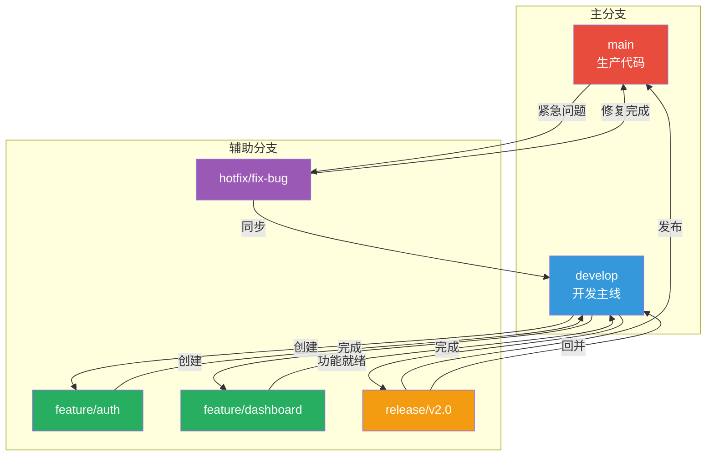

# Git 分支策略

分支策略是团队协作开发中最重要的规范之一。良好的分支策略能够保证代码质量、提高协作效率、简化发布流程。本文详细介绍三种主流的 Git 分支策略，帮助团队选择最适合的工作模式。

## 一、Git Flow（经典分支模型）

### 1.1 策略概述

Git Flow 由 Vincent Driessen 于 2010 年提出，是最经典的多分支管理策略。它定义了五种核心分支类型和严格的合并规则。

### 1.2 核心分支结构

```
                        ┌─────────────────┐
                        │    main (master) │
                        │   生产环境代码    │
                        └────────┬────────┘
                                 │ merge (tag)
                                 ▼
                        ┌─────────────────┐
                        │     develop      │
                        │   集成开发分支    │
                        └────────┬────────┘
                    ┌───────┼───────┐
                    │       │       │
                    ▼       ▼       ▼
            ┌──────────┐ ┌──────────┐ ┌──────────┐
            │ feature/ │ │ release/ │ │ hotfix/  │
            │ 功能分支  │ │ 发布分支  │ │ 热修复分支│
            └──────────┘ └──────────┘ └──────────┘
```

### 1.3 五种分支详解

#### main（或 master）分支

- **用途**：生产环境代码，始终保持可部署状态
- **特点**：
  - 只接受来自 `release` 和 `hotfix` 的合并
  - 每次合并打版本标签（如 `v1.0.0`, `v2.0.0`）
  - 开发者不能直接提交到此分支

```bash
# 查看生产分支
git checkout main
git log --oneline -10

# 只能通过以下方式更新 main:
# git checkout main && git merge release/v2.0.0
# git checkout main && git merge hotfix/critical-fix
```

#### develop 分支

- **用途**：集成开发的主线分支，包含下次发布的所有功能
- **特点**：
  - 所有 `feature` 分支从这里创建并合并回来
  - 创建 `release` 分支时从 develop 切出
  - 接受 `release` 完成后的回并

```bash
# 从 main 创建 develop（首次）
git checkout main
git checkout -b develop
git push -u origin develop

# 日常同步 develop
git checkout develop
git pull origin develop
```

#### feature/* 分支

- **用途**：开发新功能的分支
- **生命周期**：从 develop 创建 → 合并回 develop → 删除
- **命名规范**：`feature/<ticket-id>-<short-description>`

```bash
# 创建功能分支
git checkout develop
git pull origin develop
git checkout -b feature/PROJ-123-user-authentication

# 开发过程中...
# git add . && git commit -m "feat: add login page"

# 功能完成后合并到 develop
git checkout develop
git merge --no-ff feature/PROJ-123-user-authentication
git push origin develop

# 删除本地和远程的功能分支
git branch -d feature/PROJ-123-user-authentication
git push origin --delete feature/PROJ-123-user-authentication
```

#### release/* 分支

- **用途**：准备新版本发布
- **生命周期**：从 develop 创建 → 合并到 main + develop → 删除
- **工作内容**：修复 Bug、版本号更新、文档完善、性能调优

```bash
# 创建发布分支（当 develop 的功能足够发布时）
git checkout develop
git checkout -b release/v2.1.0

# 更新版本号等准备工作
# ... 修改 version, changelog 等 ...
git add .
git commit -m "chore: bump version to 2.1.0"

# 完成发布准备后，先合并到 main
git checkout main
git merge --no-ff release/v2.1.0
git tag -a v2.1.0 -m "Release version 2.1.0"
git push origin main --tags

# 再将变更回并到 develop
git checkout develop
git merge --no-ff release/v2.1.0
git push origin develop

# 清理发布分支
git branch -d release/v2.1.0
```

#### hotfix/* 分支

- **用途**：紧急修复生产环境的严重问题
- **生命周期**：从 main 创建 → 合并到 main + develop → 删除
- **特点**：优先级最高，可以打断正常开发流程

```bash
# 生产发现紧急 Bug
git checkout main
git pull origin main
git checkout -b hotfix/HOTFIX-001-fix-login-crash

# 快速修复...
git add . && git commit -m "fix: resolve null reference in login service"

# 测试通过后，合并到 main
git checkout main
git merge --no-ff hotfix/HOTFIX-001-fix-login-crash
git tag -a v2.1.1 -m "Hotfix v2.1.1"
git push origin main --tags

# 同时合并到 develop（防止遗漏）
git checkout develop
git merge --no-ff hotfix/HOTFIX-001-fix-login-crash
git push origin develop

# 清理
git branch -d hotfix/HOTFIX-001-fix-login-crash
```

### 1.4 Git Flow 完整流程图（Mermaid）



### 1.5 Git Flow 优缺点

**优点**：
- 角色清晰，每种分支有明确职责
- 支持并行开发多个功能
- 发布流程标准化，适合严格版本控制
- 历史记录完整，可追溯性强

**缺点**：
- 分支复杂，学习成本高
- 对于持续部署场景过于繁琐
- 频繁合并可能导致冲突
- 不适合小团队或快速迭代项目

**适用场景**：
- 有明确版本号的软件产品
- 需要支持多版本并行维护
- 大型团队协作项目
- 有固定发布周期的项目

---

## 二、GitHub Flow（简化流程）

### 2.1 策略概述

GitHub Flow 是 GitHub 推荐的轻量级分支策略，核心理念是"任何时刻 main 都是可部署的"。它只有两种分支：`main` 和 `feature` 分支。

### 2.2 核心原则

```
GitHub Flow 六大原则：

1. main 分支始终可部署
2. 从 main 创建分支进行开发
3. 以短命名、有意义的名称命名分支
4. 定期推送到远程进行备份和协作
5. 创建 Pull Request 进行代码审查
6. 审查通过且 CI 通过后合并到 main
```

### 2.3 工作流图示

```
┌─────────────────────────────────────────────────────────────┐
│                     GitHub Flow 工作流                       │
├─────────────────────────────────────────────────────────────┤
│                                                             │
│  ┌──────┐                                                   │
│  │ main │ ◄─── 始终可部署                                   │
│  └──┬───┘                                                   │
│     │                                                       │
│     │ 1. 创建分支                                           │
│     ▼                                                       │
│  ┌──────────────┐                                           │
│  │ feature/add- │                                           │
│  │ new-feature  │                                           │
│  └──────┬───────┘                                           │
│         │                                                   │
│         │ 2. 开发 & 提交                                     │
│         │ 3. Push 到远程                                    │
│         ▼                                                   │
│  ┌──────────────┐                                           │
│  │ Pull Request │                                           │
│  │ (代码审查)    │                                           │
│  └──────┬───────┘                                           │
│         │                                                   │
│         │ 4. 审查 & CI 检查                                 │
│         ▼                                                   │
│  ┌──────────────┐                                           │
│  │ Merge to main│                                           │
│  └──────┬───────┘                                           │
│         │                                                   │
│         │ 5. 自动部署                                       │
│         ▼                                                   │
│  ┌──────────────┐                                           │
│  │ Production   │                                           │
│  └──────────────┘                                           │
│                                                             │
└─────────────────────────────────────────────────────────────┘
```

### 2.4 具体操作步骤

```bash
# ===== 步骤一：保持 main 最新 =====
git checkout main
git pull origin main

# ===== 步骤二：创建功能分支 =====
git checkout -b feature/user-profile-page

# ===== 步骤三：开发与提交 =====
# 编写代码...

# 小步提交，使用规范的 commit message
git add src/Pages/Profile.cshtml.cs
git commit -m "feat(profile): add profile page model"

git add src/Pages/Profile.cshtml
git commit -m "feat(profile): add profile page view"

git add src/Services/UserService.cs
git commit -m "feat(profile): implement user data retrieval"

# ===== 步骤四：推送分支到远程 =====
git push -u origin feature/user-profile-page

# ===== 步骤五：创建 Pull Request =====
# 在 GitHub 上操作，或使用 CLI:
gh pr create \
  --title "Add user profile page" \
  --body "## Summary\n- Add user profile page with avatar and bio display\n- Implement user data retrieval service\n\n## Test Plan\n- [ ] View own profile\n- [ ] Edit profile information\n- [ ] Upload avatar image" \
  --base main \
  --head feature/user-profile-page

# ===== 步骤六：处理审查反馈 =====
# 继续在分支上修改...
git add .
git commit -m "address review: fix null check for user avatar"
git push

# ===== 步骤七：合并 PR =====
# 在 GitHub 上点击 Merge 按钮，选择合并方式:
# - Create a merge commit（默认）
# - Squash and merge（推荐，保持历史整洁）
# - Rebase and merge

# ===== 步骤八：清理 =====
git checkout main
git pull origin main
git branch -d feature/user-profile-page
git push origin --delete feature/user-profile-page
```

### 2.5 PR 合并方式选择

| 方式 | 说明 | 适用场景 |
|------|------|----------|
| **Merge Commit** | 创建合并提交，保留完整历史 | 需要保留每个 PR 的独立历史 |
| **Squash Merge** | 将所有提交压缩为一个 | 推荐！保持 main 历史整洁 |
| **Rebase Merge** | 变基后快进合并 | 保持线性历史 |

**推荐配置 Squash Merge**：

```yaml
# .github/pull_request_template.md
## 变更描述
<!-- 简要描述这次 PR 的内容 -->

## 关联 Issue
Closes #<issue-number>

## 变更类型
- [ ] 新功能 (Feature)
- [ ] Bug 修复 (Bug Fix)
- [ ] 重构 (Refactor)
- [ ] 文档更新 (Documentation)
- [ ] 其他 (Other)

## 测试清单
- [ ] 本地测试通过
- [ ] 单元测试已添加/更新
- [ ] 无编译警告
- [ ] 代码格式符合规范

## 截图（如有 UI 变更）
<!-- 添加截图 -->
```

### 2.6 GitHub Flow 优缺点

**优点**：
- 极简设计，易于理解和实施
- 与 CI/CD 天然契合
- 适合持续部署/持续交付
- 减少合并冲突

**缺点**：
- 缺乏明确的发布阶段
- 处理热修复不够优雅
- 对于需要版本号的产品不太适用

**适用场景**：
- Web 应用 / SaaS 产品
- 持续部署的项目
- 小中型团队
- 开源项目

---

## 三、Trunk Based Development（主干开发）

### 3.1 策略概述

Trunk Based Development (TBD) 是最激进的分支策略，核心理念是"全员直接在主干上开发"，通过特性开关来管理未完成的功能。

### 3.2 核心理念

```
Trunk Based Development:

┌─────────────────────────────────────────────────────┐
│                                                     │
│                   trunk (main)                      │
│                  ┌──────────────┐                   │
│                  │  始终可部署   │                   │
│                  └──────────────┘                   │
│                     ▲    ▲    ▲                     │
│                    /      |      \                  │
│                   /       |       \                 │
│              提交A     提交B     提交C              │
│           (开发者A)  (开发者B)  (开发者C)           │
│                                                     │
│  特性开关 (Feature Flags):                           │
│  ├── FeatureAuth: true                              │
│  ├── FeatureDashboard: false (隐藏中)               │
│  └── FeaturePayment: true                           │
│                                                     │
└─────────────────────────────────────────────────────┘
```

### 3.3 两种变体

#### 变体一：纯主干开发

```bash
# 所有开发者直接在 main 上工作
git checkout main
git pull origin main

# 直接提交（确保代码质量高）
git add .
git commit -m "feat: add user preferences API endpoint"
git push origin main

# CI 自动运行，失败则立即修复
```

**关键实践**：
- 极短的提交周期（每天多次提交）
- 全面的自动化测试覆盖
- 即时的代码审查（Pair Programming 或工具辅助）
- 持续集成必须快速反馈

#### 变体二：短命分支（Short-Lived Branches）

```bash
# 允许创建短期分支，但寿命不超过一天
git checkout -b quick-fix/login-error

# 快速修复并合并
git add . && git commit -m "fix: handle empty email gracefully"
git push origin quick-fix/login-error

# 通过 PR 快速合并（分支存活 < 1天）
gh pr create --title "Fix login error" --body "Quick fix"
# 审查通过后立即合并
```

**分支规则**：
- 分支寿命不超过 1 个工作日
- 分支与主干差异最小化
- 必须通过全部自动化检查才能合并

### 3.4 特性开关（Feature Flags）

特性开关是 TBD 的核心技术支撑：

```csharp
// Services/FeatureFlags.cs
public interface IFeatureFlagService
{
    Task<bool> IsEnabledAsync(string featureName);
}

// 实现 - 可从配置文件、数据库或服务获取
public class FeatureFlagService : IFeatureFlagService
{
    private readonly IConfiguration _configuration;

    public FeatureFlagService(IConfiguration configuration)
    {
        _configuration = configuration;
    }

    public Task<bool> IsEnabledAsync(string featureName)
    {
        var enabled = _configuration.GetValue<bool>($"Features:{featureName}");
        return Task.FromResult(enabled);
    }
}

// 使用示例
public class DashboardController : Controller
{
    private readonly IFeatureFlagService _flagService;

    public async Task<IActionResult> Index()
    {
        // 检查特性开关
        var isEnabled = await _flagService.IsEnabledAsync("NewDashboard");
        if (!isEnabled)
        {
            return RedirectToAction(nameof(OldDashboard));
        }

        return View("NewDashboard");
    }
}
```

**appsettings.json 配置**：

```json
{
  "Features": {
    "NewDashboard": false,
    "DarkMode": true,
    "BetaAPI": true,
    "AdvancedSearch": false
  }
}
```

**特性开关类型**：

| 类型 | 用途 | 示例 |
|------|------|------|
| **Release Flag** | 控制功能发布 | 新功能上线 |
| **Experiment Flag** | A/B 测试 | 不同用户看到不同版本 |
| **Ops Flag** | 运维控制 | 降级开关、限流开关 |
| **Permission Flag** | 权限控制 | 高级功能仅对付费用户开放 |

### 3.5 TBD 优缺点

**优点**：
- 最简化的分支管理
- 消除合并冲突（几乎）
- 持续集成的理想形态
- 发布极其灵活

**缺点**：
- 对代码质量和测试要求极高
- 需要完善的特性开关基础设施
- 团队纪律要求严格
- 初期实施成本较高

**适用场景**：
- SaaS 产品 / 云原生应用
- 高成熟度工程团队
- 强大的 CI/CD 基础设施
- 追求极致交付速度的团队

---

## 四、三种策略对比总结

### 4.1 决策矩阵

| 维度 | Git Flow | GitHub Flow | Trunk Based |
|------|----------|-------------|-------------|
| **复杂度** | ★★★★★ | ★★☆☆☆ | ★☆☆☆☆ |
| **分支数量** | 5 种 | 2 种 | 1-2 种 |
| **发布节奏** | 版本驱动 | 持续部署 | 持续部署 |
| **CI/CD 要求** | 中等 | 较高 | 极高 |
| **团队规模** | 大型 | 中小型 | 任意（需高成熟度） |
| **学习成本** | 高 | 低 | 中 |
| **合并冲突** | 较多 | 少 | 极少 |
| **历史整洁度** | 详细但复杂 | 整洁 | 线性 |
| **适用产品** | 传统软件 | Web/SaaS | 云原生/SaaS |

### 4.2 选择指南

```
如何选择分支策略？

问自己几个问题：

1. 你的产品是否有明确的版本号？
   ├─ 是 → 考虑 Git Flow
   └─ 否 → 继续 ↓

2. 你们是否做持续部署？
   ├─ 是 → 考虑 GitHub Flow 或 TBD
   └─ 否 → 继续 ↓

3. 团队规模多大？
   ├─ >20 人 → Git Flow 或 GitHub Flow
   ├─ 5-20 人 → GitHub Flow（推荐起点）
   └─ <5 人 → GitHub Flow 或 TBD

4. CI/CD 成熟度如何？
   ├─ 完善（自动测试+自动部署）→ TBD 可行
   └─ 正在建设 → GitHub Flow 作为过渡

5. 是否需要同时维护多个版本？
   ├─ 是 → Git Flow
   └─ 否 → GitHub Flow 或 TBD
```

---

## 五、分支命名规范

### 5.1 通用命名规则

```
格式: <type>/<ticket-id>-<short-description>

示例:
✅ feature/PROJ-123-user-registration
✅ bugfix/BUG-456-login-timeout
✅ hotfix/HOTFIX-789-payment-failure
✅ release/v2.1.0
✅ refactor/REF-101-extract-service-layer
✅ docs/DOC-202-api-documentation
✅ test/TEST-303-add-unit-tests-for-orders
✅ chore/CHORE-404-update-dependencies
```

### 5.2 前缀分类

| 前缀 | 用途 | 生命周期 | 合并目标 |
|------|------|----------|----------|
| `feature/*` | 新功能开发 | 数天~数周 | develop/main |
| `bugfix/*` | 一般 Bug 修复 | 数小时~数天 | develop/main |
| `hotfix/*` | 紧急生产修复 | 数小时内 | main (+develop) |
| `release/*` | 发布准备 | 数天 | main (+develop) |
| `refactor/*` | 代码重构 | 数天~数周 | develop/main |
| `docs/*` | 文档更新 | 数小时~数天 | develop/main |
| `test/*` | 测试相关 | 数小时~数天 | develop/main |
| `chore/*` | 构建/工具/依赖 | 数小时 | develop/main |
| `experiment/*` | 实验性功能 | 不确定 | 可能丢弃 |

### 5.3 命名反模式

```
❌ 错误命名示例:
- feature/new-stuff          # 太模糊
- fix                       # 没有任何信息
- test                      # 无法区分
- johns-branch              # 个人名字
- wip                       # Work In Progress（应避免长期存在）
- temp                      # 临时分支应有明确目的
- master-fix                # 不应直接修改主分支
```

---

## 六、PR/MR 最佳实践

### 6.1 Pull Request 模板

```markdown
# PR 模板 (.github/pull_request_template.md)

## 📝 变更描述
<!-- 用一两句话描述这个 PR 做了什么 -->

## 🔗 关联 Issue
<!-- Closes #123 或 Fixes #456 -->

## 📋 变更类型
<!-- 勾选一项 -->
- [ ] 🚀 新功能 (Feature)
- [ ] 🐛 Bug 修复 (Bug Fix)
- [ ] 🔨 重构 (Refactor)
- [ ] 📚 文档 (Documentation)
- [ ] 🧪 测试 (Test)
- [ ] 🔧 样式/UI (Style/UI)
- [ ] ⚙️ 配置/构建 (Chore)

## 💡 动机与背景
<!-- 为什么需要这个变更？解决了什么问题？ -->

## 🔄 变更内容
<!-- 列出主要变更点 -->
-
-

## 📸 截图/Demo（如有 UI 变更）
<!-- 添加截图或 GIF -->

## ✅ 检查清单
<!-- 审查者和作者都应确认 -->
- [ ] 代码遵循项目编码规范
- [ ] 已自测并通过
- [ ] 单元测试已添加/更新
- [ ] 无编译警告或错误
- [ ] 文档已更新（如有必要）
- [ ] 敏感信息未被提交（密钥、密码等）
- [ ] 数据库迁移脚本已提供（如有 Schema 变更）

## ⚠️ 注意事项
<!-- 需要特别说明的事项 -->
<!--
- 是否影响现有 API？
- 是否需要数据库迁移？
- 是否有性能影响？
-->
```

### 6.2 代码审查清单

```markdown
## 代码审查 Checklist

### 功能正确性
- [ ] 代码实现了 PR 描述的功能
- [ ] 边界情况已处理
- [ ] 错误处理完善
- [ ] 无明显的逻辑错误

### 代码质量
- [ ] 命名清晰有意义
- [ ] 方法/类职责单一
- [ ] 无重复代码
- [ ] 遵循 SOLID 原则
- [ ] 注释恰当（不过度也不过少）

### 安全性
- [ ] 无 SQL 注入风险
- [ ] 无 XSS 漏洞
- [ ] 认证/授权正确
- [ ] 敏感数据已加密/脱敏
- [ ] 无硬编码密钥

### 性能
- [ ] 无 N+1 查询问题
- [ ] 必要处有缓存
- [ ] 无内存泄漏风险
- [ ] 异步方法正确使用

### 测试
- [ ] 单元测试覆盖率足够
- [ ] 测试用例有意义
- [ ] 边界条件已测试

### 文档
- [ ] 公共 API 有 XML 文档注释
- [ ] README/CHANGELOG 已更新
- [ ] 复杂逻辑有内联注释
```

### 6.3 PR 自动化检查建议

```yaml
# .github/workflows/pr-check.yml
name: PR Checks

on:
  pull_request:
    branches: [main, develop]

jobs:
  build-and-test:
    runs-on: ubuntu-latest
    steps:
      - uses: actions/checkout@v4

      - name: Setup .NET
        uses: actions/setup-dotnet@v4
        with:
          dotnet-version: '8.0.x'

      - name: Restore dependencies
        run: dotnet restore

      - name: Build
        run: dotnet build --no-restore --configuration Release

      - name: Run tests
        run: dotnet test --no-build --configuration Release \
          --collect:"XPlat Code Coverage"

      - name: Code formatting check
        run: dotnet format --verify-no-changes

      - name: Security analysis
        run: dotnet list package --vulnerable

  code-review-bot:
    needs: build-and-test
    runs-on: ubuntu-latest
    steps:
      - uses: actions/checkout@v4
      - name: Code Review
        uses: github/super-linter@v5
        env:
          DEFAULT_BRANCH: main
          GITHUB_TOKEN: ${{ secrets.GITHUB_TOKEN }}
          VALIDATE_CSHARP: true
```

---

## 七、Fork & Pull Request 协作模型

### 7.1 适用场景

Fork & Pull Request 模型主要用于开源项目和外部贡献者参与的场景。贡献者没有原始仓库的直接写入权限，需要通过 Fork 来提交代码。

### 7.2 工作流程

```
┌──────────────────────────────────────────────────────────────┐
│             Fork & Pull Request 工作流                        │
├──────────────────────────────────────────────────────────────┤
│                                                              │
│   上游仓库 (Upstream)                                        │
│   ┌─────────────────┐                                        │
│   │ org/repo        │                                        │
│   │ └── main        │                                        │
│   └────────┬────────┘                                        │
│            │ Fork                                             │
│            ▼                                                  │
│   你的仓库 (Origin/Fork)                                     │
│   ┌─────────────────┐                                        │
│   │ your/repo       │                                        │
│   │ └── main        │                                        │
│   │     └── feature │ ← 在这里开发                            │
│   └────────┬────────┘                                        │
│            │ Pull Request                                    │
│            ▼                                                  │
│   回到上游仓库                                               │
│   ┌─────────────────┐                                        │
│   │ org/repo        │ ← PR 在这里审查和合并                   │
│   └─────────────────┘                                        │
│                                                              │
└──────────────────────────────────────────────────────────────┘
```

### 7.3 具体操作步骤

```bash
# ===== 第一步：Fork 仓库 =====
# 在 GitHub 页面点击 Fork 按钮

# ===== 第二步：克隆你的 Fork =====
git clone https://github.com/your-username/repo.git
cd repo

# ===== 第三步：添加上游仓库 =====
git remote add upstream https://github.com/org-name/repo.git

# 查看远程仓库配置
git remote -v
# origin    https://github.com/your-username/repo.git (fetch)
# origin    https://github.com/your-username/repo.git (push)
# upstream  https://github.com/org-name/repo.git (fetch)
# upstream  https://github.com/org-name/repo.git (push)

# ===== 第四步：创建功能分支 =====
git checkout main
git fetch upstream
git merge upstream/main          # 同步上游最新代码
git checkout -b feature/my-contribution

# ===== 第五步：开发与提交 =====
# ... 编写代码 ...
git add .
git commit -m "feat: add awesome feature"

# ===== 第六步：推送并创建 PR =====
git push -u origin feature/my-contribution

# 在 GitHub 上创建 Pull Request:
# 进入你的 Fork → 点击 "Compare & pull request"
# 选择 base: org-name/repo:main
# 选择 compare: feature/my-contribution
# 填写 PR 描述并提交

# ===== 第七步：处理反馈 =====
# 如果维护者要求修改，继续在你的分支上工作:
git add .
git commit -m "address feedback: improve error handling"
git push origin feature/my-contribution
# PR 会自动更新

# ===== 第八步：PR 合并后同步 =====
# PR 合并后，你的 Fork 的 main 分支可能落后了
git checkout main
git fetch upstream
git merge upstream/main
git push origin main              # 同步你的 Fork

# 清理已合并的功能分支
git branch -d feature/my-contribution
git push origin --delete feature/my-contribution
```

### 7.4 保持 Fork 同步的技巧

```bash
# 创建一个快捷脚本来同步上游
sync-upstream() {
  echo "=== Syncing with upstream ==="
  git checkout main
  git fetch upstream
  git merge upstream/main
  git push origin main
  echo "=== Sync complete ==="
}

# 或者创建 Git 别名
git config --global alias.sync "!f() { git checkout main && git fetch upstream && git merge upstream/main && git push origin main; }; f"
```

---

## 八、团队分支策略落地建议

### 8.1 渐进式采用路径

```
第一阶段（第1-2周）：GitHub Flow
├── 建立 main 保护规则
├── 设置 PR 模板
├── 配置基础 CI 检查
└── 团队培训基本流程

第二阶段（第3-4周）：完善流程
├── 引入 PR 审查制度
├── 添加自动化检查（lint/test/security）
├── 建立分支命名规范文档
└── 收集反馈并调整

第三阶段（第5-8周）：优化提升
├── 根据项目特点决定是否引入更多分支类型
├── 建立发布流程（如有需要）
├── 完善文档和培训材料
└── 形成团队标准操作程序
```

### 8.2 关键配置建议

```yaml
# GitHub 分支保护规则设置建议

# main 分支保护
branch_protection:
  main:
    required_status_checks:
      strict: true                    # PR 也必须通过最新的 main
      contexts:                       # 必须通过的 CI 检查
        - build
        - test
        - lint
        - security-scan
    enforce_admins: true              # 管理员也遵守规则
    required_pull_request_reviews:
      dismiss_stale_reviews: true     # 新提交需重新审查
      require_code_owner_reviews: true  # 代码所有者必须审查
      required_approving_review_count: 1  # 至少 1 个 approval
    restrictions: null                # 谁可以推送到此分支
    allow_force_pushes: false         # 禁止强制推送
    allow_deletions: false            # 禁止删除分支
    require_linear_history: true      # 要求线性历史（配合 squash merge）
    require_signed_commits: false     # 可选：要求签名提交
```

选择合适的分支策略并坚持执行，是建立高效团队协作的基础。记住：最好的策略是团队能够一致执行的策略。
