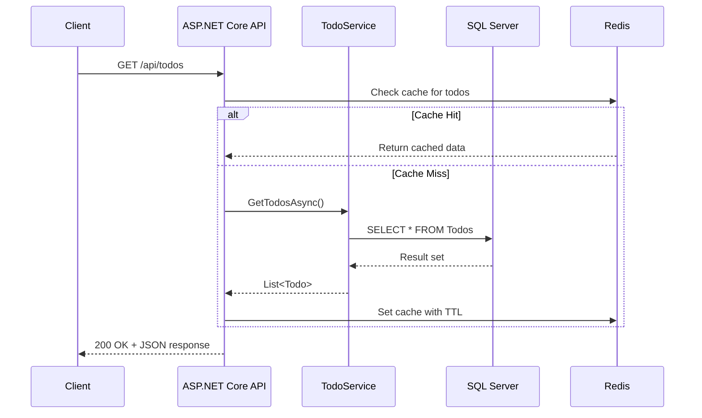

# 开发者工具箱：.NET 全栈开发工具完全指南

## 概述

"工欲善其事，必先利其器。" 一套高效的开发工具链可以显著提升开发效率、代码质量和调试体验。本文档系统整理了ASP.NET/.NET全栈开发过程中需要的各类工具，涵盖IDE、API测试、数据库、缓存、版本控制、容器化、设计、性能分析和部署等全方位场景。

**文档价值**：
- 为每个开发环节推荐最佳工具
- 提供详细的对比分析帮助选择
- 包含价格、下载地址和替代方案
- 基于实际使用经验的评价和建议

---

## 一、IDE与代码编辑器

### 1.1 Visual Studio 2022（微软官方IDE）

| 属性 | 信息 |
|------|------|
| **名称** | Visual Studio 2022 (VS2022) |
| **开发商** | Microsoft |
| **最新版本** | 17.11.x (2026年4月) |
| **平台** | Windows |
| **价格** | Community（免费）/ Pro（$45/月）/ Enterprise（$250/月） |
| **下载地址** | https://visualstudio.microsoft.com/zh-cn/downloads/ |

**版本对比**：

| 特性 | Community | Professional | Enterprise |
|------|-----------|--------------|------------|
| **价格** | 免费 | $45/月 | $250/月 |
| **适用人群** | 个人学习者/开源项目 | 专业开发者/小团队 | 大型企业 |
| **支持语言** | 完整 | 完整 | 完整 |
| **代码量限制** | 无限制 | 无限制 | 无限制 |
| **IntelliCode AI辅助** | ✅ 基础版 | ✅ 完整版 | ✅ 完整版+团队模型 |
| **Code Maps** | ❌ | ✅ | ✅ |
| **架构验证** | ❌ | ❌ | ✅ |
| **Live Unit Testing** | ✅ | ✅ | ✅ |
| ** IntelliTrace历史调试** | ❌ | ❌ | ✅ |
| **Team Foundation Server集成** | 基础 | 高级 | 完整 |
| **Xamarin/MAUI** | ✅ | ✅ | ✅ |
| **Python/Data Science** | ✅ | ✅ | ✅ |

**核心优势**：

1. **对.NET的深度集成**
   - ASP.NET Core项目模板最丰富
   - 调试体验最佳（IIS Express/Kestrel无缝切换）
   - 数据库工具内置（SQL Server Object Explorer）
   - Azure发布向导一键部署
   - 性能分析器(Profiler)功能强大

2. **生产力特性**
   - IntelliSense智能提示（基于AI的IntelliCode）
   - 代码重构（Extract Method/Rename/等200+种操作）
   - Live Share实时协作编程
   - Solution Explorer的多层次视图
   - 类图(Class Diagram)和依赖关系图

3. **调试能力**
   - 断点条件设置
   - 调用堆栈(Call Stack)
   - 监视窗口(Watch/Locals/Autos)
   - 内存窗口(Memory View)
   - 并行栈(Parallel Stacks)
   - 异常助手(Exception Assistant)

**安装建议的工作负载(Workloads)**：

```
必选工作负载：
├── ASP.NET 和 Web 开发          # Web API / MVC / Blazor
├── .NET 桌面开发                # WPF / WinForms / 控制台应用
├── Azure 开发                   # 云服务集成
└── 数据存储和处理               # SQL Server 工具

可选工作负载：
├── Node.js 开发                 # 前端开发
├── Python 开发                  # 数据科学/AI
├── Visual Studio 扩展开发        # 如果你要写扩展
└── 游戏开发（Unity/C#）          # 游戏方向
```

**推荐扩展(Extensions)**：

| 扩展名 | 用途 | 必要性 |
|--------|------|--------|
| **ReSharper** | 代码质量分析和高级重构 | ⭐⭐⭐⭐⭐ 强烈推荐 |
| **SonarLint** | 实时代码质量扫描 | ⭐⭐⭐⭐ 推荐 |
| **Productivity Power Tools** | 增强编辑器体验 | ⭐⭐⭐ 有用 |
| **SQLite/SQL Server Compact Toolbox** | 轻量级数据库管理 | ⭐⭐⭐ 有用 |
| **Image Optimizer** | 图片压缩优化 | ⭐⭐ 可选 |
| **Markdown Editor** | 在VS中编辑.md文件 | ⭐⭐ 可选 |

---

### 1.2 Visual Studio Code（轻量级编辑器）

| 属性 | 信息 |
|------|------|
| **名称** | Visual Studio Code (VS Code) |
| **开发商** | Microsoft |
| **最新版本** | 1.90+ (2026年) |
| **平台** | Windows / macOS / Linux |
| **价格** | 完全免费（开源） |
| **下载地址** | https://code.visualstudio.com/ |

**为什么VS Code如此流行？**

- 🚀 启动速度极快（<2秒）
- 💾 占用资源少（内存约200-500MB，VS需要2GB+）
- 🔌 丰富的扩展生态（7万+扩展）
- 🎨 高度可定制化
- 📱 跨平台统一体验
- 💻 内置Git集成
- 🤖 内置终端
- ☁️ Remote SSH/Container/WSL远程开发

**.NET开发必备扩展**：

| 扩展名 | 发布者 | 用途 | 下载量 |
|--------|--------|------|--------|
| **C# Dev Kit** | Microsoft | C#语言支持、IntelliSense、调试、测试 | 5000万+ |
| **C#** | Microsoft | C#基础语言服务（Dev Kit的前端） | 8000万+ |
| **.NET Core Test Explorer** | Jun Han | 单元测试运行和查看 | 300万+ |
| **Auto-Using for C#** | Kent Boogaart | 自动添加using语句 | 100万+ |
| **NuGet Package Manager** | Mohamed Hassan | NuGet包管理GUI | 80万+ |
| **SQL Server (mssql)** | Microsoft | SQL Server数据库连接和查询 | 500万+ |
| **Docker** | Microsoft | Docker容器管理 | 4000万+ |
| **GitLens** | GitKraken | Git增强（ blame、history、compare） | 4500万+ |
| **Error Lens** | Philipp Spiegel | 行内显示错误和警告 | 800万+ |
| **Thunder Client** | Ranga Vadhineni | API测试（Postman替代） | 600万+ |
| **Prettier** | Prettier | 代码格式化 | 3000万+ |
| **Material Icon Theme** | Philipp Kief | 文件图标美化 | 2000万+ |
| **One Dark Pro** | binaryify | 流行的暗色主题 | 3000万+ |
| **Babel JavaScript** | 微软 | JavaScript/TypeScript语法高亮 | 2000万+ |
| **Live Server** | Ritwick Dey | 本地静态服务器预览 | 5000万+ |

**推荐的VS Code配置（settings.json）**：

```json
{
    // 编辑器
    "editor.fontSize": 14,
    "editor.fontFamily": "Cascadia Code, Consolas, 'Courier New', monospace",
    "editor.formatOnSave": true,
    "editor.wordWrap": "on",
    "editor.minimap.enabled": true,
    "editor.renderWhitespace": "selection",

    // C#特定
    "[csharp]": {
        "editor.defaultFormatter": "ms-dotnettools.csharp"
    },
    "omnisharp.enableImportCompletion": true,
    "omnisharp.enableRoslynAnalyzers": true,

    // 文件
    "files.autoSave": "afterDelay",
    "files.autoSaveDelay": 1000,
    "files.exclude": {
        "**/bin": true,
        "**/obj": true,
        "**/.vs": true
    },

    // 终端
    "terminal.integrated.fontFamily": "Cascadia Code",
    "terminal.integrated.defaultProfile.windows": "PowerShell",

    // 其他
    "workbench.iconTheme": "material-icon-theme",
    "workbench.colorTheme": "One Dark Pro",
    "git.autofetch": true,
    "explorer.confirmDelete": false
}
```

**VS Code vs Visual Studio 选择建议**：

| 场景 | 推荐选择 | 理由 |
|------|----------|------|
| 大型解决方案（50+项目） | Visual Studio | 解决方案加载和管理更强大 |
| Web前端 + .NET后端 | VS Code | 前端工具链更完善 |
| 远程开发（WSL/Docker） | VS Code | Remote扩展体验极佳 |
| 快速编辑少量文件 | VS Code | 启动快，轻量级 |
| 需要强大的GUI调试器 | Visual Studio | 调试功能更全面 |
| 团队使用不同操作系统 | VS Code | 跨平台一致性 |
| 初学者入门 | VS Code | 界面简洁，不会吓到新手 |
| 企业级项目开发 | Visual Studio | 更专业的工程化管理 |

**我的建议**：两个都装！根据项目和场景灵活切换。

---

### 1.3 JetBrains Rider（专业跨平台IDE）

| 属性 | 信息 |
|------|------|
| **名称** | JetBrains Rider |
| **开发商** | JetBrains |
| **最新版本** | 2024.3 / 2025.1 |
| **平台** | Windows / macOS / Linux |
| **价格** | 个人$149/年（有免费试用30天） / 学生免费 |
| **下载地址** | https://www.jetbrains.com/rider/ |

**Rider的核心优势**：

1. **基于ReSharper引擎**
   - 与Visual Studio + ReSharper相同级别的代码分析
   - 2000+代码检查和快速修复
   - 先进的代码重构能力
   - 无需额外购买ReSharper插件（已内置）

2. **跨平台的完整IDE体验**
   - macOS/Linux上最好的.NET IDE选择
   - UI响应速度快于Visual Studio
   - 内存占用比VS低（约1-1.5GB vs VS的2-3GB）

3. **独特的功能**
   - **数据库工具内置**：无需额外安装SSMS
   - **HTTP客户端**：类似Postman的功能直接在IDE中
   - **前端支持优秀**：TypeScript/React/Vue/Angular支持完善
   - **Vim模式**：原生支持Vim键绑定
   - **多光标编辑**：非常强大

**Rider vs Visual Studio 对比**：

| 维度 | Visual Studio 2022 | Rider |
|------|-------------------|-------|
| **启动速度** | 较慢（15-30秒） | 较快（5-10秒） |
| **内存占用** | 2-4 GB | 1-2 GB |
| **跨平台** | 仅Windows | Win/Mac/Linux |
| **价格** | Community免费 | 商业软件（有免费试用） |
| **.NET调试** | 最佳 | 优秀（接近VS） |
| **Web前端** | 一般 | 优秀 |
| **重构能力** | 好于基础版 | 极强（ReSharper级别） |
| **插件生态** | 丰富 | 相对较少但质量高 |
| **Unity游戏开发** | 支持 | **最佳选择**（官方推荐） |
| **数据库工具** | 需要SSMS | 内置DataGrip |
| **UI风格** | 传统Windows风格 | 现代化Material Design |

**适合使用Rider的人群**：
- 使用macOS或Linux作为主力系统的开发者
- 同时需要开发.NET和前端的开发者
- Unity游戏开发者
- 已经习惯JetBrains产品（IntelliJ/WebStorm）的用户
- 追求极致代码质量和重构效率的人

**不适合的情况**：
- 只用Windows且Visual Studio Community已满足需求
- 不想付费（虽然物有所值）
- 需要与大型企业TFS/Azure DevOps深度集成
- 团队其他人都用VS（保持一致性）

---

## 二、API 测试工具

### 2.1 Postman（行业标准的API测试工具）

| 属性 | 信息 |
|------|------|
| **名称** | Postman |
| **平台** | Web / Desktop (Win/Mac/Linux) / 移动端 |
| **价格** | Free（个人版）/$12/月（Basic）/$29/月（Pro） |
| **下载地址** | https://www.postman.com/downloads/ |

**核心功能**：

| 功能 | 说明 | 免费版可用性 |
|------|------|-------------|
| **请求构建器** | GET/POST/PUT/DELETE/PATCH等HTTP方法 | ✅ |
| **环境变量** | Development/Staging/Production环境切换 | ✅ |
| **集合(Collections)** | 组织和管理多个API请求 | ✅ |
| **Pre-request Scripts** | 请求前的JavaScript脚本（如生成Token） | ✅ |
| **Tests Scripts** | 响应断言和自动化测试 | ✅ |
| **变量** | Global/Collection/Environment/Local作用域 | ✅ |
| **Mock Server** | 模拟API响应 | 部分（有限制） |
| **API文档自动生成** | 从请求生成OpenAPI/Swagger文档 | ❌ 付费 |
| **监控(Monitoring)** | 定时运行集合检查API健康 | ❌ 付费 |
| **团队协作** | 共享集合和环境 | 部分（限制成员数） |
| **CI/CD集成** | Newman命令行运行集合 | ✅ |

**Postman在ASP.NET Core开发中的典型用途**：

```javascript
// Pre-request Script: 获取JWT Token
pm.sendRequest({
    url: pm.environment.get("baseUrl") + "/api/auth/login",
    method: 'POST',
    header: 'Content-Type: application/json',
    body: {
        mode: 'raw',
        raw: JSON.stringify({
            email: "test@example.com",
            password: "Test123!"
        })
    }
}, function (err, res) {
    if (err) { throw err; }
    var json = res.json();
    pm.environment.set("accessToken", json.token);
});

// Tests: 验证响应
pm.test("Status code is 200", function () {
    pm.response.to.have.status(200);
});

pm.test("Response has data array", function () {
    var jsonData = pm.response.json();
    pm.expect(jsonData).to.have.property('data');
    pm.expect(jsonData.data).to.be.an('array').that.is.not.empty;
});
```

---

### 2.2 Thunder Client（VS Code原生API测试）

| 属性 | 信息 |
|------|------|
| **名称** | Thunder Client |
| **类型** | VS Code扩展 |
| **价格** | 免费版够用 / Pro $5/月 |
| **下载方式** | VS Code扩展市场搜索"Thunder Client" |
| **优势** | 轻量快速，不需要离开VS Code |

**为什么很多开发者从Postman转向Thunder Client？**

- ✅ 直接在VS Code内操作，无需切换应用
- ✅ 启动速度比Postman快得多
- ✅ 界面简洁直观
- ✅ 支持环境变量、集合、脚本
- ✅ 支持OpenAPI导入导出
- ✅ 免费版功能已经足够日常使用

**基本功能一览**：
- HTTP方法：GET/POST/PUT/PATCH/DELETE/OPTIONS/HEAD
- 认证：Bearer Token / Basic Auth / OAuth 2.0
- 请求体：JSON/XML/Form-Data/Binary/GraphQL
- 响应查看：Pretty/Raw/Preview
- 环境管理：多环境变量支持
- 集合组织：文件夹式管理
- 脚本支持：Pre-request和Response脚本（兼容Postman语法）

**适合场景**：
- 主要在VS Code中开发的开发者
- 轻度到中度API测试需求
- 不想维护另一个重型桌面应用

---

### 2.3 Insomnia（优雅的REST客户端）

| 属性 | 信息 |
|------|------|
| **名称** | Insomnia |
| **平台** | Win/Mac/Linux |
| **价格** | Core（免费）/ Plus（$5/月） |
| **下载地址** | https://insomnia.rest/download |

**特色**：
- UI设计精美现代（比Postman好看）
- 支持gRPC和GraphQL（不仅是REST）
- 插件系统可扩展
- 设计优先的界面布局
- OpenAPI导入导出支持良好

---

### 2.4 httprepl（微软官方命令行REST客户端）

| 属性 | 信息 |
|------|------|
| **名称** | Microsoft.REPL (HttpRepl) |
| **类型** | .NET CLI全局工具 |
| **价格** | 免费 |
| **安装命令** | `dotnet tool install -g Microsoft.dotnet-httprepl` |

**使用示例**：

```bash
# 启动并连接到本地API
httprepl https://localhost:5001

# 查看所有端点
ls

# 导航到控制器
ls api/Todos

# 发送GET请求
get

# 发送POST请求
post -c "{"title":"Learn httprepl","isComplete":false}"

# 设置默认头
set header Content-Type application/json
```

**适用场景**：
- 喜欢命令行操作的硬核用户
- 在无GUI的服务器上测试API
- 快速验证一个endpoint是否正常

---

## 三、数据库工具

### 3.1 SQL Server Management Studio (SSMS)

| 属性 | 信息 |
|------|------|
| **名称** | SQL Server Management Studio |
| **开发商** | Microsoft |
| **平台** | 仅Windows |
| **价格** | 免费 |
| **下载地址** | https://docs.microsoft.com/en-us/sql/ssms/download-sql-server-management-studio-ssms |
| **适用数据库** | SQL Server / Azure SQL Database |

**核心功能**：

| 功能 | 说明 |
|------|------|
| **对象资源管理器** | 浏览数据库、表、视图、存储过程等对象 |
| **查询编辑器** | T-SQL编辑器，带语法高亮和智能提示 |
| **查询计划分析** | 图形化执行计划，性能调优必备 |
| **表设计器** | GUI方式设计和修改表结构 |
| **数据导入/导出** | 向导式的数据迁移工具 |
| **代理(Agent)** | 定时任务和作业调度 |
| **报表服务(SSRS)** | 报表设计和管理 |
| **集成服务(SSIS)** | ETL数据管道设计 |

**使用技巧**：
- 使用 `Ctrl+E` 打开新查询窗口
- `Ctrl+R` 隐藏/显示结果面板
- `Ctrl+Shift+R` 刷新对象资源管理器
- 配置深色主题：`Tools > Options > Environment > Fonts and Colors`
- 安装SQL Prompt（Red Gate出品）增强IntelliSense

**不足之处**：
- 仅限Windows平台
- 界面相对老旧（传统Windows风格）
- 启动较慢
- 不支持非SQL Server数据库

---

### 3.2 DataGrip（JetBrains全家桶）

| 属性 | 信息 |
|------|------|
| **名称** | DataGrip |
| **开发商** | JetBrains |
| **平台** | Win/Mac/Linux |
| **价格** | 个人$169/首年（有免费试用30天） |
| **下载地址** | https://www.jetbrains.com/datagrip/ |
| **支持数据库** | SQL Server/MySQL/PostgreSQL/Oracle/SQLite/Redis/MongoDB等几乎所有主流数据库 |

**为什么DataGrip被广泛认为是最好的数据库IDE？**

1. **多数据库支持**：一个工具连接所有类型的数据库
2. **智能代码补全**：表名、列名、关键字自动补全
3. **SQL分析优化**：检测潜在的性能问题和反模式
4. **数据比较和同步**：方便地比较两个数据库的差异
5. **版本控制集成**：Git支持，可以追踪Schema变更
6. **数据编辑器**：类似Excel的数据编辑体验
7. **图表可视化**：ER图自动生成
8. **跨平台**：Mac/Linux用户的最佳选择

**注意**：如果你购买了JetBrains All Products Pack（包含Rider），DataGrip通常也包含在内或可以免费添加。

---

### 3.3 DbVisualizer（通用数据库工具）

| 属性 | 信息 |
|------|------|
| **名称** | DbVisualizer |
| **平台** | Win/Mac/Linux |
| **价格** | Free（免费版功能受限）/ Pro $197/永久 |
| **下载地址** | https://www.dbvis.com/ |
| **特点** | 轻量级、启动快、支持50+种数据库 |

**免费版限制**：最多同时连接2个数据库，部分高级功能不可用。

---

### 3.4 DBeaver（开源免费的全能选手）

| 属性 | 信息 |
|------|------|
| **名称** | DBeaver Community Edition |
| **类型** | 开源软件（Apache 2.0许可） |
| **平台** | Win/Mac/Linux |
| **价格** | 完全免费（社区版）/ Enterprise版收费 |
| **下载地址** | https://dbeaver.io/download/ |
| **支持数据库** | 几乎所有主流数据库（MySQL/PG/SQL Server/Oracle/SQLite/Redis/MongoDB/Cassandra...） |

**DBeaver的优势**：
- ✅ 完全免费且开源
- ✅ 功能接近商业软件（DataGrip/Toad）
- ✅ ER图自动生成和编辑
- ✅ 数据导入导出（支持CSV/Excel/JSON等多种格式）
- ✅ SQL编辑器带智能提示和语法检查
- ✅ SSH隧道安全连接远程数据库
- ✅ 插件生态系统

**不足**：
- 基于Java，内存占用较大（约500MB-1GB）
- UI响应速度不如原生应用
- 某些高级企业功能仅在Enterprise版提供

**对于.NET开发者的建议**：
- 如果你主要使用SQL Server → SSMS（免费且原生）
- 如果你需要连接多种数据库 → DataGrip（最佳体验）或 DBeaver（免费替代）
- 如果你使用Rider → 可以直接用Rider内置的数据库工具

---

### 3.5 Docker中的数据库客户端

有时候你不想在本地安装任何数据库GUI工具，可以使用基于Docker的浏览器端工具：

#### Adminer（轻量级PHP单文件）

```bash
docker run -d --name adminer \
  -p 8080:8080 \
  adminer
```
访问 `http://localhost:8080`，输入数据库连接信息即可使用。

#### pgAdmin 4（PostgreSQL官方管理工具）

```bash
docker run -d --name pgadmin \
  -p 5050:80 \
  -e PGADMIN_DEFAULT_EMAIL=admin@example.com \
  -e PGADMIN_DEFAULT_PASSWORD=admin123 \
  dpage/pgadmin4
```
访问 `http://localhost:5050`。

---

## 四、Redis 客户端

### 4.1 Another Redis Desktop Manager (ARDM)

| 属性 | 信息 |
|------|------|
| **名称** | Another Redis Desktop Manager |
| **GitHub** | https://github.com/qishibo/AnotherRedisDesktopManager |
| **平台** | Windows / macOS / Linux |
| **价格** | 完全免费（开源 MIT 许可） |
| **下载地址** | https://github.com/qishibo/AnotherRedisDesktopManager/releases |

**为什么强烈推荐？**

这是目前最好用的免费Redis桌面客户端，主要优势：

- ✅ **完全免费开源**（MIT许可证）
- ✅ **跨平台**（Win/Mac/Linux都有发行版）
- ✅ **界面现代化**（基于Electron，美观易用）
- ✅ **功能全面**：
  - 键值浏览和搜索
  - 支持所有Redis数据类型（String/List/Set/Hash/ZSet/Stream）
  - JSON值的高亮显示和格式化
  - 键的TTL（过期时间）管理
  - 批量删除和重命名
  - 命令行终端（可以直接执行Redis命令）
  - 连接管理（保存多个连接配置）
  - SSL/TLS加密连接支持
  - SSH隧道连接
- ✅ **活跃维护**：更新频繁，Bug修复及时
- ✅ **中文友好**：支持中文界面

**基本使用流程**：
1. 下载并安装ARDM
2. 点击左下角 "+" 新建连接
3. 填写Redis服务器信息（Host: localhost, Port: 6379）
4. 如果有密码，填入Password
5. 点击"测试连接"确认成功
6. 双击连接进入数据库浏览
7. 左侧树形结构展示所有Key
8. 点击某个Key查看详情和值

---

### 4.2 RedisInsight（Redis官方客户端）

| 属性 | 信息 |
|------|------|
| **名称** | RedisInsight |
| **开发商** | Redis Inc.（原Redis Labs） |
| **平台** | Win/Mac/Linux / Docker / Web |
| **价格** | 免费 |
| **下载地址** | https://redis.io/insight/ |

**RedisInsight的特色**：
- Redis官方出品的图形化工具
- 内置性能分析仪表板（Memory/CPU/Network/Keyspace）
- CLI命令行界面（带自动补全）
- 浏览器-based（也可以作为桌面应用运行）
- 支持Redis Stack（Redis模块）的可视化管理

**Docker运行方式**：
```bash
docker run -d --name redisinsight \
  -v redisinsight:/db \
  -p 5540:5540 \
  redis/redisinsight:latest
```
访问 `http://localhost:5540` 进行初始设置。

**对比选择**：

| 维度 | ARDM | RedisInsight |
|------|------|-------------|
| 价格 | 免费（开源） | 免费（官方） |
| 界面 | 更简洁美观 | 更专业详细 |
| 性能分析 | 基础 | **强大**（内置Profiler） |
| 启动速度 | 快 | 较慢（Electron应用） |
| 中文支持 | ✅ | 英文为主 |
| 更新频率 | 社区驱动 | 官方维护 |
| 推荐度 | ⭐⭐⭐⭐⭐ 日常使用首选 | ⭐⭐⭐⭐ 性能分析时使用 |

**建议**：两个都装！日常用ARDM做CRUD操作，需要深入分析Redis性能时用RedisInsight。

---

## 五、版本控制工具

### 5.1 Git（命令行）

| 属性 | 信息 |
|------|------|
| **名称** | Git |
| **官网** | https://git-scm.com/ |
| **平台** | 全平台 |
| **价格** | 免费（开源） |

**安装后必须做的配置**：

```bash
# 设置你的名字和邮箱
git config --global user.name "Your Name"
git config --global user.email "your.email@example.com"

# 设置默认分支名为main
git config --global init.defaultBranch main

# 设置编辑器为VS Code
git config --global core.editor "code --wait"

# 配置别名（提升效率）
git config --global alias.co checkout
git config --global alias.br branch
git config --global alias.ci commit
git config --global alias.st status
git config --global alias.lg "log --oneline --graph --all --decorate"

# Windows上配置换行符处理
git config --global core.autocrlf input
```

**.NET项目中建议添加的.gitignore**：

```gitignore
## .NET
bin/
obj/
*.user
*.suo
*.cache
*.dll
*.exe
*.pdb

## Build results
[Dd]ebug/
[Rr]elease/
x64/
[Bb]in/
[Oo]bj/

## VS User files
*.rsuser
*.suo
*.user
*.userosscache
*.sln.docstates

## NuGet
packages/
project.lock.json
project.fragment.lock.json
artifacts/

## MSTest test Results
[Tt]est[Rr]esult*/
[Bb]uild[Ll]og.*

## ReSharper
*_i.csproj
*.ReSharper.user

## Node (for frontend tools)
node_modules/
dist/

## Environment variables
.env
.env.local
.env.*.local

## IDE
.vs/
.idea/
*.swp
*.swo
*~

## OS
.DS_Store
Thumbs.db
```

---

### 5.2 GitKraken（跨平台Git GUI客户端）

| 属性 | 信息 |
|------|------|
| **名称** | GitKraken |
| **平台** | Win/Mac/Linux |
| **价格** | Free（公开仓库）/ Pro（$5/月私有仓库） |
| **下载地址** | https://www.gitkraken.com/ |

**GitKraken的核心优势**：

1. **可视化的Git操作**
   - 分支图清晰展示提交历史
   - 拖拽式合并和变基操作
   - 交互式rebase界面
   - 冲突解决工具（三路合并视图）

2. **集成功能**
   - GitHub/GitLab/Bitbucket账号登录
   - PR/MR创建和管理（在GUI中完成）
   - Issue追踪集成
   - 内置代码审查工具

3. **用户体验**
   - 美观的暗色主题
   - 快速搜索提交、文件、分支
   - 内置终端（需要时可以用命令行）
   - LFS（Large File Support）支持

**适合人群**：
- Git命令行不熟练的新手
- 喜欢可视化操作的开发者
- 需要频繁进行复杂合并/变基操作的人
- 团队希望统一Git工作流的场景

---

### 5.3 SourceTree（Atlassian出品）

| 属性 | 信息 |
|------|------|
| **名称** | SourceTree |
| **开发商** | Atlassian（Bitbucket母公司） |
| **平台** | Win/Mac |
| **价格** | 免费 |
| **下载地址** | https://www.sourcetreeapp.com/ |

**特点**：
- 完全免费（无Pro版限制）
- 与Bitbucket/Jira深度集成
- 简洁的双栏界面设计
- 适合中小型项目的Git管理

**注意**：近年来更新较慢，部分用户反馈稳定性问题。

---

### 5.4 Fork（快速轻量的Git客户端）

| 属性 | 信息 |
|------|------|
| **名称** | Fork |
| **平台** | Windows / macOS |
| **价格** | Free（Beta阶段免费） |
| **下载地址** | https://git-fork.com/ |

**Fork的特点**：
- 极快的启动速度和响应速度
- 干净清爽的界面
- 优秀的冲突解决工具
- 内置Git Flow支持
- 正在快速迭代改进中

---

## 六、Docker 工具

### 6.1 Docker Desktop

| 属性 | 信息 |
|------|------|
| **名称** | Docker Desktop |
| **开发商** | Docker, Inc. |
| **平台** | Windows / macOS |
| **价格** | 个人免费 / Pro $5/月 / Team $9/用户/月 / Business $21/用户/月 |
| **下载地址** | https://www.docker.com/products/docker-desktop/ |
| **系统要求** | Windows 10/11 Pro/Enterprise（需启用WSL2或Hyper-V） |

**Docker Desktop提供的功能**：

| 功能 | 说明 |
|------|------|
| **Engine** | Docker容器运行时 |
| **Compose V2** | docker-compose 命令（多容器编排） |
| **Extensions** | 扩展市场（第三方工具集成） |
| **Dashboard** | 容器和镜像的GUI管理界面 |
| **Kubernetes** | 内置单节点K8s集群（可选开启） |
| **WSL2 Backend** | 基于WSL2的Linux兼容层 |
| **BuildKit** | 高效的镜像构建引擎 |
| **Scout** | 镜像安全漏洞扫描 |
| **Dev Environments** | 团队共享的开发环境配置 |

**常用Docker Compose模板（ASP.NET Core项目）**：

```yaml
# docker-compose.yml
version: '3.8'

services:
  web:
    image: ${DOCKER_REGISTRY-}myapp
    build:
      context: .
      dockerfile: Dockerfile
    ports:
      - "5000:80"
    environment:
      - ASPNETCORE_ENVIRONMENT=Development
      - ConnectionStrings__DefaultConnection=Server=db;Database=mydb;User Id=sa;Password=YourStrong!Passw0rd;
    depends_on:
      - db
      - redis

  db:
    image: mcr.microsoft.com/mssql/server:2022-latest
    environment:
      ACCEPT_EULA: "Y"
      SA_PASSWORD: "YourStrong!Passw0rd"
    ports:
      - "1433:1433"
    volumes:
      - sqlserver_data:/var/opt/mssql

  redis:
    image: redis:alpine
    ports:
      - "6379:6379"
    volumes:
      - redis_data:/data

volumes:
  sqlserver_data:
  redis_data:
```

**.NET开发者常用的Docker命令速查**：

```bash
# 构建镜像
docker build -t myapp:dev .

# 运行容器
docker run -d -p 5000:80 --name myapp myapp:dev

# 查看日志
docker logs -f myapp

# 进入容器内部
docker exec -it myapp bash

# 清理未使用的资源
docker system prune -a

# Compose编排
docker compose up -d          # 后台启动所有服务
docker compose down           # 停止并移除容器
docker compose logs -f web    # 查看web服务日志
docker compose restart db     # 重启数据库服务
```

---

### 6.2 Portainer（Docker管理界面）

| 属性 | 信息 |
|------|------|
| **名称** | Portainer |
| **类型** | Docker容器（本身也是容器化的应用） |
| **价格** | Community（免费）/ Business（付费） |
| **部署方式** | Docker一键部署 |

**一键部署Portainer**：

```bash
docker volume create portainer_data
docker run -d -p 9000:9000 --name portainer \
  --restart always \
  -v /var/run/docker.sock:/var/run/docker.sock \
  -v portainer_data:/data \
  portainer/portainer-ce:latest
```

访问 `http://localhost:9000` 设置管理员密码即可使用。

**Portainer的功能**：
- 容器的创建、启动、停止、删除（GUI操作）
- 镜像管理和拉取
- 网络和卷的管理
- Docker Compose栈的可视化管理
- 容器资源监控（CPU/内存/网络）
- 用户权限管理和团队协作
- Kubernetes集群管理（Business版）

**什么时候需要Portainer？**
- 你不想记Docker命令行
- 需要给团队成员（非技术人员）提供Docker管理界面
- 管理多个Docker主机
- 想要可视化的容器监控仪表板

---

## 七、设计与架构工具

### 7.1 Draw.io (diagrams.net)

| 属性 | 信息 |
|------|------|
| **名称** | diagrams.net (原名Draw.io) |
| **类型** | 在线/桌面应用 |
| **平台** | Web / Win/Mac/Linux |
| **价格** | 完全免费（开源 Apache 2.0） |
| **在线地址** | https://app.diagrams.net/ |
| **桌面版** | https://github.com/jgraph/drawio-desktop/releases |

**为什么Draw.io是最佳选择？**

- ✅ **完全免费且开源**
- ✅ **无需注册**（打开网页就能用）
- ✅ **支持保存到多种位置**（Google Drive / OneDrive / GitHub / 本地文件）
- ✅ **丰富的形状库**：流程图、UML类图、ER图、网络拓扑图、AWS/Azure架构图标...
- ✅ **导出格式多样**：PNG/SVG/PDF/XML/PNG
- ✅ **支持协作**：多人同时编辑
- ✅ **支持嵌入**：可以将图表嵌入Confluence/Notion等平台

**.NET架构师常用的图表类型**：

| 图表类型 | 用途 | Draw.io形状库位置 |
|----------|------|-------------------|
| **系统架构图** | 整体技术架构展示 | Cloud / AWS / Azure |
| **类图(Class Diagram)** | 类型关系和设计 | UML |
| **序列图(Sequence Diagram)** | API调用流程 | UML |
| **ER图(Entity Relationship)** | 数据库设计 | ER Diagram |
| **部署图(Deployment)** | 服务器和网络拓扑 | Network |
| **流程图(Flowchart)** | 业务流程或算法逻辑 | Basic / Flowchart |
| **C4模型图** | 软件架构描述标准 | 自定义组合 |

**实用技巧**：
- 使用快捷键提高效率：`Ctrl+D` 复制, `Ctrl+Shift+V` 粘贴为链接
- 将常用组件保存为Custom Shape（自定义形状）
- 使用Layers分层组织复杂图表
- 导出为SVG可以在网页中无损缩放
- 结合Markdown和Draw.io在Obsidian中记录架构决策

---

### 7.2 Mermaid Live Editor

| 属性 | 信息 |
|------|------|
| **名称** | Mermaid Live Editor |
| **类型** | 在线工具 |
| **地址** | https://mermaid.live/ |
| **价格** | 免费 |
| **特点** | 用文本描述绘制图表（代码即图表） |

**Mermaid语法示例**：



**Mermaid的优势**：
- 图表以纯文本形式存储（可以放入Git版本控制）
- 易于修改和维护（改文字就行）
- GitHub/Notion/Obsidian都原生支持Mermaid渲染
- 适合程序员思维（用代码描述图表）

**支持的图表类型**：流程图 / 序列图 / 类图 / 状态图 / ER图 / 饼图 / 甘特图 等

---

### 7.3 Excalidraw（手绘风格白板）

| 属性 | 信息 |
|------|------|
| **名称** | Excalidraw |
| **类型** | 在线白板工具 |
| **地址** | https://excalidraw.com/ |
| **价格** | 免费（开源） |
| **特色** | 手绘风格的虚拟白板 |

**Excalidraw的使用场景**：
- 快速草图和头脑风暴
- 会议记录和白板讨论
- 手绘风格的架构图（更加亲切易懂）
- 协作绘图（多人同时编辑）
- 作为演示文稿的配图

**与Draw.io的区别**：
- Draw.io = 精确规范的正式图表
- Excalidraw = 自由创意的手绘草图
- 两者互补，不是替代关系

---

## 八、性能分析与诊断工具

### 8.1 dotnet-counters（实时性能计数器）

| 属性 | 信息 |
|------|------|
| **名称** | dotnet-counters |
| **类型** | .NET CLI 全局工具 |
| **安装** | `dotnet tool install -g dotnet-counters` |
| **价格** | 免费（微软官方工具） |

**使用示例**：

```bash
# 监控正在运行的进程
dotnet-counters monitor --process-id 1234

# 监控指定的计数器
dotnet-counters monitor --counters System.Runtime

# 常用计数器组：
# System.Runtime       - GC、线程池、程序集
# Microsoft.AspNetCore.Hosting - HTTP请求指标
# Microsoft.EntityFrameworkCore - EF Core操作
```

**输出示例**：
```
Press p to pause, r to resume, q to quit.
    Status: Running

[System.Runtime]
    CPU Usage (%)                             12
    Working Set (MB)                         256
    GC Heap Size (MB)                         84
    Gen 0 GC / sec                            2
    Gen 1 GC / sec                            0
    Gen 2 GC / sec                            0
    # of Exceptions / sec                     0
    ThreadPool Thread Count                  12
    ThreadPool Completed Work Item / sec   1045
    Active Timer Count                        8
```

---

### 8.2 PerfView（免费的性能分析利器）

| 属性 | 信息 |
|------|------|
| **名称** | PerfView |
| **开发商** | Microsoft Research |
| **平台** | Windows |
| **价格** | 免费 |
| **下载地址** | https://github.com/microsoft/perfview/releases |

**PerfView的能力**：
- CPU采样分析（找出热点方法）
- GC分析（垃圾回收详情）
- 内存分配跟踪（Allocation View）
- ETW事件查看（Windows事件追踪）
- JIT编译分析
- 线程时间线（Thread Time视图）

**使用场景**：
- 应用程序CPU使用率过高
- 内存泄漏排查
- GC暂停(GC Pause)时间过长
- 启动慢的问题诊断
- 方法级性能瓶颈定位

**注意**：PerfView的学习曲线较陡峭，但它是免费的且功能极其强大。微软内部的性能团队都在使用它。

---

### 8.3 dotnet-trace（性能追踪收集）

```bash
# 安装
dotnet tool install -g dotnet-trace

# 收集应用的性能追踪
dotnet-collect collect -p 1234 --duration 00:00:30

# 分析追踪文件（使用PerfView或SpeedScope打开）
dotnet-trace convert trace.nettrace --format SpeedScope
```

---

### 8.4 Application Insights（APM监控）

| 属性 | 信息 |
|------|------|
| **名称** | Azure Application Insights |
| **平台** | 云服务（Azure） |
| **价格** | 免费层（每月5GB数据）/ 付费按量计费 |
| **集成方式** | NuGet包 + 配置 |

**Application Insights提供的可观测性**：

| 能力 | 说明 |
|------|------|
| **Application Map** | 服务间调用关系的可视化拓扑图 |
| **Performance** | 操作响应时间和吞吐量统计 |
| **Failures** | 异常和失败的聚合分析 |
| **Availability** | 可用性测试（全球多点Ping） |
| **Metrics** | 自定义指标仪表板 |
| **Logs(Log Analytics)** | 日志查询和分析（Kusto查询语言） |
| **Transactions** | 端到端事务追踪(Distributed Tracing) |
| **Profiling** | 生产环境的性能剖析 |

**在ASP.NET Core中集成**：

```csharp
// Program.cs
builder.Services.AddApplicationTelemetry();

builder.Services.Configure<TelemetryConfiguration>(config =>
{
    var telemetryProcessorChainBuilder = config.DefaultTelemetrySink.TelemetryProcessorChainBuilder;
    // 可以添加过滤器
});

// appsettings.json
{
  "ApplicationInsights": {
    "ConnectionString": "InstrumentationKey=YOUR_KEY;IngestionEndpoint=https://..."
  }
}
```

---

## 九、云服务平台

### 9.1 Azure 免费账户

| 属性 | 信息 |
|------|------|
| **名称** | Azure Free Account |
| **免费额度** | 12个月热门服务免费 + $200额度（30天内用完） + 永久免费服务 |
| **申请地址** | https://azure.microsoft.com/zh-cn/free/ |

**永久免费的服务**：

| 服务 | 免费额度 | 适用场景 |
|------|----------|----------|
| **App Service** | F1 Free Tier（共享实例，60分钟/天计算时间） | 学习和小型个人项目托管 |
| **Functions** | 100万次调用/月 | Serverless函数实验 |
| **SQL Database** | 250GB（12个月，之后降级为Basic） | 学习EF Core和Azure SQL |
| **Cosmos DB** | 1000请求单位/秒 + 25GB存储 | NoSQL数据库学习 |
| **Blob Storage** | 5GB（LRS热存储） | 文件和静态资源存储 |
| **Bandwidth** | 100GB出站流量/月 | 小型网站足够 |

**学习建议**：利用免费额度搭建完整的ASP.NET Core应用部署管线，包括Web App + SQL Database + Blob Storage。

---

### 9.2 AWS 免费套餐

| 属性 | 信息 |
|------|------|
| **名称** | AWS Free Tier |
| **免费额度** | 12个月部分服务免费 + 永久免费服务 |
| **申请地址** | https://aws.amazon.com/free/ |

**值得关注的免费服务**：
- EC2（t2.micro 或 t3.micro，12个月，750小时/月）
- RDS（db.t2.micro，12个月，750小时/月，20GB通用型SSD）
- S3（5GB存储，20000次GET，2000次PUT，永久免费）
- Lambda（100万次免费调用/月，永久免费）

---

### 9.3 阿里云学生优惠

| 属性 | 信息 |
|------|------|
| **名称** | 阿里云学生计划 / 云翼计划 |
| **优惠内容** | ECS云服务器约￥9.9/月（1核2G配置） |
| **申请要求** | 年龄24岁以下或在读学生（需学信网认证） |
| **地址** | https://developer.aliyun.com/student |

**适合国内学生**：用于学习Docker部署、域名绑定、Nginx反向代理等运维技能。

---

## 十、域名与部署平台

### 10.1 Cloudflare（DNS + CDN + 安全）

| 属性 | 信息 |
|------|------|
| **名称** | Cloudflare |
| **免费套餐** | DNS / CDN / HTTPS / DDoS防护 / 基础防火墙 |
| **付费套餐** | Pro($20/月) / Business($200/月) / Enterprise |
| **网址** | https://cloudflare.com |

**免费版已包含**：
- ✅ 全球CDN加速
- ✅ 免费SSL证书（自动HTTPS）
- ✅ DDoS攻击防护
- ✅ DNS管理（支持CNAME扁平化）
- ✅ 基本防火墙规则
- ✅ 页面规则（URL重定向、缓存规则）
- ✅ Worker边缘计算（每天10万次请求免费）

**.NET开发者常用配置**：
1. 在Cloudflare添加你的域名
2. 修改域名的NS服务器为Cloudflare的NS
3. 添加A记录指向你的服务器IP
4. 开启"Proxied"（橙色云朵）获得CDN和HTTPS
5. 配置Page Rules缓存策略

---

### 10.2 Vercel（前端 + Serverless Functions）

| 属性 | 信息 |
|------|------|
| **名称** | Vercel |
| **免费额度** | Hobby（个人项目免费） / Pro($20/月) |
| **网址** | https://vercel.com |
| **适合** | Next.js/Nuxt/静态站点/Blazor WASM托管 |

**Vercel的特点**：
- 部署极其简单（Git push自动触发）
- 全球CDN分发
- 自定义域名和HTTPS自动配置
- Serverless Functions（Node.js）
- 边缘函数(Edge Functions)
- 实时日志和性能分析
- 预览部署（每个PR自动生成预览环境）

**Blazor WebAssembly部署到Vercel**：
```bash
# 发布Blazor WASM项目
dotnet publish -c Release -o publish

# 在Vercel中导入publish目录
# 或使用vercel CLI
npm i -g vercel
vercel --prod
```

---

### 10.3 Railway / Render（全栈应用托管）

| 平台 | 免费额度 | 特色 | 适合 |
|------|----------|------|------|
| **Railway** | $5/月免费额度 | 一键部署Docker容器，自动扩缩容 | ASP.NET Core API |
| **Render** | 静态站免费/Web Service有免费额度 | 简单易用的Heroku替代品 | 小型Web应用 |
| **Fly.io** | 3个小型VM免费 | 边缘部署，全球节点 | 低延迟应用 |

---

## 十一、工具选型总结表

| 类别 | 首选推荐 | 备选方案 | 免费可用 |
|------|----------|----------|----------|
| **IDE** | VS Code (跨平台) / VS2022 (Windows深度) | Rider | ✅ VS Code / VS Community |
| **API测试** | Thunder Client (VS Code内) / Postman | Insomnia | ✅ Thunder Client / httprepl |
| **数据库GUI** | SSMS (SQL Server) / DataGrip (多数据库) | DBeaver | ✅ SSMS / DBeaver |
| **Redis客户端** | Another Redis Desktop Manager | RedisInsight | ✅ ARDM |
| **Git GUI** | GitKraken / VS Code内置Git | Fork / SourceTree | ✅ VS Code Git / Fork |
| **Docker** | Docker Desktop + Portainer | Podman | ✅ Docker Desktop (Personal) |
| **设计工具** | Draw.io + Mermaid | Excalidraw | ✅ 全部免费 |
| **性能工具** | dotnet-counters + PerfView | Application Insights | ✅ CLI工具全部免费 |
| **云服务** | Azure免费层 (学习) / Railway (部署) | AWS免费层 / Render | ✅ 都有免费额度 |
| **DNS/CDN** | Cloudflare | - | ✅ 免费版够用 |

---

## 十二、行动建议

### 本周工具检查清单

**今天就可以做的事**：
- [ ] 确认你的VS Code已安装C# Dev Kit扩展
- [ ] 安装Thunder Client扩展（替代Postman）
- [ ] 安装Another Redis Desktop Manager
- [ ] 配置Git全局设置（user.name/user.email）
- [ ] 注册Cloudflare账号（即使暂时不用）

**本周内完成**：
- [ ] 评估是否需要安装Docker Desktop（如果还没装的话）
- [ ] 尝试用draw.io画一张系统架构图
- [ ] 申请Azure免费账户（用于后续学习部署）
- [ ] 整理你的开发工具快捷键清单

**记住**：

> "最好的工具是你真正熟练使用的那个工具。" —— 不要追求拥有最多的工具，而是精通手中的每一个。

工具的价值在于提升效率和解决问题，而不是增加收藏数量。建议每类工具选择1-2个深入学习，而不是浅尝辄止地装一堆。

祝你开发愉快！

---

*文档版本：v1.0*
*最后更新：2026年4月*
*工具价格和功能可能变动，请以官方网站最新信息为准*
