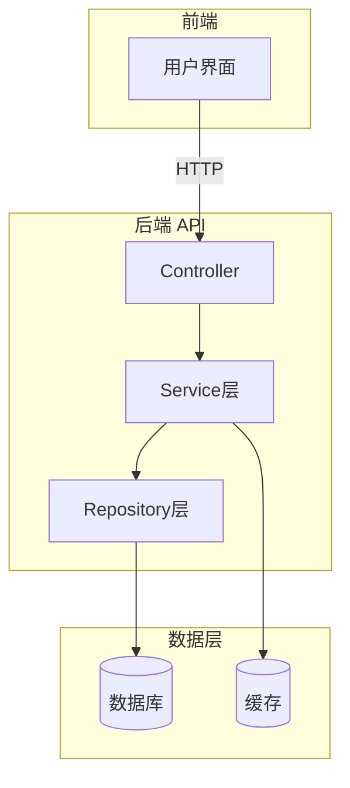
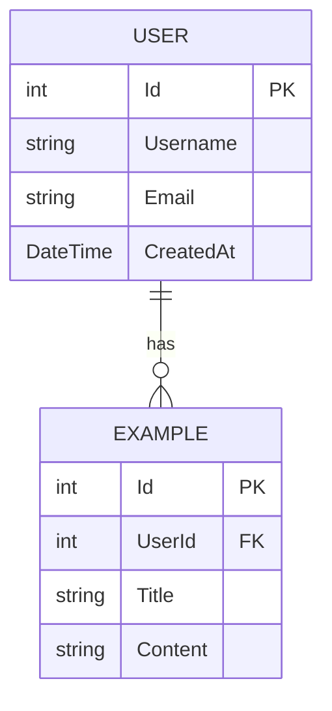

# {{title}} - 实战项目

## 🎯 项目概述

### 项目简介

{{project_description}}

### 学习目标

通过本项目，你将掌握：

-

### 技术栈

| 层面 | 技术 | 版本 |
|------|------|------|
| 后端框架 | ASP.NET Core | 8.0/9.0 |
| ORM | Entity Framework Core | 8.0 |
| 数据库 | SQL Server / SQLite | 最新 |
| 前端（可选） | Razor / Blazor / Vue | - |
| 认证 | JWT / Cookie | - |
| 测试 | xUnit + Moq | - |

### 功能特性

#### 核心功能 ✅

- [ ] 功能 1
- [ ] 功能 2
- [ ] 功能 3

#### 扩展功能 🎁

- [ ] 功能 A（可选）
- [ ] 功能 B（进阶）

### 项目预览



---

## 📐 系统设计

### 需求分析

#### 用户故事

**作为** 一个[角色]，
**我希望** 能够[功能]，
**以便于** [价值]。

#### 功能需求清单

| ID | 功能描述 | 优先级 | 复杂度 | 状态 |
|----|---------|--------|--------|------|
| US-01 | | P0 | 简单 | 待开发 |
| US-02 | | P0 | 中等 | 待开发 |
| US-03 | | P1 | 复杂 | 待开发 |

### 数据库设计

#### ER 图



#### 表结构详情

**表名：Users**

| 字段名 | 类型 | 约束 | 说明 |
|--------|------|------|------|
| Id | int | PK, 自增 | 主键 |
| Email | nvarchar(256) | Unique, Not Null | 邮箱 |
| ... | | | |

---

## 🚀 实现步骤

### 第 1 步：项目初始化

**目标**：搭建项目骨架

#### 1.1 创建解决方案和项目

```bash
# 创建解决方案
dotnet new sln -n {{project_name}}

# 创建 Web API 项目
dotnet new webapi -n {{project_name}}.Api -o src/Api

# 创建类库（领域层）
dotnet new classlib -n {{project_name}}.Domain -o src/Domain

# 创建类库（基础设施层）
dotnet new classlib -n {{project_name}}.Infrastructure -o src/Infrastructure

# 添加项目引用
dotnet sln add src/Api/src/Domain/src/Infrastructure
dotnet add src/Api reference src/Domain src/Infrastructure
```

#### 1.2 配置 Program.cs

```csharp
using Microsoft.EntityFrameworkCore;

var builder = WebApplication.CreateBuilder(args);

// 添加服务到容器
builder.Services.AddControllers();
builder.Services.AddDbContext<ApplicationDbContext>(options =>
    options.UseSqlServer(builder.Configuration.GetConnectionString("DefaultConnection")));

// 配置 CORS
builder.Services.AddCors(options =>
{
    options.AddPolicy("AllowAll",
        policy => policy.AllowAnyOrigin()
                      .AllowAnyMethod()
                      .AllowAnyHeader());
});

var app = builder.Build();

// 配置 HTTP 请求管道
if (app.Environment.IsDevelopment())
{
    app.UseDeveloperExceptionPage();
}

app.UseHttpsRedirection();
app.UseCors("AllowAll");
app.MapControllers();

app.Run();
```

**✅ 验证**：运行 `dotnet run`，访问 `http://localhost:5000` 应看到 Swagger 页面

---

### 第 2 步：数据模型与数据库

**目标**：定义实体类并完成数据库迁移

#### 2.1 创建实体类

```csharp
namespace {{project_name}}.Domain.Entities;

public class ExampleEntity
{
    public int Id { get; set; }
    public string Name { get; set; } = string.Empty;
    // 其他属性...
}
```

#### 2.2 配置 DbContext

```csharp
using Microsoft.EntityFrameworkCore;
using {{project_name}}.Domain.Entities;

namespace {{project_name}}.Infrastructure.Data;

public class ApplicationDbContext : DbContext
{
    public ApplicationDbContext(DbContextOptions<ApplicationDbContext> options)
        : base(options) { }

    public DbSet<ExampleEntity> Examples { get; set; }

    protected override void OnModelCreating(ModelBuilder modelBuilder)
    {
        base.OnModelCreating(modelBuilder);

        // Fluent API 配置
        modelBuilder.Entity<ExampleEntity>(entity =>
        {
            entity.HasKey(e => e.Id);
            entity.Property(e => e.Name).IsRequired().HasMaxLength(100);
        });
    }
}
```

#### 2.3 执行数据库迁移

```bash
# 创建初始迁移
dotnet ef migrations add InitialCreate -p src/Infrastructure -s src/Api

# 应用迁移到数据库
dotnet ef database update -p src/Infrastructure -s src/Api
```

**✅ 验证**：检查数据库是否已创建对应的表

---

### 第 3 步：业务逻辑层

**目标**：实现 Service 层处理业务规则

#### 3.1 定义接口

```csharp
using {{project_name}}.Domain.Entities;

namespace {{project_name}}.Application.Interfaces;

public interface IExampleService
{
    Task<IEnumerable<ExampleEntity>> GetAllAsync();
    Task<ExampleEntity?> GetByIdAsync(int id);
    Task<ExampleEntity> CreateAsync(ExampleEntity entity);
    Task UpdateAsync(int id, ExampleEntity entity);
    Task DeleteAsync(int id);
}
```

#### 3.2 实现服务

```csharp
using Microsoft.EntityFrameworkCore;
using {{project_name}}.Application.Interfaces;
using {{project_name}}.Domain.Entities;
using {{project_name}}.Infrastructure.Data;

namespace {{project_name}}.Application.Services;

public class ExampleService : IExampleService
{
    private readonly ApplicationDbContext _context;

    public ExampleService(ApplicationDbContext context)
    {
        _context = context;
    }

    public async Task<IEnumerable<ExampleEntity>> GetAllAsync()
    {
        return await _context.Examples.ToListAsync();
    }

    // 实现其他方法...
}
```

**💡 重点**：注意依赖注入的使用方式

---

### 第 4 步：API 控制器

**目标**：暴露 RESTful API 端点

#### 4.1 创建 Controller

```csharp
using Microsoft.AspNetCore.Mvc;
using {{project_name}}.Application.Interfaces;
using {{project_name}}.Domain.Entities;

namespace {{project_name}}.Api.Controllers;

[ApiController]
[Route("api/[controller]")]
public class ExamplesController : ControllerBase
{
    private readonly IExampleService _service;

    public ExamplesController(IExampleService service)
    {
        _service = service;
    }

    /// <summary>
    /// 获取所有记录
    /// </summary>
    [HttpGet]
    public async Task<ActionResult<IEnumerable<ExampleEntity>>> GetAll()
    {
        var items = await _service.GetAllAsync();
        return Ok(items);
    }

    /// <summary>
    /// 根据 ID 获取单条记录
    /// </summary>
    [HttpGet("{id}")]
    public async Task<ActionResult<ExampleEntity>> GetById(int id)
    {
        var item = await _service.GetByIdAsync(id);

        if (item == null)
        {
            return NotFound();
        }

        return Ok(item);
    }

    // POST, PUT, DELETE 方法...
}
```

**✅ 验证**：使用 Swagger UI 测试各个 API 端点

---

### 第 5 步：数据验证与错误处理

**目标**：确保数据的合法性和友好的错误提示

#### 5.1 添加数据注解

```csharp
using System.ComponentModel.DataAnnotations;

namespace {{project_name}}.Domain.Entities;

public class CreateExampleRequest
{
    [Required(ErrorMessage = "名称不能为空")]
    [StringLength(100, ErrorMessage = "名称长度不能超过100个字符")]
    public string Name { get; set; } = string.Empty;
}
```

#### 5.2 全局异常处理

```csharp
// 创建自定义异常中间件
```

---

### 第 6 步：（可选）认证授权

**目标**：保护 API 端点

#### 6.1 配置 JWT 认证

```csharp
// Program.cs 中添加
builder.Services.AddAuthentication(JwtBearerDefaults.AuthenticationScheme)
    .AddJwtBearer(options =>
    {
        options.TokenValidationParameters = new TokenValidationParameters
        {
            // 配置参数...
        };
    });
```

---

## 🧪 测试

### 单元测试

```csharp
using Xunit;
using Moq;
using {{project_name}}.Application.Interfaces;

namespace {{project_name}}.Tests.Services;

public class ExampleServiceTests
{
    private readonly Mock<IExampleRepository> _mockRepository;
    private readonly ExampleService _service;

    public ExampleServiceTests()
    {
        _mockRepository = new Mock<IExampleRepository>();
        _service = new ExampleService(_mockRepository.Object);
    }

    [Fact]
    public async Task GetAllAsync_ShouldReturnAllItems()
    {
        // Arrange
        var expectedItems = new List<ExampleEntity> { /* ... */ };
        _mockRepository.Setup(r => r.GetAllAsync())
            .ReturnsAsync(expectedItems);

        // Act
        var result = await _service.GetAllAsync();

        // Assert
        Assert.NotNull(result);
        Assert.Equal(expectedItems.Count(), result.Count());
    }
}
```

### 集成测试

```csharp
// 使用 WebApplicationFactory
```

---

## 📊 项目总结

### 学到了什么

1. **技术层面**：
   -
   -

2. **架构层面**：
   -
   -

3. **最佳实践**：
   -
   -

### 遇到的挑战及解决方案

| 问题 | 解决方案 | 经验教训 |
|------|---------|----------|
| 问题1 | 方案1 | 教训1 |

### 下一步可以做什么

- [ ] 添加更多功能
- [ ] 性能优化
- [ ] 部署上线
- [ ] 编写文档

### 扩展方向

- 集成 Redis 缓存
- 添加日志监控
- Docker 容器化
- CI/CD 自动化部署

---

## 📁 项目文件清单

```
{{project_name}}/
├── src/
│   ├── Api/                 # Web API 项目
│   │   ├── Controllers/
│   │   ├── Program.cs
│   │   └── appsettings.json
│   ├── Domain/              # 领域层
│   │   ├── Entities/
│   │   └── Interfaces/
│   └── Infrastructure/      # 基础设施层
│       ├── Data/
│       └── Repositories/
├── tests/                   # 测试项目
├── docs/                    # 文档
└── {{project_name}}.sln     # 解决方案文件
```

## 🔗 相关教程

本项目使用了以下知识点：

- [[MVC架构]]
- [[Entity Framework Core]]
- [[依赖注入]]
- [[RESTful API]]

## 💡 提示与建议

> ⚠️ **新手注意**：
>
> 如果遇到问题，先检查：
> 1. NuGet 包是否正确安装
> 2. 连接字符串是否配置正确
> 3. 迁移是否成功执行

> 🎯 **进阶挑战**：
>
> 尝试将本项目改造为微服务架构！

---
**项目难度**: {{difficulty}} | **预计耗时**: {{estimated_duration}}
**前置知识**: [[前置教程1]], [[前置教程2]]
**下一步项目**: [[下一个实战项目]]
